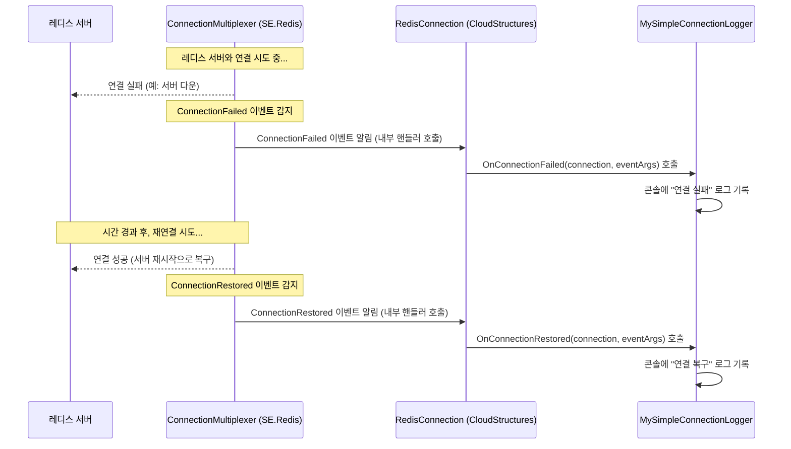

# Chapter 6: 연결 이벤트 처리기


이전 [레디스 작업 결과](05_레디스_작업_결과_.md) 장에서는 레디스에 명령을 실행하고 그 결과를 안전하게 확인하는 `RedisResult<T>`에 대해 배웠습니다. 이제 우리는 레디스와의 연결 자체에서 발생하는 다양한 상황들, 예를 들어 연결이 끊어지거나 다시 연결되는 등의 이벤트에 어떻게 대응할 수 있는지 알아보겠습니다. 바로 **연결 이벤트 처리기**가 이 역할을 담당합니다.

## 왜 연결 이벤트 처리기가 필요한가요? "비상 상황 알림 시스템"

우리가 만든 애플리케이션이 레디스 서버를 잘 사용하고 있다고 가정해 봅시다. 그런데 만약 갑자기 네트워크에 문제가 생겨 레디스 서버와의 연결이 끊어진다면 어떻게 될까요? 또는, 유지보수 작업으로 인해 레디스 서버가 잠시 중단되었다가 다시 시작될 수도 있습니다. 이런 상황을 우리 애플리케이션이 알아채지 못한다면, 사용자에게 오류를 보여주거나 데이터를 제대로 처리하지 못할 수 있습니다.

**중심 사용 사례:** 여러분의 애플리케이션이 레디스를 캐시 서버로 사용하고 있다고 생각해 보세요. 만약 레디스 연결이 끊겼다면, 애플리케이션은 이를 감지하고 다음과 같은 조치를 취하고 싶을 수 있습니다:
*   연결 실패 사실을 로그 파일에 기록하기.
*   관리자에게 즉시 알림 보내기.
*   연결이 복구될 때까지 레디스 사용을 일시 중단하고, 데이터베이스에서 직접 데이터를 가져오도록 임시 전환하기.
*   연결이 복구되면 다시 로그를 남기고, 정상적으로 레디스 사용 재개하기.

이처럼 레디스 연결 상태의 변화를 감지하고, 그에 맞춰 특정 동작을 수행하게 해주는 것이 바로 **연결 이벤트 처리기**입니다. 마치 건물의 화재 경보 시스템과 같아요. 화재(문제)가 발생하면 경보(알림)를 울려 즉시 대처할 수 있도록 도와주죠.

## 연결 이벤트 처리기란 무엇인가요?

연결 이벤트 처리기는 `CloudStructures`에서 레디스 연결과 관련된 다양한 이벤트가 발생했을 때, 이를 감지하고 우리가 정의한 특정 코드를 실행할 수 있도록 하는 기능입니다. 이 기능의 핵심은 `IConnectionEventHandler`라는 인터페이스(일종의 '약속' 또는 '규칙 모음')입니다.

**`IConnectionEventHandler` 인터페이스**

이 인터페이스는 레디스 연결과 관련된 여러 종류의 이벤트에 대응하는 메서드들을 정의하고 있습니다. 개발자는 이 인터페이스를 구현하는 클래스를 만들어서, 각 이벤트가 발생했을 때 어떤 동작을 할지 직접 코드로 작성할 수 있습니다.

주요 이벤트와 해당 메서드는 다음과 같습니다:

*   **`OnConnectionOpened(RedisConnection sender, ConnectionOpenedEventArgs e)`**: `RedisConnection`을 통해 레디스 서버와의 새 연결이 처음 성공적으로 **수립되었을 때** 호출됩니다.
*   **`OnConnectionFailed(RedisConnection sender, ConnectionFailedEventArgs e)`**: 레디스 서버와의 물리적인 연결 시도에 **실패했거나**, 이미 연결된 상태에서 연결이 **끊어졌을 때** 호출됩니다.
*   **`OnConnectionRestored(RedisConnection sender, ConnectionFailedEventArgs e)`**: 끊어졌던 연결이 성공적으로 **복구되었을 때** 호출됩니다.
*   **`OnErrorMessage(RedisConnection sender, RedisErrorEventArgs e)`**: 레디스 서버로부터 **오류 메시지를 수신했을 때** 호출됩니다. (예: 잘못된 명령어 사용 시)
*   **`OnConfigurationChanged(RedisConnection sender, EndPointEventArgs e)`**: 레디스 서버의 **구성 변경(예: 마스터/슬레이브 역할 변경 등)이 감지되었을 때** 호출됩니다.
*   `OnInternalError`, `OnHashSlotMoved` 등 더 상세한 이벤트들도 있습니다.

이러한 이벤트가 발생하면, `CloudStructures`는 우리가 등록한 `IConnectionEventHandler` 구현 객체의 해당 메서드를 자동으로 호출해줍니다. 그러면 우리는 그 안에서 로그 기록, 알림 발송, 시스템 상태 변경 등 필요한 모든 작업을 수행할 수 있습니다.

## 연결 이벤트 처리기 사용 방법

연결 이벤트 처리기를 사용하는 단계는 매우 간단합니다.

### 1. `IConnectionEventHandler` 인터페이스 구현하기

먼저, `IConnectionEventHandler` 인터페이스를 구현하는 자신만의 클래스를 만듭니다. 이 클래스 안에 각 이벤트가 발생했을 때 실행될 코드를 작성합니다.

가장 간단한 예로, 연결 실패와 복구 시 콘솔에 메시지를 출력하는 로거를 만들어 보겠습니다.

```csharp
using System;
using CloudStructures; // IConnectionEventHandler 사용을 위해 필요
using StackExchange.Redis; // ConnectionFailedEventArgs 등 사용을 위해 필요
using StackExchange.Redis.Maintenance; // ServerMaintenanceEvent 등 사용을 위해 필요

public class MySimpleConnectionLogger : IConnectionEventHandler
{
    public void OnConnectionOpened(RedisConnection sender, ConnectionOpenedEventArgs e)
    {
        Console.WriteLine($"[{DateTime.Now:HH:mm:ss}] 레디스 연결 성공! (소요 시간: {e.Elapsed.TotalMilliseconds}ms)");
    }

    public void OnConnectionFailed(RedisConnection sender, ConnectionFailedEventArgs e)
    {
        Console.WriteLine($"[{DateTime.Now:HH:mm:ss}] 레디스 연결 실패: EndPoint={e.EndPoint}, Type={e.FailureType}");
        if (e.Exception != null)
        {
            Console.WriteLine($"    예외: {e.Exception.Message}");
        }
    }

    public void OnConnectionRestored(RedisConnection sender, ConnectionFailedEventArgs e)
    {
        Console.WriteLine($"[{DateTime.Now:HH:mm:ss}] 레디스 연결 복구됨: EndPoint={e.EndPoint}, Type={e.FailureType}");
    }

    // 나머지 인터페이스 멤버들은 간단히 구현하거나 비워둘 수 있습니다.
    public void OnConfigurationChanged(RedisConnection sender, EndPointEventArgs e)
    {
        Console.WriteLine($"[{DateTime.Now:HH:mm:ss}] 설정 변경: {e.EndPoint}");
    }

    public void OnConfigurationChangedBroadcast(RedisConnection sender, EndPointEventArgs e)
    {
        Console.WriteLine($"[{DateTime.Now:HH:mm:ss}] 설정 변경 브로드캐스트: {e.EndPoint}");
    }

    public void OnErrorMessage(RedisConnection sender, RedisErrorEventArgs e)
    {
        Console.WriteLine($"[{DateTime.Now:HH:mm:ss}] 오류 메시지: {e.Message}");
    }

    public void OnHashSlotMoved(RedisConnection sender, HashSlotMovedEventArgs e)
    {
        // 필요시 구현
    }

    public void OnInternalError(RedisConnection sender, InternalErrorEventArgs e)
    {
        Console.WriteLine($"[{DateTime.Now:HH:mm:ss}] 내부 오류: {e.Origin} - {e.Exception?.Message}");
    }

    public void OnServerMaintenanceEvent(RedisConnection sender, ServerMaintenanceEvent e)
    {
        Console.WriteLine($"[{DateTime.Now:HH:mm:ss}] 서버 유지보수 이벤트: {e.ServerName} - {e.Type}");
    }
}
```
위 `MySimpleConnectionLogger` 클래스는 `IConnectionEventHandler`의 모든 메서드를 구현합니다. 여기서는 `OnConnectionOpened`, `OnConnectionFailed`, `OnConnectionRestored` 메서드에 간단한 콘솔 출력 로직을 추가했습니다. 실제 애플리케이션에서는 로깅 라이브러리(NLog, Serilog 등)를 사용하거나, 알림 서비스를 호출하는 등의 코드가 들어갈 수 있습니다.

### 2. `RedisConnection` 생성 시 핸들러 등록하기

다음으로, [레디스 연결 관리자](02_레디스_연결_관리자_.md)인 `RedisConnection` 객체를 생성할 때, 위에서 만든 이벤트 핸들러 클래스의 인스턴스를 `handler` 매개변수로 전달합니다.

```csharp
// 레디스 접속 설정 (1장에서 배운 내용)
var config = new CloudStructures.RedisConfig("event-test-redis", "localhost:6379");

// 위에서 만든 MySimpleConnectionLogger 인스턴스 생성
var logger = new MySimpleConnectionLogger();

// RedisConnection 생성 시 logger 인스턴스를 handler로 전달
var connection = new CloudStructures.RedisConnection(config, handler: logger);

// 이제 이 'connection' 객체에서 연결 이벤트가 발생하면
// 'logger' 객체의 해당 메서드가 호출됩니다.
```
이렇게 하면 `connection` 객체 내부에서 레디스 연결과 관련된 이벤트가 발생할 때마다 `logger` 객체의 해당 메서드가 호출됩니다.

### 3. 이벤트 발생 시 동작 확인

이제 모든 준비가 끝났습니다. 만약 애플리케이션 실행 중에 레디스 서버가 중지되면, `MySimpleConnectionLogger`의 `OnConnectionFailed` 메서드가 호출되어 콘솔에 "레디스 연결 실패" 관련 메시지가 출력될 것입니다. 그리고 레디스 서버가 다시 시작되어 연결이 복구되면, `OnConnectionRestored` 메서드가 호출되어 "레디스 연결 복구됨" 메시지가 나타날 것입니다.

실제로 테스트해보려면, 애플리케이션을 실행한 상태에서 로컬 레디스 서버를 잠시 중단했다가 다시 시작해보세요. 콘솔에 기록되는 로그를 통해 이벤트 핸들러가 잘 동작하는지 확인할 수 있습니다.

## 내부 동작 살짝 엿보기

우리가 등록한 이벤트 핸들러는 어떻게 `RedisConnection` 내부에서 동작하는 걸까요?

### 어떻게 이벤트가 전달될까요?

`CloudStructures`의 `RedisConnection` 객체는 내부적으로 `StackExchange.Redis` 라이브러리의 핵심 객체인 `ConnectionMultiplexer`를 사용하여 실제 레디스 서버와 통신합니다. 이 `ConnectionMultiplexer`는 자체적으로 다양한 연결 관련 이벤트를 감지하고 발생시키는 기능을 가지고 있습니다.

`RedisConnection`은 이 `ConnectionMultiplexer`로부터 발생하는 이벤트들을 구독(관찰)합니다. 그리고 특정 이벤트가 감지되면, `RedisConnection`은 자신이 가지고 있는 (우리가 생성자에게 전달한) `IConnectionEventHandler` 인스턴스의 해당 메서드를 호출해주는 역할을 합니다. 마치 중간에서 소식을 전달해주는 '메신저'와 같습니다.

### 간단한 순서도

다음은 레디스 연결이 실패했다가 복구되는 상황에서 이벤트가 처리되는 대략적인 흐름입니다:


이처럼 `ConnectionMultiplexer`가 실제 이벤트를 감지하고, `RedisConnection`이 이를 받아 사용자 정의 핸들러에게 전달하는 구조입니다.

### 코드 살펴보기

실제 코드를 통해 이 과정을 더 자세히 이해해 봅시다.

먼저, `IConnectionEventHandler.cs` 인터페이스는 우리가 구현해야 할 '약속'을 정의합니다. 이 파일의 내용은 이 장의 시작 부분에서 이미 간략히 소개되었습니다. 각 메서드는 특정 이벤트에 해당합니다.

```csharp
// 파일: CloudStructures/IConnectionEventHandler.cs
// (앞서 설명한 인터페이스 정의와 동일합니다. 주요 메서드 몇 가지만 다시 보면...)
public interface IConnectionEventHandler
{
    // ... 다른 메서드들 ...
    void OnConnectionFailed(RedisConnection sender, ConnectionFailedEventArgs e);
    void OnConnectionOpened(RedisConnection sender, ConnectionOpenedEventArgs e);
    void OnConnectionRestored(RedisConnection sender, ConnectionFailedEventArgs e);
    // ... 다른 메서드들 ...
}
```

다음은 `RedisConnection.cs`의 일부입니다. 생성자에서 `IConnectionEventHandler` 타입의 `handler`를 받아 내부 필드에 저장합니다.

```csharp
// 파일: CloudStructures/RedisConnection.cs (생성자 부분)

public sealed class RedisConnection(
    RedisConfig config,
    IValueConverter? converter = null,
    IConnectionEventHandler? handler = null, // 사용자 정의 핸들러를 받는 매개변수
    TextWriter? logger = null)
    : IDisposable
{
    // ...
    private IConnectionEventHandler? Handler { get; } = handler; // 전달받은 핸들러 저장
    // ...
}
```
`Handler` 속성에 우리가 전달한 `MySimpleConnectionLogger` 인스턴스가 저장됩니다.

실제 `ConnectionMultiplexer` 객체가 생성되고 이벤트 구독이 일어나는 부분은 `RedisConnection`의 `GetConnection()` 메서드(또는 관련 내부 메서드)에 있습니다. `ConnectionMultiplexer`가 성공적으로 연결을 맺거나, 연결 관련 이벤트가 발생하면 `RedisConnection`에 등록된 내부 핸들러들이 호출됩니다. 이 내부 핸들러들이 다시 우리가 제공한 `IConnectionEventHandler`의 메서드를 호출합니다.

예를 들어 `GetConnection()` 메서드 내부에서 `ConnectionMultiplexer` 객체(`connection`)가 만들어지면, 다음과 같이 이벤트들이 연결됩니다.

```csharp
// 파일: CloudStructures/RedisConnection.cs (GetConnection 메서드 내 이벤트 연결 부분 - 간략화)

// ... ConnectionMultiplexer.Connect(...) 호출 후 ...
// connection 변수가 생성된 ConnectionMultiplexer 객체라고 가정

if (this.Handler is not null) // 사용자가 핸들러를 제공했다면
{
    // ConnectionMultiplexer의 이벤트를 RedisConnection 내부 메서드에 연결
    connection.ConnectionFailed += this.OnInternalConnectionFailed;
    connection.ConnectionRestored += this.OnInternalConnectionRestored;
    connection.ErrorMessage += this.OnInternalErrorMessage;
    connection.ConfigurationChanged += this.OnInternalConfigurationChanged;
    connection.ConfigurationChangedBroadcast += this.OnInternalConfigurationChangedBroadcast;
    connection.HashSlotMoved += this.OnInternalHashSlotMoved;
    connection.InternalError += this.OnInternalInternalError;
    connection.ServerMaintenanceEvent += this.OnInternalServerMaintenanceEvent;

    // CloudStructures 자체 ConnectionOpened 이벤트
    // (이것은 ConnectionMultiplexer의 이벤트가 아니라 CloudStructures가 연결 성공 시 직접 발생)
    this.Handler.OnConnectionOpened(this, new(stopwatch.Elapsed));
}
```
여기서 `this.OnInternalConnectionFailed` 같은 메서드들은 `RedisConnection` 클래스 내부에 `private`으로 선언된 메서드들입니다. 이 메서드들이 바로 우리가 제공한 `Handler`의 실제 메서드를 호출해줍니다.

예를 들어, `OnInternalConnectionFailed` 메서드는 다음과 같이 생겼을 것입니다 (실제 코드는 다를 수 있음):

```csharp
// 파일: CloudStructures/RedisConnection.cs (내부 이벤트 핸들러 예시 - 간략화)

private void OnInternalConnectionFailed(object? sender, ConnectionFailedEventArgs e)
{
    // 사용자가 제공한 Handler가 있다면, 그 Handler의 OnConnectionFailed 메서드 호출
    this.Handler?.OnConnectionFailed(this, e);
}

private void OnInternalConnectionRestored(object? sender, ConnectionFailedEventArgs e)
{
    this.Handler?.OnConnectionRestored(this, e);
}
// 다른 내부 이벤트 핸들러들도 유사한 패턴을 따릅니다.
```
`this.Handler?.OnConnectionFailed(this, e)` 코드는 `Handler`가 `null`이 아닐 경우에만 `OnConnectionFailed` 메서드를 호출합니다. `this`는 현재 `RedisConnection` 인스턴스를 의미하며, `e`는 `ConnectionMultiplexer`로부터 전달받은 이벤트 정보를 담고 있는 객체입니다.

마지막으로, `CloudStructures`는 자체적으로 정의한 이벤트 정보 클래스도 사용합니다. 예를 들어 `ConnectionOpenedEventArgs`는 `CloudStructures`가 새 연결이 열렸을 때 추가적인 정보(연결 소요 시간 등)를 전달하기 위해 사용됩니다.

```csharp
// 파일: CloudStructures/ConnectionEventArgs.cs (ConnectionOpenedEventArgs 정의)
public sealed class ConnectionOpenedEventArgs : EventArgs
{
    public TimeSpan Elapsed { get; } // 연결 수립에 걸린 시간

    internal ConnectionOpenedEventArgs(TimeSpan elapsed)
        => this.Elapsed = elapsed;
}
```
이처럼 `RedisConnection`은 `StackExchange.Redis`의 강력한 이벤트 시스템을 기반으로, 사용자에게는 더 간편하고 `CloudStructures`에 특화된 방식으로 연결 이벤트를 처리할 수 있는 `IConnectionEventHandler` 인터페이스를 제공합니다.

## 정리하며

이번 장에서는 `IConnectionEventHandler` 인터페이스를 사용하여 레디스 연결 상태의 변화(예: 연결 실패, 복구, 설정 변경 등)를 감지하고, 이에 대응하는 사용자 정의 로직을 실행하는 방법에 대해 배웠습니다. 마치 우리 애플리케이션에 '레디스 연결 상태 감시 시스템'을 설치하는 것과 같습니다.

핵심 내용을 다시 정리하면:
*   `IConnectionEventHandler` 인터페이스를 구현하여 레디스 연결 관련 이벤트 발생 시 실행될 코드를 작성할 수 있습니다.
*   구현한 핸들러 인스턴스를 `RedisConnection` 생성 시 전달하면, 해당 `RedisConnection`에서 발생하는 연결 이벤트들이 핸들러로 전달됩니다.
*   이를 통해 연결 문제 발생 시 로그 기록, 알림 발송, 시스템 장애 극복(Failover) 로직 실행 등 애플리케이션의 안정성과 대응력을 높일 수 있습니다.

이것으로 `CloudStructures` 기본 튜토리얼 시리즈를 마무리합니다. 지금까지 배운 내용들 - [레디스 접속 설정](01_레디스_접속_설정_.md)부터 시작해서 [레디스 연결 관리자](02_레디스_연결_관리자_.md), [값 변환기](03_값_변환기_.md), 다양한 [레디스 데이터 구조](04_레디스_데이터_구조_.md) 사용법, [레디스 작업 결과](05_레디스_작업_결과_.md) 확인, 그리고 오늘 배운 연결 이벤트 처리까지 - 이 모든 것이 여러분이 `CloudStructures`를 사용하여 레디스를 더욱 효과적이고 안정적으로 활용하는 데 든든한 기초가 되기를 바랍니다.

`CloudStructures`와 함께 즐거운 개발 여정이 되시길 응원합니다!

---

Generated by [AI Codebase Knowledge Builder](https://github.com/The-Pocket/Tutorial-Codebase-Knowledge)