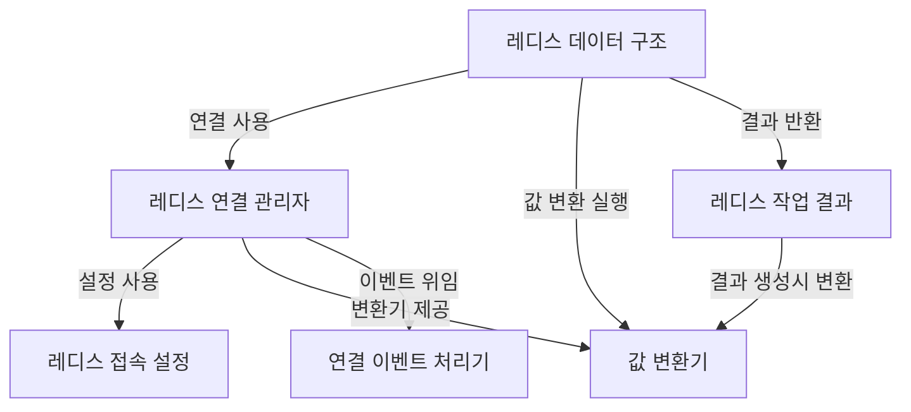

# Tutorial: CloudStructures

*CloudStructures*는 **레디스(Redis)** 데이터베이스를 C# 애플리케이션에서 *쉽고 편리하게* 사용할 수 있도록 지원하는 라이브러리입니다. 개발자는 이 라이브러리를 통해 레디스의 다양한 **데이터 구조**를 마치 C#의 일반 컬렉션처럼 다룰 수 있으며, **연결 관리**, **값 변환**, 접속 설정 등의 복잡한 세부 사항은 추상화되어 간단하게 처리됩니다.

**Source Repository:** [None](None)

## Chapters

1. [레디스 접속 설정
](01_레디스_접속_설정_.md)
2. [레디스 연결 관리자
](02_레디스_연결_관리자_.md)
3. [값 변환기
](03_값_변환기_.md)
4. [레디스 데이터 구조
](04_레디스_데이터_구조_.md)
5. [레디스 작업 결과
](05_레디스_작업_결과_.md)
6. [연결 이벤트 처리기
](06_연결_이벤트_처리기_.md)

---

Generated by [AI Codebase Knowledge Builder](https://github.com/The-Pocket/Tutorial-Codebase-Knowledge)