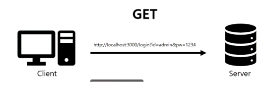
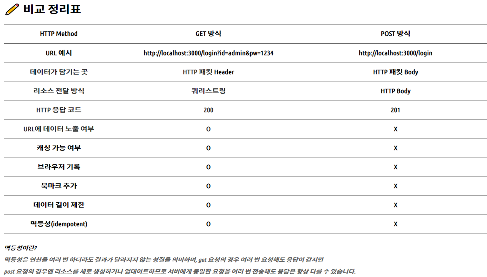
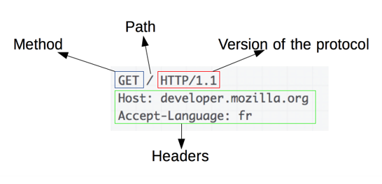
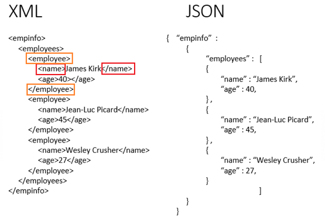
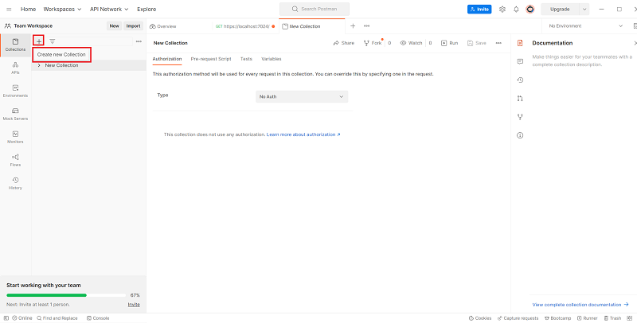
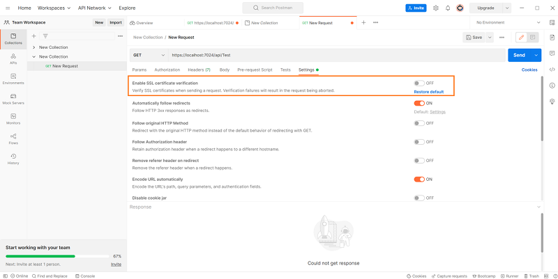
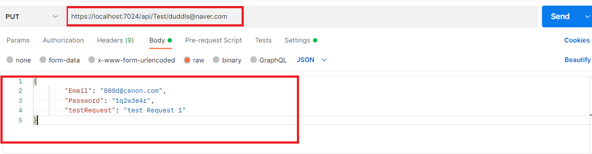

# HTTP
---
## 목차
1. [REST](#REST)
2. [HTTP 설명](#HTTP-설명)
3. [HTTP의 특징](#HTTP의-특징)
   * [클라이언트 - 서버 구조](#클라이언트-서버-구조)
   * [무상태(Stateless)](#무상태-Stateless)
   * [비 연결성(Connectionless)](#비-연결성-Connectionless)
4. [게임서버에서의 웹서버](#게임서버에서의-웹서버)
   * [게임서버에서 웹서버를 사용하는 이유](#게임서버에서-웹서버를-사용하는-이유)
   * [게임서버에서 사용하는 방식](#게임서버에서-사용하는-방식)
5. [통신 방식](#통신-방식)
   * [GET](#GET)
   * [POST](#POST)
   * [GET vs POST](#GET-vs-POST)
6. [HTTP vs HTTPS](#HTTP-vs-HTTPS)
7. [JSON](#JSON-포멧)
   * [JSON 이란](#JSON-이란)
   * [JSON의 구조](#JSON의-구조)
   * [JSON의 장단점](#JSON의-장단점)
8. [Postman](#Postman)
   * [설치](#설치)
   * [실행](#실행)
   * [GET / POST / PUT / DELETE](#GET--POST--PUT--DELETE)

---
## REST
````
Rest란 Representational State Transfer의 약자로 자원을 이름으로 구분하여  해당 자원의 상태를 주고받는 모든 것을 의미합니다.

즉 REST란 HTTP URI(Uniform Resource Identifier)를 통해 자원(Resource)을 명시하고, HTTP Method(POST, GET, PUT, DELETE)를 통해
해당 자원(URI)에 대한 CRUD Operation을 적용하는 것을 의미합니다.  
````

````
** 여기서 CRUD Operation이란
Create : 데이터 생성(POST)
Read : 데이터 조회(GET)
Update : 데이터 수정(PUT)
Delete : 데이터 삭제(DELETE)
````
* 장점
````
1. HTTP 프로토콜의 인프라를 그대로 사용하므로 REST API 사용을 위한 별도의 인프라를 구출할 필요가 없다.
2. HTTP 프로토콜의 표준을 최대한 활용하여 여러 추가적인 장점을 함께 가져갈 수 있게 해 준다.
3. HTTP 표준 프로토콜에 따르는 모든 플랫폼에서 사용이 가능하다.
4. Hypermedia API의 기본을 충실히 지키면서 범용성을 보장한다.
5. REST API 메시지가 의도하는 바를 명확하게 나타내므로 의도하는 바를 쉽게 파악할 수 있다.
6. 여러 가지 서비스 디자인에서 생길 수 있는 문제를 최소화한다.
7. 서버와 클라이언트의 역할을 명확하게 분리한다.
````

* 단점
````
1. 표준이 자체가 존재하지 않아 정의가 필요하다.
2. 사용할 수 있는 메소드가 4가지밖에 없다.
3. HTTP Method 형태가 제한적이다.
4. 브라우저를 통해 테스트할 일이 많은 서비스라면 쉽게 고칠 수 있는 URL보다 Header 정보의 값을 처리해야 하므로 전문성이 요구된다.
5. 구형 브라우저에서 호환이 되지 않아 지원해주지 못하는 동작이 많다.(익스폴로어)
6. 비교적 성능적으로 좋지 않다.
````
https://khj93.tistory.com/entry/%EB%84%A4%ED%8A%B8%EC%9B%8C%ED%81%AC-REST-API%EB%9E%80-REST-RESTful%EC%9D%B4%EB%9E%80

----

## HTTP 설명
* HyperText Transfer Protocol의 약자이며 WWW에 내재된 프로토콜이다.
* 인터넷에서 데이터를 주고 받을 수 있는 프로토콜이다.
* HTTP에 데이터 암호화가 추가된 프로토콜이다.
* HTTP와 다르게 443번 포트를 사용하며 네트워크 상에서 제3가자 정보를 볼 수 없도록 암호화 지원을 하고 있다.
* 암호화 방식에는 두가지가 있다.
  * 대칭 키 암호화
    * 클라이언트와 서버가 동일한 키를 사용해 암호화/복호화를 진행한다.
    * 키가 노출되면 위험하지만 연산 속도가 빠르다.
  * 비대칭 키 암호화
    * 1개의 쌍으로 구성된 공개키와 개인키를 암호화/복호화 하는데 사용한다.
    * 키가 노출되어도 비교적 안전하지만 연산속도가 느리다

````
* 대칭키는 비교적 쉬운 개념이므로 비대칭키에 대해 자세히 알아볼 것이다.
* 비 대칭 키는 공개키와 개인키를 가지고 있는데 공개키는 모두에게 공개가능한 키를 의미하고 개인키는 개인이 가지고 있으며 개인만 
    알고 있어야 하는 키이며 이렇게 공개키와 개인키를 같이 사용하는 방식은 다음과 같은 효과를 낼 수 있다.
 
  * 공개키 암호화 : 공개키로 암호화를 하면 개인키로 복호화 할 수 있다. -> 개인키는 나만 가지고 있으므로 나만 볼 수 있다.
  
  * 개인키 암호화 : 개인키로 암호화하면 공개키로만 복호화 할 수 있다. -> 공개키는 모두에게 공개되어 있으므로, 
                    내가 인증한 정보임을 알려 신뢰성을 보장할 수 있다.
````


* HTTPS는 대칭키 암호화와 비대칭키 암호화를 모두 사용하여 빠른 연산 속도와 안정성을 모두 얻고 있다.
* HTTPS 연결 과정에서는 서버와 클라이언트가 세션키를 교환하는데 여기서 세션키는 주고 받는 데이터를 암호화하기 위해서 사용되는 대칭키 이며, 데이터 간의 교환에는 빠른 연산 속도가 필요하므로 세션키는 대칭키로 만들어진다.
* 문제는 이 세션키를 클라이언트와 서버가 어떻게 교환할 것인가 인데, 이 과정에서 비대칭키가 사용된다. 즉, 처음 연결을 성립하여 세션키를 공유하는 과정에서는 비대칭키가 사용되고 이후에 데이터 교환에는 대칭키를 사용하는 것이다.
````
실제 HTTPS 연결 과정이 성립되는 흐름을 살펴보면 다음과 같다.

1. 클라이언트(브라우저)가 서버로 최초 연결 시도를 함
2. 서버는 공개키(엄밀히는 인증서)를 브라우저에게 넘겨줌
3. 브라우저는 인증서의 유효성을 검사하고 세션키를 발급함
4. 브라우저는 세션키를 보관하며 추가로 서버의 공개키로 세션키를 암호화하여 서버로 전송함
5. 서버는 개인키로 암호화된 세션키를 복호화하여 세션키를 얻음
6. 클라이언트와 서버는 동일한 세션키를 공유하므로 데이터를 전달할 때 세션키로 암호화/복호화를 진행함
````
출처: https://mangkyu.tistory.com/98 [MangKyu's Diary:티스토리]

## HTTP의 특징
#### 클라이언트 서버 구조
   * Request(client to server) / Response(server to client) 구조
   * 클라이언트는 서버에 요청을 보내고 응답을 대기하며 서버는 요청에 대한 결과를 만들어 응답한다.
   * https://hanamon.kr/%eb%84%a4%ed%8a%b8%ec%9b%8c%ed%81%ac-http%ec%99%80-%ed%81%b4%eb%9d%bc%ec%9d%b4%ec%96%b8%ed%8a%b8-%ec%84%9c%eb%b2%84-%ec%95%84%ed%82%a4%ed%85%8d%ec%b2%98/


#### 무상태 Stateless
* 내부에서 session에 대한 값을 메모리에 들고 있으면 stateful, 반대면 stateless에요
* 서버가 클라이언트의 상태를 보존하지 않음
* 서버 확장성이 높다는 장점이 있지만 클라이언트가 추가로 데이터를 전송해야 한다는 단점이 있다.
* 이를 해결하기 위한 방법으로는 쿠키와 세션이 있다.
* https://interconnection.tistory.com/74


#### 비 연결성 Connectionless
* 비 연결성 모델은 응답을 마치면 맺었던 연결을 끊는 방식으로 서버가 유지해야 하는 자원이 줄어든다는 장점이 있다.
* 서버는 클라이언트를 기억하고 있지 않으므로 동일한 클라이언트의 모든 요청에 대해, 매번 새로운 연결을 시도/해제의 과정을 거쳐야하므로 연결/해제에 대한 오버헤드가 발생한다는 단점이 있다.
---

## 게임서버에서의 웹서버

---

### 게임서버에서 웹서버를 사용하는 이유
````
1. 개발이 훨씬 편리함. (언어자체의 편의성, 자료, 라이브러리 등이 많음)
2. 서버의 오류가 발생 하여도 일부 유저,일부 기능에만 문제가 생김
3. 모든 데이터는 DB 기준으로 처리 하기 때문에 서버 다운의 롤백이 없음
4. 웹서버의 분산 처리가 용이함.
````
Stateless 에서는 게임 서버에 상태, 데이터가 없기 때문에 게임 서버의 메모리는 이번 행동의 로직 처리를 위한 임시 저장소로 사용 되며,   
즉시 DB 에 저장후 메모리의 데이터는 사라지게 되는데 이는 곧 DB 의 데이터가 최신 데이터이자 원본 데이터의 역할을 한다는 것을 의미 한다.

이러한 stateless 서버의 특징으로 인하여 Scale-Out 확장이 가능한데 조금 더 풀어서 말하자면 서버 자체에는 로직 코드만 있을 뿐 데이터가 없기 때문에 서버의 수, 종류에 관계 없이 없이 같은 데이터의 결과를 보게 된다.
그러므로 서버의 대수를 늘려 확장이 쉽지만 대신 DB에 모든 데이터가 집중 되고 사용량이 많기에 DB 분산, 설계가 제일 중요하다.

---

### 게임서버에서 사용하는 방식

유저간의 실시간 상호작용 컨텐츠 없이 혼자서 싱글 플레이를 하는 게임, 또는 완벽한 실시간 컨텐츠가 없는 모바일 싱글 RPG / 온라인 퍼즐게임 / 방치형 게임 / 수집형 게임 등과 같이
다른 유저와의 실시간 상호 작용이 없고 싱글 플레이 후 플레이 데이터의 보관, 랭킹, 친구간의 선물 교환 등의 요소들로 이루어진 게임에 사용된다.


연결을 유지하지 않는다는 특징이 있기 때문에(Stateless) 평소에는 서버와 연결이 끊어진 상태로 단독 싱글 플레이를 하며, 스테이지 클리어, 아이템 사용, 구매, 가챠뽑기 등 게임의 중요 포인트에만 서버에 연결하여 데이터를 전달하고
이에 대한 결과를 반영 하는 방식의 게임에서 사용 하는데 이렇게 연결을 유지 하지 않는 이유는 클라이언트의 요청이 없을 시에 서버는 할 일이 없고 이런 상황에서는 연결을 유지할 필요가 없기 때문입니다.

그리고 연결을 유지 하지 않기 때문에 서버의 메모리에 유저의 데이터, 컨텐츠 데이터를 올려 놓고 사용 하지 않습니다.
그렇기 때문에 연결이 끊어진 상태에서는 여떤 유저가 플레이 중인지 모르기 때문에 서버는 필요시 마다 데이터베이스에서 데이터를 읽어오고 특정 로직을 수행 하는 과정을 반복 하게 됩니다.

http://post.procademy.co.kr/archives/753

---

## 통신 방식
참고 : https://cocoon1787.tistory.com/526
### GET

GET 방식은 클라이언트가 서버로 데이터를 요청하기 위해 사용되는 메서드이며 GET 요청을 할 때는 BODY 부분은 비어 있고 헤더에 Body의 콘텐츠타입을 명시하는 Content-Type 헤더 필드도 작성하지 않고 URL뒤에 쿼리 스트링을 붙여 HTTP  패킷의 헤어에 포함해서 서버에 데이터를 요청하는 방식이다.   
  
?뒤부터 작성되는 쿼리 스트링은 데이터를 표현하는데 중요한 값들이 노출되기 때문에 ID&PW와 같이 중요한 데이터를 통신하는 경우에는 사용하지 않는다.
또한 브라우저마다 글자 수 제한이 있기 때문에 간단한 데이터를 요청할 때만 사용한다.
한번 접근 한 후 다음 요청부터 빠르게 접근하기 위해 레지스터에 데이터를 저장 시켜놓는 캐싱이 가능하기 때문에 POST 방식 보다 상대적으로 전송 속도가 빠르다.
브라우저 히스토리에 기록이 남는다.

### POST
  
POST 방식은 클라이언트가 서버로 데이터를 전송해 리소스를 추가하거나 생성하기 위해 사용되는 Method로써 패킷의 헤더에 Body의 콘텐츠 타입을 명시하는 Content-Type 헤더 필드를 포함하고 HTTP 패킷의 Body에는 데이터를 담아서 서버로 전송한다.  
    
POST 방식은 GET방식과 다르게 데이터들이 URL에 표시되지 않고 Body에 담겨 서버로 전송되므로 보내는 데이터의 양에 제한이 없다.  
데이터가 표시되지 않기 때문에 GET 방식에 비해 보안적으로 우수하지만 특정 툴을 사용하여 내용을 확인할 수 있기에 암호화 하는 작업이 필요하다.  
URL에 데이터가 작성되지 않으므로 캐싱은 불가능  
클라이언트에서 인코딩, 서버에서 디코딩  
브라우저 히스토리에 기록이 남지 않음  


### GET vs POST

참고 : https://cocoon1787.tistory.com/526
---
### HTTP vs HTTPS

* HTTP는 애플리케이션 레벨의 프로토콜로 TCP/IP 위에서 작동하며 Method / Path / Version / Headers / Body로 구성된다.
  하지만 HTTP는 암호화되지 않은 데이터 이기 때문에 HTTP로 비밀번호나 주민등록번호를 주고 받으면 제3자가 정보를 조회할 수 있었다.
* 이를 해결하기 위해 등장한 것이 HTTPS이다.

---
---

### JSON 포멧
#### JSON 이란
````C#
JavaScript Object Notation의 약자로써
자바스크립트 (Javascript)에서 객체를 만들 때 사용 하는 표현 식이며 사람이 읽을 수 있는 텍스트 기반의 데이터 교환 표준 입니다.
경량의 데이터 교환 형식으로 프로그래밍 언어가 아닌 단순히 데이터를 표시 하는 표현 방법, 데이터 포맷을 의미 합니다.

JSON의 자료형은 string, number, true, false, null, object, array 가 올 수 있습니다.
````
---

#### JSON의 구조

````C#
JSON 데이터는 이름과 값의 쌍입니다.(Key : Value)
key 값은 문자열이기 때문에 쌍따옴표 "" 를 붙여줘야 하고, value에는 기본 자료형, 배열 혹은 객체를 넣으면 됩니다.


JSON 데이터는 쉼표(,)로써 구분하게 됩니다.

객체(object)는 중괄호({})로 둘러 쌓아 표현 하며 key/value 쌍들의 비 순서화된 SET입니다.

배열(array)는 대괄호([])로 둘러 쌓아 표현 하며 array는 순서화된 collection
````

---

#### JSON의 장단점
* 장점
```` 
내용이 함축적으로 최소한의 정보만을 가지고 있습니다.
-> xml은 HTML과 같이 태그 구조의 형식으로 데이터를 표현하는데 구조가 복잡해지고 용량이 커진다.
    == 아래 사진의 빨강/주황 박스쌍 처럼 데이터의 시작과 끝에 대한 주기를 해줘야 한다.

그렇기 때문에 XML 에 비해 용량이 줄어들고 그만큼 빠른 속도를 가지게 됩니다.

언어에 독립적이며, 구조정의의 용이성과 가독성이 뛰어나기 때문에 사용하기가 쉽습니다.

특정언어에 종속되지 않는다.
````


* 단점
````C#
XML에 비해 문법 오류에 취약
XML은 사용처마다 요구되는 구조와 형태를 잘 갖췄는지 스키마를 이용해 검증 가능한데 JSON은 이런 기능 X
JSON은 주석처리가 불가능하다.

내용이 함축적이다 보니 의미 파악이 힘들 수가 있습니다.
경량의 데이터 교환 형식이기 때문에 XML보다 빠르지만, 대용량급의 데이터 송수신에는 부적합한 모습도 있습니다.
````
---


----
---
### Postman
#### 설치
* https://www.postman.com/
---
#### 실행

````
Postman 설치 후 좌 상단의 + 버튼을 클릭하면 아래에 New Collection과 우측에 창이 생긴다.
````
---

````
새로 생긴 New Collection에서 오른쪽 버튼을 클릭하여 Add request버튼을 누르면 아래와 같이 우측에 새로운 창이하나 더 생기게된다.
````
---

````
생성된 창의 Header를 클릭하여 KEY와 VALUE를 각각 Content-Type, application/json으로 세팅한다.
````
---


````
테스트하고자하는 Url을 입력 후 Body에 raw를 선택하고 우측에 JSON 옵션을 선택한다.
해당 Body창에는 서버로 보내고하자는 Request 패킷의 내용이 작성될 것이다.

이상태로 POST,GET등의 요청을 수행할경우 SSL certificate 오류가 발생하게된다.
````
---

````
SSL certificate 오류가 발생하면 위의 사진과 같이 Setting 항목의 Enable SSL certificate verification 항목을 off로 세팅하여
사용할 수도 있고 프로젝트의 URL을 Https가 아닌 Http로 설정하여 사용해도된다.
````
[참고] https://yjh5369.tistory.com/entry/Postman-%EC%82%AC%EC%9A%A9-%EC%8B%9C-SSL-Error-Self-signed-certificate-%EC%98%A4%EB%A5%98-%EB%B0%9C%EC%83%9D?category=1059199

---
#### GET  POST  PUT  DELETE
1. GET


````
GET 메소드는 주로 데이터를 읽거나(Read) 검색(Retrieve)할 때에 사용되는 메소드이다. 
만약에 GET요청이 성공적으로 이루어진다면 XML이나 JSON과 함께 200 (Ok) HTTP 응답 코드를 리턴하고에러가 발생하면 주로 404 (Not found) 에러나 400 (Bad request) 에러가 발생한다.

데이터를 조회하는 것이기 때문에 일반적으로 Body값이 비워져 있고 특정 데이터를 조회 하기 위해 Url을 통해 인자를 전달한다.

빨간 박스 : 전체 조회
주황 박스 : 특정 데이터 조회
````
2. POST


````
POST는 일반적으로 새로운 리소스를 생성할 때 사용한다.
성공적으로 생성할 경우 201 응답을 반환한다.

데이터를 생성하는 것이기 때문에 빨간박스와 같이 Body값을 작성한다.
해당 Body값은 코드에서 작성한 Param과 일치하는 데이터여야 한다.
````
3. PUT
   

````
PUT은 일반적으로 리소스를 생성/업데이트하기 위해 사용한다. 
그렇기 때문에 Body값이 필요하고 특정 데이터를 업데이트하기 위해 URL에 파라미터로 인자를 넣어준다.

위의 사진은 URL의  duddls@naver.com의 데이터를 Body와 같이 바꾸겠다는 의미이다.
````
4. DELETE


````
일반적으로 데이터를 삭제할때 쓰이므로 Url을 통해 삭제할 데이터를 파라미터로 입력하고 Body는 비워놓는다.
````