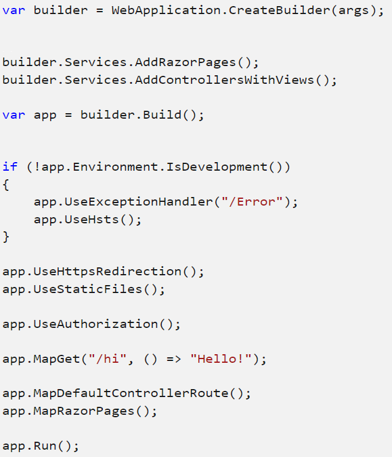
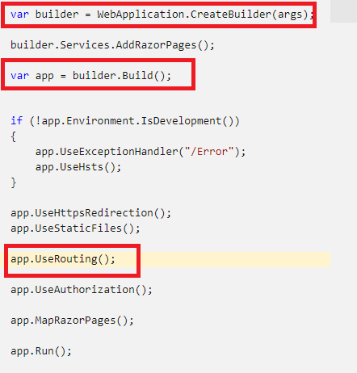
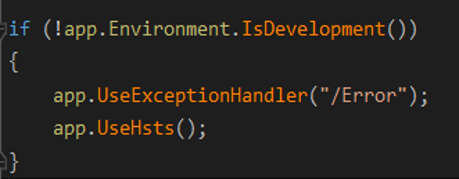
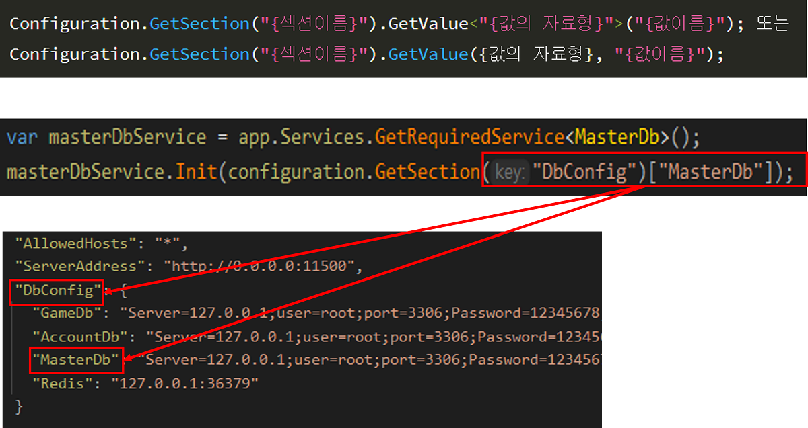
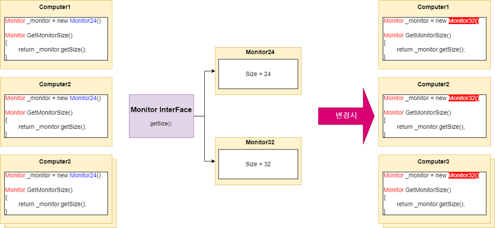
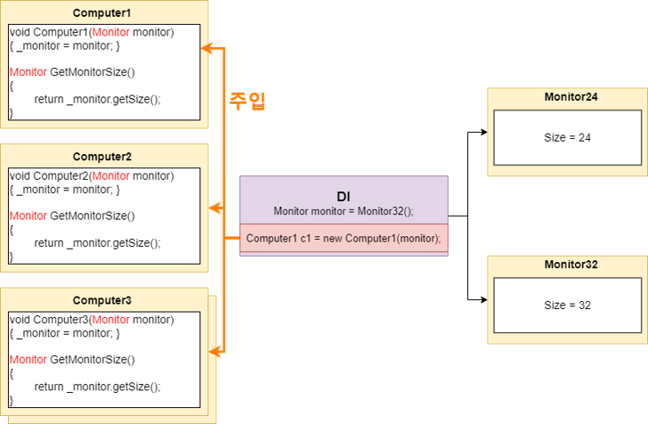
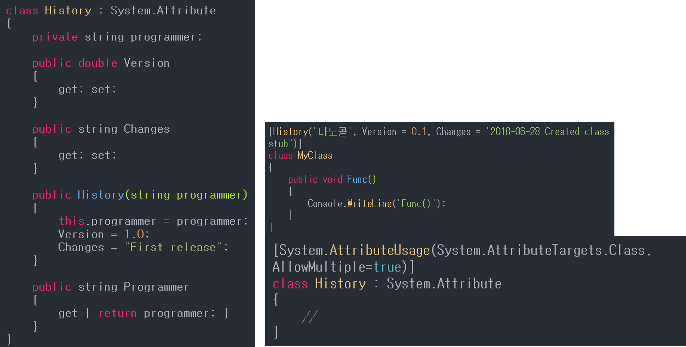
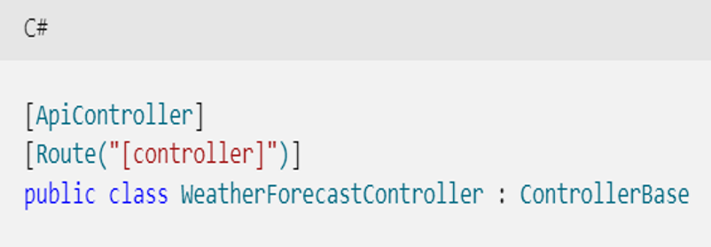
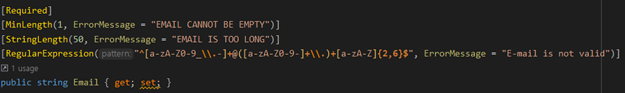

# ASP.NET Core

---

## 목차
1. [ASP.NET Core란?](#ASP-NET-Core-설명)
2. [ASP.NET Core의 기능](#ASP-NET-Core의-기능)
    * [Progam](#Program)
    * [Create Builder](#Create-Builder)
    * [WebApplicationBuilder](#WebApplicationBuilder)
    * [Routing](#Routing)
    * [ConfigureAppConfiguration](#ConfigureAppConfiguration)
        * [SetBasePath](#SetBasePath)
        * [AddJsonFile](#AddJsonFile)
    * [ConfigureServices](#ConfigureServices)
    * [ConfigureLogging](#ConfigureLogging)
    * [설정 제공자 Appsettings](#설정-제공자-Appsettings.json)
3. [미들웨어](#미들웨어)
    * [주로 사용하는 미들웨어의 순서와 기능](#주로-사용하는-미들웨어의-순서와-기능)
4. [의존성 주입 Dependency Injection](#의존성-주입-Dependency-Injection)
    * [의존성 주입이 아닌 경우](#의존성-주입이-아닌-경우)
    * [의존성 주입의 경우](#의존성-주입의-경우)
    * [ASP NET Core에서의 의존성 주입](#ASP-NET-Core에서의-의존성-주입)
5. [Async와 Await](#Async와-Await)
6. [Attribute](#Attribute)
    * [Attribute 설명](#Attribute-설명)
    * [Attribute 사용](#Attribute-사용)
    * [Attribute 종류](#Attribute-종류)
        * [Conditional Attribute](#Conditional-Attribute)
        * [Obsolete Attribute](#Obsolete-Attribute)
        * [Dll Import Attribute](#Dll-Import-Attribute)
        * [사용자 정의 Attribute](#사용자-정의-Attribute)
        * [ApiController Attribute](#ApiController-Attribute)
        * [Route Attribute](#Route-Attribute)
        * [HTTP Attribute](#HTTP-Attribute)
        * [Require Attribute](#Require-Attribute)
        * [Mmo에 사용된 required, minLength등의 Attribute](#Mmo에-사용된-required,-minLength등의-Attribute)

````
대부분의 자료가 MSDN을 참고하여 작성하였기 때문에 이해안되는 부분이나 조금더 깊게 공부해 보고싶은 파트가 있다면
아래 링크를 보고 공부하면 좋을 듯하다.
````
* https://docs.microsoft.com/ko-kr/aspnet/core/?view=aspnetcore-7.0  
  
## ASP NET Core 설명
1. C#을 사용한다(F#도 사용 가능)
2. .NET을 이용하여 클라우드 기반 웹 응용 프로그램을 개발하기 위해 개발된 크로스 플랫폼 프레임워크이다.
3. Visual Studio, JetBrains Rider를 이용한 개발이 가능하다.
4. 잘게 분리된 Nuget 패키지들을 기반으로 하여 사용한 만큼 지불 하는 pay-for-what-you-use 모델을 채택함 으로써 성능면에서 효율적이다.
  
<br>

---
## ASP NET Core의 기능

---
### Program 
웹 애플리케이션의 진입점이다.  

````
* ASP.NET Core 6버전에서는 Main 사용구가 없다.
* Startup 클래스가 없어지고 하나의 파일에 모든 코드가 작성된다.

* 앱에서 요구하는 서비스가 구성된다.
* 앱의 요청 처리 파이프라인이 일련의  미들웨어 구성 요소로 정의

* Main 메서드는 빌더 패턴을 따르는 WebHostBuilder 클래스를 이용해 호스트를 생성한다.
* Build  및 Run 메서드는 응용 프로그램을 호스트하는 IWebHost 개체를 만들고 이를 실행해서 전달되는 HTTP 요청의 수신을 대기합니다.

````
  

---  

<br>  
  
### Create Builder
Create Builder는 미리 구성된 기본값을 사용하여 클래스의 WebApplicationBuilder 객체의 새 인스턴스를 초기화 하며 설정 제공자를 호출 한다.
초기화된 WebCreateBuilder는 가장 높은 우선 순위부터 가장 낮은 우선 순위까지 다음 순서로 앱의 기본 구성을 제공한다.

1. 명령줄 구성 공급자를 사용하는 명령줄 인수
2. 접두사 없는 환경 변수 구성 공급자를 사용하는 접두사 없는 환경 변수.
3. 사용자 비밀 - 앱이 환경에서 실행되는 경우.
4. JSON 구성 공급자를 사용하는 appsettings.{Environment}.json. 예를 들어 appsettings.Production.json 및 appsettings.Development.json를 지정합니다.
5. JSON 구성 공급자를 사용하는appsettings.json.
6. 다음 섹션에 설명된 호스트 구성에 대한 대체입니다.


자세하게는 WebApplicationBuilder는 다음과 같은 작업을 한다.
1. Builder.Configureation을 사용해 구성 추가
2. Builder.Servies를 사용해 서비스 추가
3. Builder.Logging을 사용해 로깅 구성
4. 일반  IHostBuilder 및 IWebHostBuilder 구성
  
설정제공자(appsetting.json)로 부터 설정을 불러온다.
  
<br>  
  
### WebApplicationBuilder
호스트를 빌드하는 기능으로써 다음과 같은 앱의 리소스를 모두 캡슐화 하는 작업을 한다.

* HTTP 서버 구현
* 미들웨어 구성 요소
* 로깅
* 종속성 주입 서비스
* Configureation

그리고 다음과 같은 일련의 기본 옵션으로 호스트를 구성한다.

* Kesterl을 웹 서버로 사용하고 IIS 통합을 사용하도록 설정
* appsettings.json, 환경 변수, 명령줄 인수, 기타 구성 소스에 구성을 로드
* 콘솔 및 디버그 공급자에게 로깅 출력을 보냄
  
참고 : https://docs.microsoft.com/ko-kr/aspnet/core/fundamentals/?view=aspnetcore-6.0&tabs=windows

---

<br>  
  
### Routing
라우팅은 HTTP 요청을 일치시켜 앱의 실행가능 엔드포인트로 디스패치하는 역할을 담당하는데 여기서 엔드포인트는 앱의 실행 가능 요청 처리 코드 단위입니다.
엔드포인트는 앱에서 정의되고 앱 시작 시 구성되는데 엔트포인트 일치 프로세스는 요청 URL에서 값을 추출하고 요청 처리를 위해 이 값을 제공할 수 있습니다.


라우팅은 UseRouting 및 UseEndpoints를 통해 등록된 미들웨어 쌍을 사용하며 앱에 정의된 엔드포인트 집합을 확인하고 요청을 기반으로 가장 일치하는 항목을 선택합니다.
UseEndpoints는 엔드포인트 실행을 미들웨어 파이프라인에 추가합니다. 선택한 엔드포인트와 연결된 대리자를 실행합니다.
  
참고 : https://docs.microsoft.com/ko-kr/aspnet/core/fundamentals/routing?view=aspnetcore-6.0

---
  
<br>  

### ConfigureAppConfiguration

  
위의 코드는 appsettings.Development.json 파일을 로드하도록 JSON 구성 공급자를 구성합니다.
Path는 주석내용과 같이 프로젝트 경로로 기본 설정 됩니다.  
   

#### SetBasePath
1. 설정파일 등을 검색할 기본 위치를 설정한다.
2. 설정을 안 하면 실행파일이 존재하는 위치에 설정한다.
3. 웹 서비스를 실행하는 서비스(클라우드 앱 서비스나 Azure Fucntions 등)에서는 실행되는 위치를 Directory.GetCurrentDirectory()를 설정해 두어야 서비스가 실행되는 위치를 기점으로 파일을 검색한다.
4. 모든 설정파일을 한 폴더에 위치할 필요는 없고 용도에 때라 기본 경로만 설정하고 나머지는 '폴더명\파일명' 식으로 찾도록 할 수 있다.
  

#### AddJsonFile
1. Json 파일을 읽어서 속성 값을 등록한다.
2. 사용 시에는 SetBasePath 에서 설정하거나 설정하지 않았다면 실행 파일 위치를 기준으로 경로를 입력한 파일을 찾는다.
3. optional을 false로 설정 시 반드시 파일이 존재해야만 한다.
4. optional을 true로 설정 시 파일이 존재하지 않으면 속성을 추가하지 않는다.
5. 나중에 호출한 메서드로 속성 값이 덮어 씌어지게 된다. 만약 'local.settings.json' 과 'local.{envSetting}.json' 파일에서 같은 Key 값 'Test'가 존재한다고 하면 나중에 호출한 'local.{envSetting}.json'에서 설정한 값으로 속성 값이 정해진다.
6. Git이나 앱 서비스 상에 업로드 시에는 Optional 값을 true로 한 파일을 환경변수나 Secret으로 해당 경로에 생성한 파일을 사용한다.
7. reloadOnChange 변수는 reload 이벤트 핸들러 실행 시(파일이 변경) 변경 사항을 다시 불러올지 여부를 뜻한다.

---  
  
<br>    

### ConfigureServices
  
  
* AddHttpsRedirection : Http 요청을 Https로 리디렉션하기 위한 미들웨어 추가
* UseHttpsRedirection와 거의 동일한 기능을 수행한다. 차이점은  http307 상태코드를 사용한다는 것 하나 뿐이며 두 메서드의 조합으로써 기능이 완성되는 것이 아니라 각 각이 Redirection 기능을 수행한다.(같이 사용해야 기능을 하는 것이 아니다)
  
  
* UseHsts : 클라이언트에 HTTP HSTS 헤더를 보내기 위한 HSTS 미들웨어
* 브라우저는 HTTP를 통해 통신을 보내지 못하게 하는 도메인에 대한 구성을 저장하며 HTTPS를 통해 모든 통신을 강제로 진행한다.
* 사용자가 신뢰할 수 없거나 잘못된 인증서를 사요하지 못하도록 차단합니다.
  
---  
  
<br>  

### ConfigureLogging

* CreateDefaultBuilder를 통해 추가된 로깅 공급자의 기본 세트를 재정의하려면 ClearProviders를 호출하고 원하는 로깅 공급자를 추가할 수 있게 한다.
* GetSection의 “Logging”은 appsettings.json의 설정을 그대로 사용한다는 뜻
  
  
* 로깅 구성
로깅 구성은 일반적으로 appsettings.{ENVIRONMENT}.json 파일의 Logging 섹션에서 제공됩니다. 여기서 {ENVIRONMENT} 자리 표시자는 환경입니다. 다음 appsettings.Development.json 파일은
ASP.NET Core 웹앱 템플릿에서 생성됩니다.
```C#
{
  "Logging": {
    "LogLevel": {
      "Default": "Information",
      "Microsoft.AspNetCore": "Warning"
    }
  }
}
```   
  
"Default" 및 "Microsoft.AspNetCore" 범주가 지정되었다.  
"Microsoft.AspNetCore" 범주는 "Microsoft.AspNetCore"로 시작하는 모든 범주에 적용됩니다. 예를 들어 이 설정은 "Microsoft.AspNetCore.Routing.EndpointMiddleware" 범주에 적용됩니다.  
"Microsoft.AspNetCore" 범주는 로그 수준 Warning 이상에 로그됩니다.  
특정 로그 공급자를 지정하지 않았으므로 LogLevel은 Windows EventLog를 제외하고 사용하도록 설정한 모든 로깅 공급자에 적용됩니다.    
  

1. LogLevel
선택한 범주에 대해 로그할 최소 수준을 지정하며 Default는 Information 입니다.  
```
LogLevel : (Trace = 0, Debug = 1, Information = 2, Warning = 3, Error = 4, Critical = 5 및 None = 6)
```
  
지정된 수준 이상의 메시지에 대해 로깅을 사용하도록 되며 위의 JSON에서 Default 범주는 Information 이상에 대해 로그됩니다.   
예를 들어 Trace, Debug 는 로그되지 않고 Information, Warning, Error 및 Critical 메시지가 로그됩니다. 
LogLevel 지정하지 않으면 로깅은 Information 수준으로 기본 설정됩니다.   

참조 : https://docs.microsoft.com/ko-kr/aspnet/core/fundamentals/logging/?view=aspnetcore-6.0#bilp

---  
   
  
### 설정 제공자 Appsettings.json
  
  
* 이 제공자는 appsettings.json 파일에 정의된 설정값들을 앱에 제공하며 프로젝트 빌드 후에 출력 폴더에 함께 복사된다.
* 주로 ConfigureServices() 메서드에서 읽어와서 사용한다.
* Appsettings.development.json  구성은 appsetting.json에 있는 값을 제정의 하는 기능을 한다.
* 프로젝트가 빌드 후에, 출력 폴더에 함께 복사된 후 출력폴더의 다른 파일들과 함께 실행할 시스템에 옮겨지고, dotnet run의 입력을 통해 웹앱이 실행될 때, 코드 내의 설정값들이 appsettings.json 파일에 의해 결정되는 것이다.
* Json문서의 일반적인 구조를 따르지만 설정의 section과 적용될 값의 쌍으로 정의한다.
* 위의 파일은 Logging, Allowhosts, ServerAddress, DBConnection 로 구성 되어있다.
  
  
* Json은 객체를 직렬화하는 가장 간편한 방식이다. 따라서 역직렬화하여 객체로 반환 받아야 하는데 이경우 사용 하는 메서드가 GetSection이다.  
  
참고 : https://docs.microsoft.com/ko-kr/aspnet/core/fundamentals/?view=aspnetcore-6.0&tabs=windows

---  
  
<br>    

## 미들웨어
* 요청 및 응답을 처리하기 위해서 응용 프로그램의 파이프라인으로 조립되는 소프트웨어
* 각 구성 요소는 파이프라인의 구성 요소로 요청을 전달할지 여부를 판단하고 다음 구성 요소가 호출되기 이전 및 이후에 특정 동작을 수행할 수 있다.
* 요청 파이프라인 구축에는 요청대리자(Request Delegates)가 사용되며, 요청 대리자는 각 hTTP요청을 처리합니다.
* 요청 대리자는 Configure의 parameter로 전달되는 IApplicationBuilder 인스턴스가 제공하는 Run, Map, Use 확장 메서드를 이용하여 구성된다.
* 각각의 요청 대리자는 인라인으로 지정될 수도, 재사용 가능한 별도의 클래스로 정의될 수 있으며 이런 메서드를 미들웨어 또는 미들웨어 구성요소라고한다.
* 각 미들웨어의 구성 요소들은 필요한 경우 적절한 방식으로 호출을 중단하고 빠져나가야한다.  
  
* 각 대리자는 다음 대리자가 호출되기 전이나 후에 작업을 수행할 수 있으며 다음 대리자로 전달하지 않기로 결정할 수도 있는데 이를 중단하고 빠져나간다는 의미로 Short-Circuiting이라고 표현한다.
* 예를 들어 정적 파일 미들웨어는 정적 파일에 대한 요청을 반환한 다음, 파이프라인의 나머지 미들웨어들을 실행하지 않고 그대로 빠져나가며 예외 처리 대리자는 초기에 호출되어야 이후 단계에서 발생하는 예외를 잡을 수 있기 때문이다.???
* ASP.NET Core Web Api 응용 프로그램이 HTTP 요청에 응답하는 방식을 지정하며 요청 파이프라인은 의존성 주입으로 제공된 IApplicationBuilder인스턴스에 미들웨어 구성 요소를 추가합니다.
  
참고 : https://docs.microsoft.com/ko-kr/aspnet/core/fundamentals/middleware/?view=aspnetcore-6.0
  
---  
  

### 주로 사용하는 미들웨어의 순서와 기능
미들웨어는 중요한 부분이므로 링크를 참고하여 학습하도록한다.  
https://docs.microsoft.com/ko-kr/aspnet/core/fundamentals/middleware/?view=aspnetcore-6.0#create-a-middleware-pipeline-with-iapplicationbuilder


* 미들웨어 구성요소가  Configure 메서드에 추가되는 순서에 의해 미들웨어가 호출되는 순서가 결정되는데 요청 시에는 추가된 순서대로 호출되고 응답 시에는 역순으로 호출됩니다.

1. UseExceptionHandler
    * 이후 호출되는 미들웨어에서 발생하는 예외를 잡는 기능을 하므로 가장 먼저 작성되어야 한다.


2. UseHsts
    * 클라이언트에 Strict-Transport-Security헤더를 추가 하여 HTTPS를 강제하게 하는 미들웨어
    * 신뢰할 수 없거나 잘못된 인증서를 사용하지 못하도록 차단한다.


3. UseRouting
    * 라우팅은 들어오는 HTTP 요청을 일치시켜 앱의 실행 가능 엔드포인트로 디스패치하는 역할을 담당 합니다.
    * UseEndpoints와 함께 사용 되어 등록된 미들웨어를 사용하는 기능을 합니다.
 

4. UseAuthentication
   * 이전에 등록된 인증 체계를 사용하는 미들웨어가 등록됩니다 
   * 보안 리소스에 대한 액세스 전 인증 시도


5. UseAuthorization
    * 보안 리소스에 대한 액세스 권한 부여


6. UseEndpoints
    * 요청 파이프라인의 끝점을 추가하는 미들웨어
    * 앱의 실행 가능 요청 처리 코드 단위이며 앱에서 정의 되고 앱 시작 시 구성 됩니다. 
    * 엔드포인트 일치 프로세스는 요청의 URL에서 값을 추출 하고 요청 처리를 위해 이 값을 제공할 수 있습니다.

````
UseAuthentication /UseAuthorization은 UseRouting과 UseEndpoints 사이에 위치해야 한다.

UseAuthentication이 UseAuthorization보다 먼저 와야 한다.(액세스 인증시도와 권한 부여 메서드 이기 때문에 순서가 중요)

미들웨어 구성요소가  Configure 메서드에 추가되는 순서에 의해 미들웨어가 호출되는 순서가 결정되는데 요청 시에는 
추가된 순서대로 호출되고 응답 시에는 역순으로 호출됩니다.
````
---  
  
<br>    

### 의존성 주입 Dependency Injection
* 의존성 주입이란?
    * 의존성 주입은 의존성 역전 원칙을 기반으로 느슨하게 결합된 모듈을 이용하여 응용 프로그램을 구성할 수 있는 기법.
    * A라는 클래스를 만들 때, A가의 존하는 클래스들을 new A와 같은 방식으로 생성하는 것이 아니라 해당 클래스들을 A에 주입해야 한다는 개념.
    * OOP에서 클래스 간 의존 관계에 있다는 것은 한 클래스가 바뀌면 의존 관계에 있는 다른 클래스들이 영향을 받는 다는 것으로 엮인 의존 관계의 볼륨이 클수록 유지보수가 힘들다는 것을 의미하는데 이를 해결하기 위한 방안이며 ASP.NET Core의 핵심 기술이다.
  
  
* 의존성 주입이란?
    * 클래스간 결합도가 약해져, 리펙토링이 쉬워진다.
    * 클래스간 결합도가 약해서 특정 클래스를 테스트하기가 편해진다.
    * 인터페이스 기반 설계는 확장에 용이하다.
    * UI가 있는 프로그램에서는 생명 주기가 중요한데, 생명주기 별로 Container를 관리할 수 있게 되어 리소스의 낭비를 막을 수 있다.
---  
  
#### 의존성 주입이 아닌 경우

````
의존성 주입이 아닌경우엔 위 사진과 같이 Monitor24에서 Monitor32로 바꾸기 위해서는 연관된 객체가 n개일 경우
n번의 코드 수정이 필요하다는 단점이 있다.
즉, 클래스간 결합도가 강해져 유지보수가 어려워진다.
````
---

#### 의존성 주입의 경우

````
의존성 주입의 경우 위 사진과 같이 클래스간 결합도가 약해서 유지보수가 쉽다.
````
---
  
<br>  

### ASP NET Core에서의 의존성 주입
````
수명 주기에 따라 AddTransient / AddScope / AddSingleton 3가지로 나뉘게 됩니다.
````

* 의존성주입 설명 및 Test
````C#
의존성주입 설명 및 Test 에서는 GUID를 사용하여 각 생명주기(Transient, Scope, Singleton)에 대한 간단한 테스트와 이론적인 부분을 공부할 것입니다.

먼저, GUID란 Globally Unique Identifier의 약자로 전역으로 사용되는 고유 식별자 라는 의미를 가지는데 
이는 각 객체를 식별하기 위한 것으로 MySQL의 PK와 같이 고유하여야 합니다.

따라서 테스트를 진행해보며 GUID가 바뀌는 시점을 확인해보며 어떤 경우에 소멸되고 다시 생성되는지 확인해 보도록 하겠습니다.

테스트 프로젝트 참고자료는 아래 링크를 참조하면 되고 테스트 소스코드는 "06연습 프로젝트 구현.md"의 가장 마지막 부분에 기재하도록 할테니
테스트를 원하시는 분들은 간단하게 따라해보시는 것을 추천드립니다. 
````

1. AddTransient
````C#
각각의 요청, 서비스마다 각각의 새로운 객체를 생성하는 의존성 주입입니다.
그래서 첫번째 Request에서 빨간박스(transient)를 보시면 각각의 서비스마다 다른 GUID를 부여받는 것을 확인할 수 있으며
이는 두번째, 세번째, 재접속 파드 모두 동일합니다.
````


2. AddScope
````C#
Scoped 수명 서비스(AddScoped)는 클라이언트 요청(연결)당 한 번 생성됩니다.
즉, 각각의 요청마다 새로운 객체를 생성하게되며 두번째 Request의 주황색 박스를 한번 보겠습니다.

AddTransient와 다르게 다른 서비스에도 같은 GUID 즉, 같은 객체가 사용되는 것을 볼 수 있지만 1,2,3번째 요청 마다는 갱신되는 것을 볼 수 있습니다.
````

3. AddSingleton
````C#
싱글톤 수명 서비스(AddSingleton)는 처음 요청할 때(또는 Startup.ConfigureServices를 실행하고 서비스 등록에서 인스턴스를 지정하는 경우) 생성됩니다.

조금 쉽게 풀어서 설명하자면 해당 서버를 시작할때부터 종료하는 순간까지가 수명주기 입니다.
노란색 박스를 보면 앞선 AddTransient, AddScope와 다르게 1,2,3번째 Request에서는 "21aa1e86~~~"으로 같은 GUID인 것을 확인할 수 있지만 서버를 종료하고 재접속한 
마지막 케이스의 초록색 박스를 보면 다른 GUID가 출력되는 것을 확인할 수 있습니다.

````
---
  
<br>  

### Async와 Await
  
#### 동기와 비동기
````C#
동기와 비동기에 대해서 아주 간단하게? 차이점을 말씀을 드리면,

동기는 쉽게 말해 요청과 결과가 한 자리에서 바로 일어나는 경우이고

반대로 비동기는, 동시에 일어나지 않고, 요청과 결과가 따로 일어날 수 있는 경우를 뜻합니다.

async / await 는 비동기 프로그래밍을 위한 키워드입니다.
````  
  
#### async 키워드
````C#
해당 메서드 내에 await 키워드를 사용할 수 있게 만들어준다.

반드시 void / Task / Task<T>를 반환한다.

void를 사용하게 되면 비동기 메서드를 호출하는 쪽에서 비동기 제어할 수 없다. 
종종 이벤트 핸들러로 사용할 때 void를 사용하곤 하는데 UI버튼을 클릭하면 일어나는 작업들을 비동기로 처리할 때 
void를 사용하는 것이 대표적인 예시이다.
````  
  
#### await 키워드
````C#
await는 비동기 작업의 흐름을 제어하는 키워드

간단하게 Task 또는 Task<T>를 반환하는 함수(+메서드)라고 생각하면 된다. 
````  
  
#### 예제를 통한 설명
````
두가지 예제를 테스트 해보고 어떤식으로 동작하는지 확인해볼 것 입니다.

여기서 두가지 예제란  
Async와 Await를 사용하지 않은 동기 프로그래밍
Async와 Await를 사용한 비동기 프로그래밍 입니다.
````
* 동기 프로그래밍
````C#
using System;
using System.Threading.Tasks;
 
namespace AsyncTest
{
    class Program
    {
        public static void Main(string[] args)
        {
            TaskTest();
            System.Console.WriteLine("Main Done");
        }
        private static void TaskTest()
        {
            Task.Delay(5000);
            System.Console.WriteLine("TaskTest Done");
        }
    }
}

// 결과
 TaskTest Done
 Main Done
 순서로 출력
 
// 실행 과정
[1] Main 메서드 진입

[2] TaskTest 메서드 진입

[3] Task.Delay(5000)를 실행
{
    5초를 기다리지 않고 "TaskTest Done"이 바로 출력되는 이유는 Task.Delay(5000);의 반환 값인 5초를 기다리는 작업(Task)을
    await 하지 않았기 때문에 바로 [4]단계로 넘어가게 된다.
}

[4] "TaskTest Done" 출력 후 작업의 흐름이 TaskTest를 호출한 호출자에게 넘어간다.

[5] 호출자 스레드는 "Main Done"을 출력한다.
````
  
* 비동기 프로그래밍
````C#
using System;
using System.Threading.Tasks;
 
namespace AsyncTest
{
    class Program
    {
        public static void Main(string[] args)
        {
            TaskTest();
            System.Console.WriteLine("Main Thread is NOT Blocked");
            Console.ReadLine();
        }
        private static async void TaskTest()
        {
            await Task.Delay(5000);
            System.Console.WriteLine("TaskTest Done");
        }
    }
}

// 결과
Main Thread is NOT Blocked 
TaskTest Done
순서로 출력

// 실행 과정
[1] Main 메서드 진입

[2] TaskTest 메서드 진입

[3] await Task.Delay(5000)를 실행

[4] 스레드 풀의 스레드가 Task.Delay(5000)를 실행하고 작업의 흐름이 TaskTest를 호출한 호출자에게 넘어간다.

[5] 호출자 스레드는 "Main Thread is NOT Blocked"를 출력한다.

[6] 5초간의 딜레이를 마치고 Task.Delay(5000)를 실행한 스레드는 "TaskTest Done"를 출력한다. 
````

---
  
<br>  

### Attribute
  
#### Attribute 설명
````C#
1. Attribute는 코드에 부가적인 정보를 기록하고 읽을 수 있는 기술이다.
2. Attribute는 클래스안에 메타정보를 포함시킬 수 있는 기술로 클래스, 데이터 구조, 열거자 그리고 어셈블리와 같은 프로그래밍적 요소들의 실행 시 행동에 대한 정보를 기술할 수 있다.
````
---

#### Attribute 사용
1. 어셈블리, 모듈, 클래스, 구조체, 열거형 변수, 생성자, 메소드, 프로퍼티, 필드, 이벤트, 인터페이스, 파라미터, 반환 값, 델리게이트에 대하여 Attribute를 사용할 수 있다.
2. 문법은 다음과 같다.
   ```
   [Attribute명 (positional_parameter, name_parameter = value, ...)]
   ```
3. Parameter
   ```
   *** positional_parameter
   위치 지정 파라미터로 반드시 입력되어야 한다.
   Attribute 클래스내 생성자의 인자 이므로 필수 파라미터.

   *** name_parameter
   명명 파라미터라고 부르며 꼭 필요하지는 않지만 추가적인 정보를 입력 시 사용한다.
   ```
---

### Attribute 종류
#### Conditional Attribute
1. 정의
    * c# 디버깅을 지원하는 기능으로 사용자가 정의한 값에 의해서 해당 메소드를 실행하도록 한다.
    * 클래스나 구조체 안에 있는 void형 메소드에서만 사용할 수 있다.

2. 사용
```
#define DEBUG

[Conditional("DEBUG")]
private void Check()
{
	 string name = new  StackTrace().GetFrame(1).GetMethod().Name;
	 Trace.WriteLine("Check for Person : ");
	 Trace.WriteLine("called by " + name);
}
DEBUG가 define 되어 있을때만 check 메서드 실행

```
출처: [https://inasie.tistory.com/15](https://inasie.tistory.com/15) [손끝으로 만드는 세상:티스토리]

---

#### Obsolete Attribute
1. 정의
    * 더 이상 사용하지 않는 클래스, 함수, 필드 앞에 Obsolete Attribute를 붙이면 해당 메소드를 호출할 때 더 이상 사용하지 않는 메소드라는 경고 메세지가 뜬다.
```
class TestClass  
{  
    [Obsolete]  
    public void Function1()  
    {  
    }  
}
```
2. 오버로딩
```
[Obsolete] :: 더 이상 사용하지 않는 코드라는 경고만 출력한다.

[Obsolete(string message)] :: 더 이상 사용하지 않는다는 경고에 추가적인 메시지를 남길 수 있다. 
이 메시지를 통해 더 이상 사용하지 않는 코드 대신에 사용할 코드를 사용자에게 알릴 수 있다.

[Obsolete(string message, bool error)] :: 추가적인 로그와 함께 이 코드를 사용할 경우
컴파일 에러를 띄울지를 결정한다. true를 넣어주면 컴파일 에러를 띄워서 이 코드를 사용하면 컴파일을 할 수 없게 된다.
 -- 빨간줄 컴파일 에러
```
해당 블로그에 설명 자세히 잘되어 있으니 참고 ->
출처: [https://wergia.tistory.com/23](https://wergia.tistory.com/23) [베르의 프로그래밍 노트:티스토리]

---

#### Dll Import Attribute
관리되지 않는 DLL(동적 연결 라이브러리)에서 특성 사용 해당 메서드를 정적 진입점으로 노출함을 나타냅니다.
````C#
다음 코드 예제에서는 특성을 사용하여 DllImportAttribute Win32 MessageBox 함수를 가져오는 방법을 보여줍니다.   
그런 다음, 코드 예제는 가져온 메서드를 호출합니다.

using System;
using System.Runtime.InteropServices;

class Example
{
   [DllImport("user32.dll", CharSet = CharSet.Unicode)]
    public static extern int MessageBox(IntPtr hWnd, String text, String caption, uint type);
    
    static void Main()
    {
        MessageBox(new IntPtr(0), "Hello World!", "Hello Dialog", 0);
    }
}
````
참고 : https://docs.microsoft.com/ko-kr/dotnet/api/system.runtime.interopservices.dllimportattribute?view=net-6.0


---
#### 사용자 정의 Attribute

* 모든 Attribute는 System.Attribute 클래스로 부터 상속을 받아 만들어 지므로 System.Attribute를 상속 받아 사용하며 []안에 Attribute 이름을 넣어 사용 한다.
* 하지만 해당 Attribute는 한번 밖에 사용할 수 없는데 이를 해결 하기 위해 System.AttributeUsage 를 사용 해야 한다.
---

#### ApiController Attribute
형식 및 모든 파생 형식이 HTTP API 응답을 제공 하는데 사용됨을 나타 낸다.
API를 빌드 하기 위해 개발자 환경을 개선 하는 기능 및 동작으로 구성 된다.


* 특성
    * 특성 라우팅 요구 사항
    * 자동 HTTP 400 응답
    * 바인딩 소스 매개 변수 유추
    * 다중 파트/폼 데이터 요청 정보 유추
    * 오류 상태 코드에 대한 문제 세부 정보


* 사용 방식
    * APIController는 Attribute Routing을 필요로한다.
      

---


#### Route Attribute

* 라우팅은 Wb API가 URI을 작업에 일치시키는 방법인데 Routing Attribute를 통하여 경로를 정의할 수 있다.


* 이 전에는 규칙 기반 라우팅을 사용했었는데 규칙 기반 라우팅은 단일 위치에 정의되고 라우팅 규칙이 모든 컨트롤러에 걸쳐 인관되게 적용된다는 장점이 있었지만 특정 URI 패턴은 지원하기 어려웠다는 문제가 있었다.


* 만들 수 있었지만 확장하여 적용하는 것이 거의 불가능 했고 이를 해결하기 위해 특성 라우팅 방식이 생겨났다.
---

#### HTTP Attribute

* HTTPGET, POST, PUT등의 역할을 하는 메서드로 만들어 주는 역할
* HttpGet 메서드의 param으로는 일치를 제한하는 특성이 포함되어 있고 주석은 그에 맞는 입력값을 보여준다.
* 만약 GetIntProduct 메서드에 abc가 입력되어 /api/test2/int/abc로 요청이 간다면 404오류를 반환한다.
* 자세한 내용은 참조 2번째 링크

---

#### Require Attribute

* 반드시 데이터가 입력되어야 하는 경우 즉 NULL이 허용되지 않는 경우 [Required] 특성을 지정한다.
* 또한, 문자열의 최대, 최소길이를 표현하기 위해서는 MaxLength(n), MinLength(m) 특성을 지정한다.
* StringLength는 사용자 입력의 유효성 검사에 사용된다.
* RegularExpression 해당 데이터의 규칙을 검사한다.
* 위의 코드에서는 E-mail 포멧에 맞는 데이터인지를 판단하는 역할을 한다.
---

#### Mmo에 사용된 required, minLength등의 Attribute
https://docs.microsoft.com/ko-kr/dotnet/api/system.componentmodel.dataannotations.requiredattribute.-ctor?view=net-6.0
https://docs.microsoft.com/ko-kr/aspnet/core/mvc/models/validation?view=aspnetcore-6.0

---


