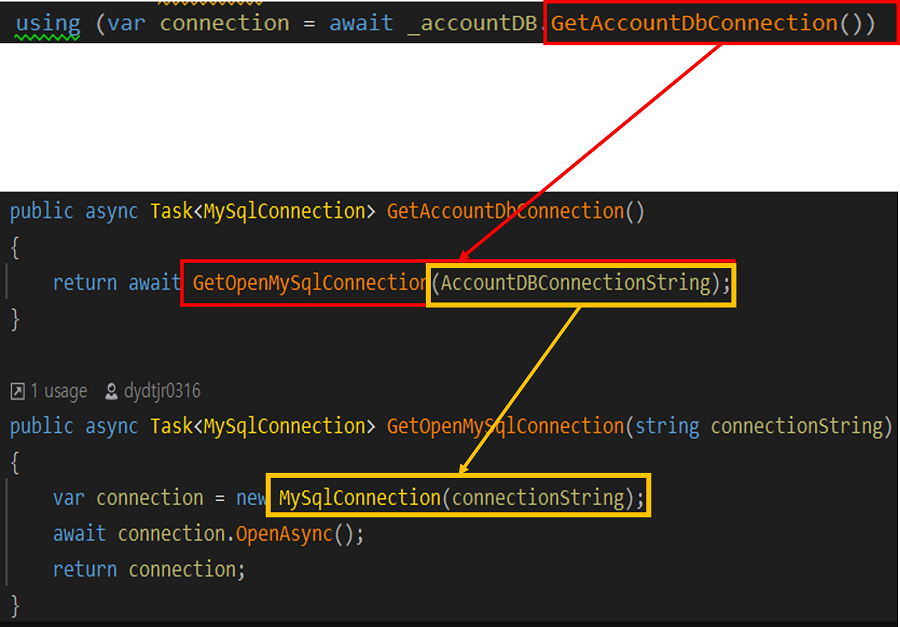
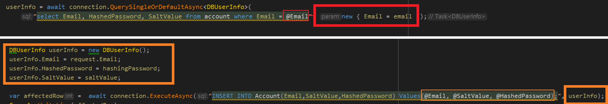
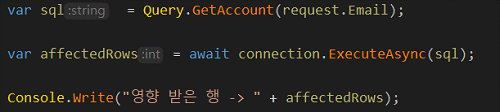
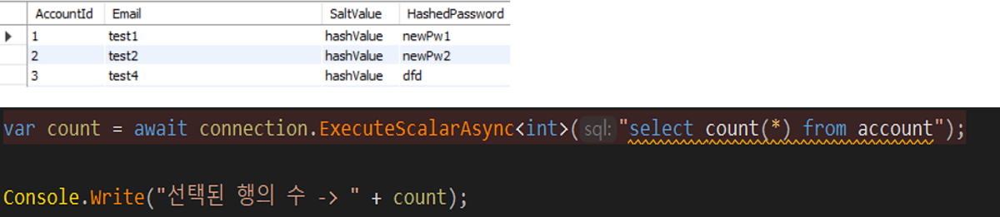
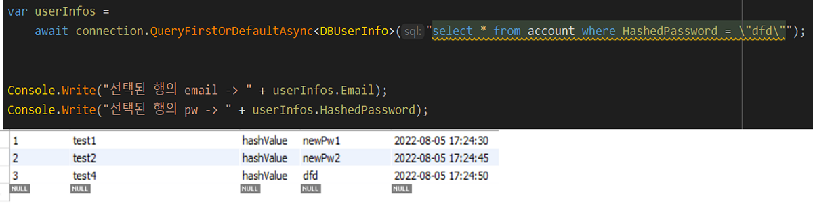
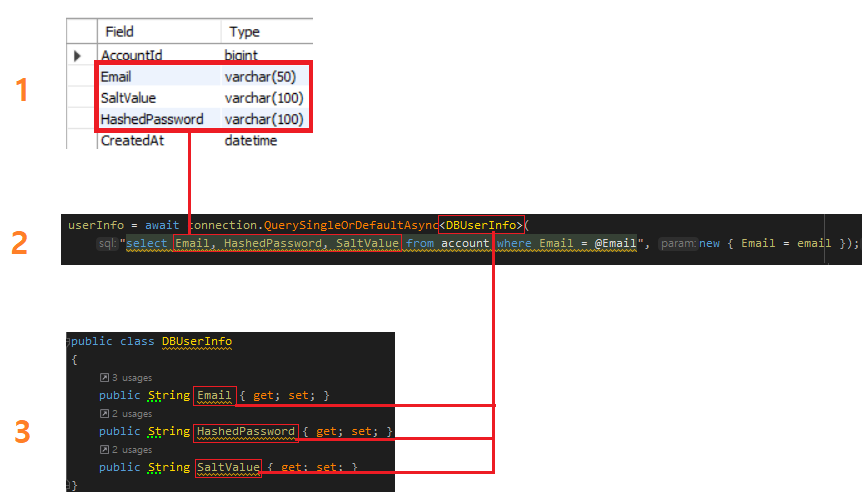
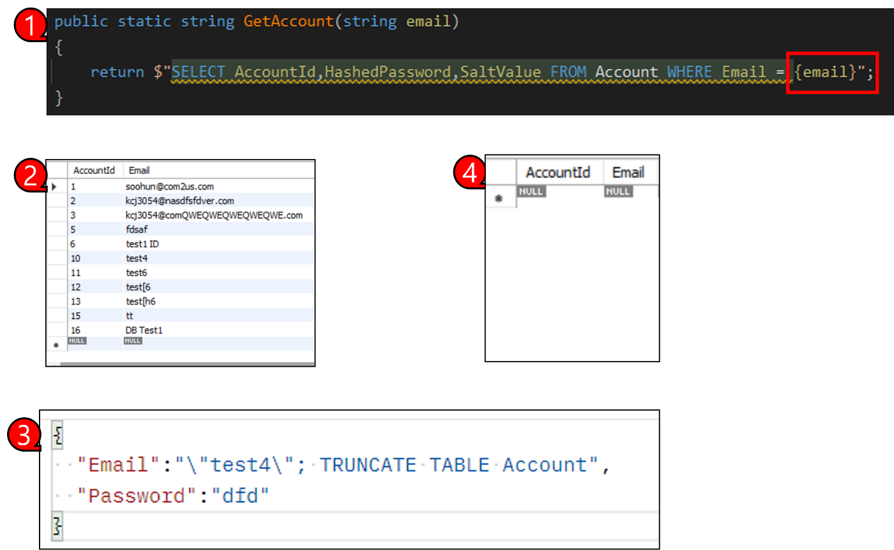
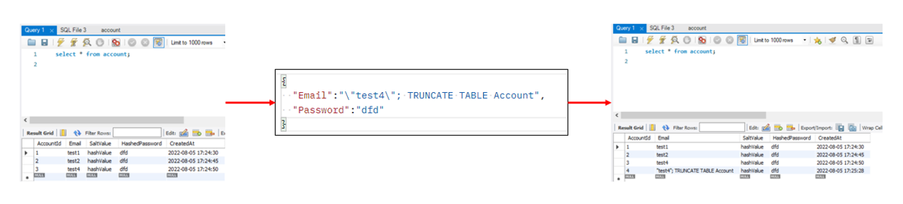

# Dapper
# 추가할 내용


---
## 목차
1. [Dapper](#Dapper)
2. [설치](#설치)
3. [연결](#연결)
4. [쿼리](#쿼리)
   * [선행](#선행)
   * [Execute와 ExecuteAsync](#Execute와-ExecuteAsync)
   * [ExcuteScalar와 ExcuteScalarAsync](#ExcuteScalar와-ExcuteScalarAsync)
   * [단일 행 선택 쿼리](#단일-행-선택-쿼리)
   * [여러 행 선택 쿼리](#여러-행-선택-쿼리)
5. [SQL Injection](#SQL-Injection)
   * [악용예시](#악용예시)
   * [실제 SQL Injection Test](#실제-SQL-Injection-Test)
   * [대응방안](#대응방안)
6. [예시 코드](#실장님-예시-코드)
   * [쿼리 갯수 얻기](#쿼리-갯수-얻기)
   * [쿼리 인자 사용](#쿼리-인자-사용)
   * [매핑에 다이나믹 타입 사용](#매핑에-다이나믹-타입-사용)
   * [하나의 쿼리에 두 개의 객체를 맵핑할 때](#하나의-쿼리에-두-개의-객체를-맵핑할-때)
   * [insert](#insert)
   * [Execute a Command that returns no results](#Execute-a-Command-that-returns-no-results)
   * [Multiple Results](#Multiple-Results)
   * [Execute](#Execute)
   * [Update](#Update)
   * [Delete](#Delete)
   * [Stored Procedures](#Stored-Procedures)
   * [Stored Procedures 인자에 객체 사용](#Stored-Procedures-인자에-객체-사용)
   * [Transaction](#Transaction)
   * [Ansi Strings and varchar](#Ansi-Strings-and-varchar)
   * [SQL Server의 time 타입](#SQL-Server의-time-타입)
   * [async await](#async-await)
   * [SP Time Parameter](#SP-Time-Parameter)
   * [SP class 결과 타입](#SP-class-결과-타입)
   * [SP 트랜잭션 사용](#SP-트랜잭션-사용)
   * [SP ReturnQueryMultiple](#SP-ReturnQueryMultiple)
   * [SP TVP 데이터 값 파라미터 멀티 리턴 datetime 사용](#SP-TVP-데이터-값-파라미터-멀티-리턴-datetime-사용)
   * [SP 테이블 파라미터](#SP-테이블-파라미터)
   * [SP DataTable Parameters With Extended Property](#SP-DataTable-Parameters-With-Extended-Property)
   * [SP 크기 제한이 있는 파라미터 사용](#SP-크기-제한이-있는-파라미터-사용)
   * [ASP NET Core에서 사용한 예](#ASP-NET-Core에서-사용한-예)

예시로 설명해 놓은 메서드 말고도 많은 메서드들이 있는데 상황에 맞게 사용할 수 있도록 아래 참고 자료들을 확인해보고
해당 교육자료에서는 몇가지만 테스트 해보고 연습 프로젝트를 만들며 연결해 본다.
* https://dapper-tutorial.net/dapper
* https://www.learndapper.com/
* https://gist.github.com/jacking75/21ec0c29bda2af62be9985f628125e00    
---
  
<br>    

## Dapper
OOP에서 데이터베이스를 쉽게 사용하기 위한 ORM(Object-Relational Mapping)도구

* ORM
````
객체지향 프로그래밍 언어에서 사용하는 데이터 타입과 데이터베이스에서 사용하는 데이터 타입은 매칭되지 않기 때문에
데이터베이스에 데이터를 요청하거나 보낼 때 데이터 타입 변환을 해줘야 하는데 이러한 작업은 시간이 많이 들어간다 따라서 데이터베이스에서 받은 
데이터 타입을 객체지향 언어에서 이해할 수 있는 데이터 타입으로 변환해주는 것이 ORM의 역할이라 볼 수 있다.
````
* 장점 
````
1. 개발이 간단하고 속도가 빠르다.
2. Stack Overflow 팀에서 유지보수를 진행하기 때문에 상당히 많은 Extension 들이 존재한다.
3. ADO.NET 을 기반으로 Data to Strong typed Entity 로 전환만 제공하므로 가볍다.
4. 초기 진입 장벽이 거의 없다.
5. 코드 라인 수가 감소한다는 이점도 있는Dapper에게 단순히 파라미터와 쿼리문만 주면 되기 때문
6. Dapper는 기본적으로 쿼리 결과를 buffer에 담아서 반환하기 때문에 대부분의 경우 db에 락을 적게 발생시켜서 좋다.
   * 다만 쿼리 결과의 양이 엄청나게 많을 때는 buffer 크기를 벗어나서 실패가 발생할 수도 있다.
   
많은 장점중 성능과 편의성이 Dapper를 사용하는 가장 큰 이유이다.
````
* 단점
````
1. 직접 쿼리를 짜야하므로 도메인 구조가 바뀌면 쿼리도 같이 바꿔줘야 하는 경우가 있다.
2. 하나의 Row 가 하나의 Entity에 Mapping 되므로 Nested Entity 등의 복잡한 구조는 추가적인 작업을 해 줘야 한다.
````
  
<br>    

## 설치

````
프로젝트 아래의 NuGet창을 선택한 후 Dapper, MySqlConnector 항목을 다운 받는다.
````
---  
  
<br>  

## 연결

````
AccountDB(예시로 든 DB 클래스) 의 Init에서는 string address를 넘겨 받아 Db연결의 주소와 옵션으로 사용하는데
appsettings.Development.json에 작성한 정보를 가져와 init의 매개변수로 넘겨주기 위해 IConfigureation객체의 GetSection 메서드를 사용한다.

위 사진에서 보듯이 builder.Configuration.GetSection("DbConnection")["MySqlAccount"]의 return값은 appsettings.Development.json에 작성된 
데이터 임을 확인할 수 있다.
````

```C#
앞서 세팅된 값을 통해 DB와의 연결 작업을 하게되는데 return 되는 MysqlConnection 객체를 사용해 Query문을 실행하는 여러 메서드를 호출한다.

-예시-
connection.ExecuteAsync("INSERT INTO Account(Email,SaltValue,HashedPassword) Values(@Email, @SaltValue, @HashedPassword);", userInfo);
````
---
  
<br>  

## 쿼리 
  
### 선행
````
쿼리문에 대한 실습을 진행하기 전 몇가지 알고가면 이해가 편한 몇가지에 대해 간단하게 설명하고 진행한 후 자료 후반에 작성한 자료를 통해 더 많은 예시를 알아 보도록 할것이다.
````
* 쿼리문에 사용자 입력 데이터를 매개 변수화 하여 입력 하는 방식


```C#
위와 같은 방식으로 사용자 입력 데이터(string email)을 쿼리문에 세팅하게 되면 email의 데이터가 문자그대로 치환되기 때문에
SQL Injection 공격에 매우 취약하다. 

SQL Injection에 대해선 추후에 설명하기로 하고 그 전까지 쿼리실행 메서드 사용방식에 대해서 이해하기 위해
SQL Injection을 방어하기 위한 방식으로 코드를 작성해 보겠다.
```

```C#
빨간색 박스는 object를 생성하여 인자로 넘겨주는 방식이고
주황색 박스는 DBUserInfo라는 class를 넘겨주는 방식이다. 

빨간색 박스가 있는 사진과 주황색 박스가 있는 사진은 같은 기능을 하는데 결국은 쿼리 실행 메서드에서 object로 사용되며
new { Email = email }의 email 데이터가 ~~ where Email = @Email 의 @Email에 매칭되게 된다.

주황색 박스도 동일하게 매칭된다.

이런식으로 사용자 입력 데이터를 넘겨주는 방식을 매개변수화된 쿼리 라고 하는데 이또한 추후에 SQL Injection파트에서 다루기로하고
이렇게 사용한다 정도만 이해하고 넘어가도록 하자

다만 Object는 부하가 큰 작업인 박싱/언박싱을 수행하기 때문에 성능적으로 좋지 않으므로 될 수 있으면 class를 생성하여 데이터를 넣어준다.
```
---  
  
  
### Execute와 ExecuteAsync

````
* Execute/ExecuteAsync 메서드는 해당 SQL문을 실행하고 그에 따라 영향 받은 행의 개수를 리턴한다.
* 위의 예시코드에서는 SELECT문을 실행 중이기 때문에 "영향 받은 행 -> -1"이 출력된다.
 ````

````
* 여러 개의 SQL을 실행하려면 사진과 같이 코드를 작성한다.
* 해당 코드를 실행할 경우 Before, After를 확인해본 결과 test1, test2의 Pw가 Update 된 것을 볼 수 있다.
* 그에 따라 영향 받은 행은 2개로 카운트 되는 것도 확인 가능하다.
````
---  
  

### ExcuteScalar와 ExcuteScalarAsync

````
* 해당 메서드들은 스칼라 함수에 대한 단일 결과를 return 하는 기능을 하는데 Scalar함수에는 count, datetime등이 있으며 
자세한 내용은 아래 링크를 참조한다.
* 위의 예시에서는 3이 return된다.
````
[참고]https://121202.tistory.com/22

---  

  
### 단일 행 선택 쿼리
  
  
#### 예시 - QueryFirstOrDefaultAsync

````
하나 이상의 행 중 첫 번째 행을 반환하며 찾을 수 없는 경우 해당 유형의 기본값을 반환하는 기능 
````
````
* 현재 DB에 Pw가 dfd인 경우는 test4, "test4";TRUNCATE~~ 이렇게 두가지가 있는데 이 중 먼저 검색되는 test4의 데이터가 반환된다.
* 즉 결과로 리턴되는 userInfos의 Email은 test4이고 Pw는 dfd이다.
* 만약 결과 값이 없다면 NULL이 return된다.
````

````C#
1 <-> 2 의 연결의 경우 처럼 Query는 당연히 일치 시켜줘야 하고

위 사진의 2번 자료와 같이 T type(이하 DBUserInfo) 으로 반환 해야 하는 경우 
Column명과 DBUserInfo이 일치해야  Query 실행의 결과로 select한 데이터를 DBUserInfo 객체에
Mapping하여 return해 줄 수 있다.
````
  

### 여러 행 선택 쿼리

### 예시 - QueryAsync

````
여러 행을 선택해야 할 경우 앞선 장에서 설명한 메서드를 사용하여 다음과 같이 여러 개의 데이터를 가져 올 수 있다.
````
---   
  
<br>  

## SQL Injection
````
* SQL Injection이란 데이터베이스에 대해 승인되지 않은 SQL 명령을 실행하는 기술 이다.
* 일반적으로 사용자 입력을 받아 애플리케이션 코드 기반의 일부를 형성하는 방식으로 구현되어 있는 SQL문에 발생한다.
````
참고 : https://www.learndapper.com/parameters
  

### 악용예시

````
* 위는 악의적인 사용자가 입력의 끝에 drop table AspNetUsers—와 같은 코드를 추가한 경우이다.
* 해당 경우에는 AspNetUsers table이 사라지는 상황이 발생하게된다.
````  
  

### 실제 SQL Injection Test

```C#
실제로 공격을 시도해 볼 것 인데 위에서 설명한 악용 예시와 같이 테이블을 초기화 하는 공격을 진행해 볼 것이다.

1번과 같은 쿼리문에 공격을 진행할 것이며

2번 그림처럼 미리 DB의 전체 데이터를 조회해서 데이터가 있는 것을 확인한다.

3번 그림처럼 Postman을 통해 Post요청으로 Email란에 "\"test4\"; TRUNCATE TABLE Account"를 작성하고 요청을 보낸다.

4번 그림처럼 테이블의 데이터가 초기화 된 것을 볼 수 있다.
```  
   

### 대응방안
````
대응 방안에 대해서는 이론적으로만 이해하고 연습 프로잭트 진행과정에서 테스트 해보기로 한다.

아래에 Dapper 공식 홈페이지에 기재된 번역본의 내용을 빌려 설명하자면 
매개변수화 된 쿼리를 만들어 SQL Injection 공격에 대응합니다.
쿼리에 필요한 Data(User 입력 데이터)를 자리 표시자 형식(@Data)을 사용해매개변수화 하여 전달하게 되면 단순 문자열 치환이 아니라 별도의 명령문으로 전달되게 되어
주입된 쿼리를 실행할 수 없게 합니다. 
````

````
SQL Injection에 대응하는 방법 중 하나는 ‘매개변수화 된 쿼리’를 사용하는 것이며 1,2번 모두 쿼리를 매개변수화 시키는 과정이다.
````
  
* Dapper 공식 홈페이지에 기재된 내용
https://www.learndapper.com/parameters
````
DbCommand매개변수는 SQL 명령에서 자리 표시자로 표시되고 값은 개체 Parameters컬렉션 내의 명령으로 전달됩니다 . 
자리 표시자의 형식은 공급자가 지원하는 항목에 따라 다릅니다. 공급자는 이름 이 SqlClient지정된 매개변수를 지원하며 매개변수 이름 앞에 @문자가 붙습니다.
OleDb공급자는 위치 매개변수를 지원하며 값은 매개변수 컬렉션에 추가된 순서와 자리 표시자가 SQL에 나타나는 순서를 일치시키는 것을 기반으로 SQL 명령에 전달됩니다.
매개변수 자리 표시자는 자리 표시자 이름이 데이터베이스 개체 이름(열, 테이블 등)과 일치하지 않는 한 아무 이름이나 지정할 수 있습니다.

Dapper는 DynamicParameters매개변수 값의 "가방"을 나타내는 클래스도 제공합니다. 
객체를 생성자에 전달할 수 있습니다. 
적합한 개체는 다음과 Dictionary<string, object>같습니다.
````
  

  
````
매개변수화 된 쿼리 방식을 사용하여 다시 한번 이전과 똑같은 SQL Injection공격을 시도하게 되면 이전과는 다르게
TRUNCATE TABLE Account 명령이 실행 되지 않았으며 
Email에 "\"test4\"; TRUNCATE TABLE Account"라는 문자열이 삽입된 것을 볼 수 있다
````
  

### 쿼리 갯수 얻기
```C#
public class Product
{
  public int ProductId { get; set; }
  public string Name { get; set; }
  public string ProductNumber { get; set; }
}

using (var connection = connectionFactory())
{
  var result = connection.Query<int>("select count(*) from Product").Single();
  Console.WriteLine(result + " products.");
}
```
  
  
### 쿼리 인자 사용

```C#
using (var connection = connectionFactory())
{
  var result = connection.Query<Product>(
          "select * from Product where ListPrice between @low and @high",
          new { low = 10.0, high = 100.0 });

  Console.WriteLine("-- simple mapping:" + result.Count());

  foreach (var p in result)
  {
      Console.WriteLine(string.Format("ID:{0},Name:{1}", p.ProductId, p.Name));
  }
}
```
  
  
### 매핑에 다이나믹 타입 사용

```C#
using (var connection = connectionFactory())
{
  var result = connection.Query(
          "select * from Product where ListPrice between @low and @high",
          new { low = 10.0, high = 100.0 });

  Console.WriteLine("-- dynamic mapping:" + result.Count());

  foreach (var p in result)
  {
      Console.WriteLine(string.Format("ID:{0},Name:{1},Price:{2}", p.ProductID, p.Name, p.ListPrice));
  }
}
```
  
  
### 하나의 쿼리에 두 개의 객체를 맵핑할 때

```C#
class Book {
    public string Isbn { get; set; }
    public string Title { get; set; }
}

class Order {
    public int Id { get; set; }
    public DateTime Date { get; set; }
    public Book Book { get; set; }
}
```

```C#
var orders = connection.Query<Order, Book, Order>(@"
                        select
                          1 as Id,
                          '2013/02/16' as Date,
                          '0001234567890' as Isbn,
                          '굉장한 책' as Title;",
                            (order, book) => {
                                order.Book = book;
                                return order;
                            },
                            // "Isbn" 부터 Book에 맵핑한다
                         splitOn: "Isbn");
foreach(var order in orders)
{
    Console.WriteLine("{0} {1:d} {2} {3}", order.Id, order.Date, order.Book.Isbn, order.Book.Title);
}
```
````
결과  
1 2013/02/16 0001234567890 굉장한 책
````
  

### insert

```C#
var affected_rows = connection.Execute(
    @"insert MyTable(colA, colB) values (@a, @b)",
    new[] { // 파라메터를 배열로 하면 복수 행을 insert 할 수 있다.
        new { a=1, b=1 },
        new { a=2, b=2 },
        new { a=3, b=3 }
    }
);
```
  
  
### Execute a Command that returns no results

```C#
connection.Execute(@"
                      set nocount on
                      create table #t(i int)
                      set nocount off
                      insert #t
                      select @a a union all select @b
                      set nocount on
                      drop table #t", new {a=1, b=2 })
                       .IsEqualTo(2);
```


### Multiple Results

```C#
var sql = @"select * from Customers where CustomerId = @id
            select * from Orders where CustomerId = @id
            select * from Returns where CustomerId = @id";

using (var multi = connection.QueryMultiple(sql, new {id=selectedId}))
{
   var customer = multi.Read<Customer>().Single();
   var orders = multi.Read<Order>().ToList();
   var returns = multi.Read<Return>().ToList();
   ...
}
```


### Execute

```C#
//Execute
public class Category
{
    public int Id { get; set; }
    public string Name { get; set; }
    public DateTime ModifiedOn { get; set; }
}

public class SubCategory : Category
{
    public int CategoryId { get; set; }
}

public int InsertSubCategory(SubCategory subCategory)
{
    using (IDbConnection connection = OpenConnection())
    {
        const string query =
          "INSERT INTO Production.ProductSubcategory(ProductCategoryID, [Name]) " + "VALUES (@CategoryId, @Name)";

        int rowsAffectd = connection.Execute(query, subCategory);
        SetIdentity<int>(connection, id => subCategory.Id = id);
        return rowsAffectd;
    }
}
```


### Update

```C#
public int UpdateSubCategory(SubCategory subCategory)
{
    using (IDbConnection connection = OpenConnection())
    {

        const string query = "UPDATE Production.ProductSubcategory " +
                             "SET ProductCategoryID = @CategoryId, " +
                             "[Name] = @Name, " +
                             "ModifiedDate = @ModifiedOn " +
                             "WHERE ProductSubcategoryID = @Id";
        return connection.Execute(query, subCategory);
    }
}
```


### Delete

```C#
public int DeleteSubCategory(SubCategory subCategory)
{
    using (IDbConnection connection = OpenConnection())
    {
        const string query = "DELETE FROM Production.ProductSubcategory " +
                             "WHERE ProductSubcategoryID = @Id";
        return connection.Execute(query, subCategory);
    }
}
```


### Stored Procedures

```C#
var user = cnn.Query<User>("spGetUser", new {Id = 1}, 
	commandType: CommandType.StoredProcedure).First();}}}

var p = new DynamicParameters();
p.Add("@a", 11);
p.Add("@b", dbType: DbType.Int32, direction: ParameterDirection.Output);
p.Add("@c", dbType: DbType.Int32, direction: ParameterDirection.ReturnValue);
cnn.Execute("spMagicProc", p, commandType: commandType.StoredProcedure);

int b = p.Get<int>("@b");
int c = p.Get<int>("@c");
```


### Stored Procedures 인자에 객체 사용

```C#
public void TestProcWithOutAndReturnParameter()
{
   connection.Execute(
        @"CREATE PROCEDURE #TestProcWithOutAndReturnParameter
        @ID int output,
        @Foo varchar(100),
        @Bar int
        AS
        SET @ID = @Bar + LEN(@Foo)
        RETURN 42");
            var obj = new
            {
                ID = 0,
                Foo = "abc",
                Bar = 4
            };

   var args = new DynamicParameters(obj);
   args.Add("ID", 0, direction: ParameterDirection.Output);
   args.Add("result", 0, direction: ParameterDirection.ReturnValue);
   connection.Execute("#TestProcWithOutAndReturnParameter", args, commandType: CommandType.StoredProcedure);
   args.Get<int>("ID").IsEqualTo(7);
   args.Get<int>("result").IsEqualTo(42);
}
```


### Transaction

```C#
public int DeleteProduct(Product product)
{
    using (IDbConnection connection = OpenConnection())
    {
        const string deleteImageQuery = "DELETE FROM Production.ProductProductPhoto " + "WHERE ProductID = @ProductID";

        const string deleteProductQuery = "DELETE FROM Production.Product " +
                                          "WHERE ProductID = @ProductID";

        IDbTransaction transaction = connection.BeginTransaction();

        int rowsAffected = connection.Execute(deleteImageQuery,
            new { ProductID = product.ProductID }, transaction);
        rowsAffected += connection.Execute(deleteProductQuery,
            new { ProductID = product.ProductID }, transaction);

        transaction.Commit();
        return rowsAffected;
    }
}
```


### Ansi Strings and varchar

```C#
Query<Thing>("select * from Thing where Name = @Name", 
                new {Name = new DbString { Value = "abcde", IsFixedLength = true, Length = 10, IsAnsi = true });
```


### SQL Server의 time 타입

- 테이블
```
CREATE TABLE [work_time_range](
    [id] [nvarchar](50) NOT NULL,
    [start_time] [time](7) NULL,
    [end_time] [time](7) NULL
)
```

- 테이블과 매핑 될 클래스
```
public class WorkTimeRange
{
    public string Id { get; set; }
    public TimeSpan StartTime { get; set; }
    public TimeSpan EndTime { get; set; }
}
```


## async await
- https://github.com/StackExchange/Dapper/blob/main/tests/Dapper.Tests/AsyncTests.cs

```C#
public async Task<List<Artist>> GetAllAsync()
{
    using (var conn = Connection(Conn.String))
    {
        await conn.OpenAsync();

        using (var multi = await conn.QueryMultipleAsync(StoredProcs.Artists.GetAll, commandType: CommandType.StoredProcedure))
        {
            var Artists = multi.Read<Artist, AlbumArtist, Artist>((artist, albumArtist) =>
            {
                artist.albumArtist = albumArtist;
                return artist;
            }).ToList();

            var albums = multi.Read<Album, AlbumArtist, Album>(
            (album, albumArtist, album) =>
            {
                album.albumArtist = album;
                return albums;
            }).ToList();


            conn.Close();

            return Artists;
        }
    }
}
```


### SP Time Parameter

```C#
public void TestProcedureWithTimeParameter()
{
	var p = new DynamicParameters();
	p.Add("a", TimeSpan.FromHours(10), dbType: DbType.Time);

	connection.Execute(@"CREATE PROCEDURE #TestProcWithTimeParameter
                    @a TIME
                    AS
                    BEGIN
                    SELECT @a
                    END");
	connection.Query<TimeSpan>("#TestProcWithTimeParameter", p, commandType: CommandType.StoredProcedure).First().IsEqualTo(new TimeSpan(10, 0, 0));
}
```


### SP class 결과 타입

```C#
public void SO24605346_ProcsAndStrings()
{
	connection.Execute(@"create proc #GetPracticeRebateOrderByInvoiceNumber @TaxInvoiceNumber nvarchar(20) as
								select @TaxInvoiceNumber as [fTaxInvoiceNumber]");
	string InvoiceNumber = "INV0000000028PPN";
	var result = connection.Query<PracticeRebateOrders>("#GetPracticeRebateOrderByInvoiceNumber", new
	{
		TaxInvoiceNumber = InvoiceNumber
	}, commandType: CommandType.StoredProcedure).FirstOrDefault();

	result.TaxInvoiceNumber.IsEqualTo("INV0000000028PPN");
}

class PracticeRebateOrders
{
	public string fTaxInvoiceNumber;
#if EXTERNALS
	[System.Xml.Serialization.XmlElementAttribute(Form = System.Xml.Schema.XmlSchemaForm.Unqualified)]
#endif
	public string TaxInvoiceNumber { get { return fTaxInvoiceNumber; } set { fTaxInvoiceNumber = value; } }
}
```


### SP 트랜잭션 사용

```C#
public void SO25069578_DynamicParams_Procs()
{
	var parameters = new DynamicParameters();
	parameters.Add("foo", "bar");
	// parameters = new DynamicParameters(parameters);

	connection.Execute("create proc SO25069578 @foo nvarchar(max) as select @foo as [X]");
	var tran = connection.BeginTransaction(); // gist used transaction; behaves the same either way, though
	var row = connection.Query<HazX>("SO25069578", parameters,
		commandType: CommandType.StoredProcedure, transaction: tran).Single();
	tran.Rollback();
	row.X.IsEqualTo("bar");
}
```


### SP ReturnQueryMultiple

```C#
public void Issue268_ReturnQueryMultiple()
{
	connection.Execute(@"create proc #TestProc268 (@a int, @b int, @c int)as
						begin
						select @a;
						select @b
						return @c;
						end");


	var p = new DynamicParameters(new { a = 1, b = 2, c = 3 });
	p.Add("RetVal", dbType: DbType.Int32, direction: ParameterDirection.ReturnValue);

	using (var reader = connection.QueryMultiple("#TestProc268", p, commandType: CommandType.StoredProcedure))
	{
		reader.Read();
	}
	var retVal = p.Get<int>("RetVal");
	retVal.IsEqualTo(3);
}
```


### SP TVP 이터 값 파라미터 멀티 리턴 datetime 사용
- [TVP](https://msdn.microsoft.com/ja-jp/library/bb510489(v=sql.120).aspx)

```C#
connection.Execute("CREATE TYPE int_list_type AS TABLE (n int NOT NULL PRIMARY KEY)");
connection.Execute("CREATE PROC get_values @ints int_list_type READONLY, @stringParam varchar(20), @dateParam datetime AS select i.*, @stringParam as stringParam, @dateParam as dateParam from @ints i");

var dynamicParameters = new DynamicParameterWithIntTVP(new int[] { 1, 2, 3 });
dynamicParameters.AddDynamicParams(new { stringParam = "stringParam", dateParam = new DateTime(2012, 1, 1) });

var results = connection.Query("get_values", dynamicParameters, commandType: CommandType.StoredProcedure).ToList();
results.Count.IsEqualTo(3);
for (int i = 0; i < results.Count; i++)
{
	var result = results[i];
	Assert.IsEqualTo(i + 1, result.n);
	Assert.IsEqualTo("stringParam", result.stringParam);
	Assert.IsEqualTo(new DateTime(2012, 1, 1), result.dateParam);
}
```


### SP 테이블 파라미터

```C#
public void SO29533765_DataTableParametersViaDynamicParameters()
{
	connection.Execute("create type MyTVPType as table (id int)");
	connection.Execute("create proc #DataTableParameters @ids MyTVPType readonly as select count(1) from @ids");

	var table = new DataTable { TableName="MyTVPType", Columns = { { "id", typeof(int) } }, Rows = { { 1 }, { 2 }, { 3 } } };
	table.SetTypeName(table.TableName); // per SO29533765
	IDictionary<string, object> args = new Dictionary<string, object>();
	args.Add("ids", table);
	int count = connection.Query<int>("#DataTableParameters", args, commandType: CommandType.StoredProcedure).First();
	count.IsEqualTo(3);

	count = connection.Query<int>("select count(1) from @ids", args).First();
	count.IsEqualTo(3);
}
```


### SP DataTable Parameters With Extended Property

```C#
public void DataTableParametersWithExtendedProperty()
{
	connection.Execute("create type MyTVPType as table (id int)");
	connection.Execute("create proc #DataTableParameters @ids MyTVPType readonly as select count(1) from @ids");

	var table = new DataTable { Columns = { { "id", typeof(int) } }, Rows = { { 1 }, { 2 }, { 3 } } };
	table.SetTypeName("MyTVPType"); // <== extended metadata
	int count = connection.Query<int>("#DataTableParameters", new { ids = table }, commandType: CommandType.StoredProcedure).First();
	count.IsEqualTo(3);

	count = connection.Query<int>("select count(1) from @ids", new { ids = table }).First();
	count.IsEqualTo(3);

	try
	{
		connection.Query<int>("select count(1) from @ids", new { ids = table }).First();
		throw new InvalidOperationException();
	}
	catch (Exception ex)
	{
		ex.Message.Equals("The table type parameter 'ids' must have a valid type name.");
	}
}
```


## SP 크기 제한이 있는 파라미터 사용

```C#
public void TestIssue17648290()
{
	var p = new DynamicParameters();
	int code = 1, getMessageControlId = 2;
	p.Add("@Code", code);
	p.Add("@MessageControlID", getMessageControlId);
	p.Add("@SuccessCode", dbType: DbType.Int32, direction: ParameterDirection.Output);
	p.Add("@ErrorDescription", dbType: DbType.String, direction: ParameterDirection.Output, size: 255);
	connection.Execute(@"CREATE PROCEDURE #up_MessageProcessed_get
							@Code varchar(10),
							@MessageControlID varchar(22),
							@SuccessCode int OUTPUT,
							@ErrorDescription varchar(255) OUTPUT
							AS
							BEGIN
							Select 2 as MessageProcessID, 38349348 as StartNum, 3874900 as EndNum, GETDATE() as StartDate, GETDATE() as EndDate
							SET @SuccessCode = 0
							SET @ErrorDescription = 'Completed successfully'
							END");
	var result = connection.Query(sql: "#up_MessageProcessed_get", param: p, commandType: CommandType.StoredProcedure);
	var row = result.Single();
	((int)row.MessageProcessID).IsEqualTo(2);
	((int)row.StartNum).IsEqualTo(38349348);
	((int)row.EndNum).IsEqualTo(3874900);
	DateTime startDate = row.StartDate, endDate = row.EndDate;
	p.Get<int>("SuccessCode").IsEqualTo(0);
	p.Get<string>("ErrorDescription").IsEqualTo("Completed successfully");
}
```


## ASP NET Core에서 사용한 예
연결 객체 코드
```C#
using MySqlConnector;
using Dapper;

public static MySqlConnection GetOpenMySqlConnection(string connectionString)
{
    var connection = new MySqlConnection(connectionString);
    connection.Open();

    return connection;
}
```

- 계정 생성
```C#
using (MySqlConnection connection = GetOpenMySqlConnection(Startup.mySqlAccountString))
{
	try
	{
		await connection.ExecuteAsync("INSERT INTO user(Id,Pw,Nickname,Sex,Age,Salt) SELECT  @id, @password,  @nickname,  @sex,  @age ,@salt FROM DUAL " +
			"WHERE EXISTS(select count(*) from user where Id = @id or Nickname = @nickname)",
		new
		{
			id = user.Id,
			password = hashingPassword,
			nickname = user.Nickname,
			sex = user.Sex,
			age = user.Age,
			salt = saltValue
		});
		getUserNo = await connection.QuerySingleAsync<int>("select UserNo from user where Id = @id", new { id = user.Id });
	}
	catch
	{
		return new Confirm
		{
			Message = ErrorCode.fail
		};
	}
}
```

- SP를 사용하여 유저 정보 로딩
```C#
using (MySqlConnection connection = GetOpenMySqlConnection(Startup.mySqlGameString))
{
	try
	{
		var procedure = new DynamicParameters();
		procedure.Add("@UserNoValue", getUserNo);
		procedure.Add("@KindValue", ItemInfoList.accountGiftNum);
		procedure.Add("@ContentValue", ItemInfoList.accountGiftContent);
		procedure.Add("@MailReceiveDateValue", System.DateTime.Now.ToString("yyyy-MM-dd"));
		procedure.Add("@ItemCountValue", ItemInfoList.accountGiftCount);
		procedure.Add("@SenderNoValue", ItemInfoList.managerNum);

		await connection.ExecuteAsync("accountSetting", procedure, commandType: CommandType.StoredProcedure);

		return new Confirm
		{
			Message = ErrorCode.none
		};
	}
	catch
	{
		return new Confirm
		{
			Message = ErrorCode.fail
		};
	}
}
```

- 메일 데이터 로딩
```C#
public override async Task<MailList> Mail(Account request, ServerCallContext context)
{
	using (MySqlConnection connection = GetOpenMySqlConnection(Startup.mySqlGameString))
	{
		var mailInfoResult = await connection.QueryAsync<MailInfo>("select SenderNo, UserNo, Content, Kind, MailReceiveDate, ItemCount," +
			" MailIdx from userMail where UserNo = @userNO", new { userNO = request.IdNo });
		MailList res = new MailList { };
		res.MailInfo.AddRange(mailInfoResult.ToList());

		return res;
	}
}
```

- 메일에서 아이템 받기
```C#
public override async Task<Confirm> GetMailItem(ItemInfo itemInfo, ServerCallContext context)
{
	using (MySqlConnection connection = GetOpenMySqlConnection(Startup.mySqlGameString))
	{
		try
		{
			var procedure = new DynamicParameters();
			procedure.Add("@itemidvalue", itemInfo.ItemId);
			procedure.Add("@usernovalue", itemInfo.UserNo);
			procedure.Add("@itemcountvalue", itemInfo.ItemCount);
			procedure.Add("@mailindexvalue", itemInfo.MailIdx);

			await connection.ExecuteAsync("getItemPro", procedure, commandType: CommandType.StoredProcedure);

			return new Confirm
			{
				Message = ErrorCode.none
			};
		}
		catch
		{
			return new Confirm
			{
				Message = ErrorCode.fail
			};
		}
	}
}
```

- 친구 신청
```C#
using (MySqlConnection connection = GetOpenMySqlConnection(Startup.mySqlGameString))
{
	try
	{
		await connection.ExecuteAsync("insert into userFriendList(LowIndex,HighIndex) select @Lowindex,@Highindex from dual where exists(select count(*) from userFriendList where LowIndex = @Lowindex and HighIndex = @Highindex)",
			new
			{
				Lowindex = lowindex,
				Highindex = highindex
			});

		return new Confirm
		{
			Message = ErrorCode.none
		};

	}
	catch
	{
		return new Confirm
		{
			Message = ErrorCode.fail
		};
	}
}
```

- 출석 처리
```C#
public override async Task<Confirm> Attendance(Account account, ServerCallContext context)
{       
	string nowAttendanceDate = System.DateTime.Now.ToString("yyyy-MM-dd");
	using (MySqlConnection connection = GetOpenMySqlConnection(Startup.mySqlGameString))
	{
		var procedure = new DynamicParameters();
		procedure.Add("@idvalue", account.IdNo);
		procedure.Add("@datevalue", nowAttendanceDate);
		procedure.Add("@sender", ItemInfoList.managerNum);
		procedure.Add("@Content", ItemInfoList.sevenDaysAttendanceGiftContent);
		procedure.Add("@Kind", ItemInfoList.sevenDaysAttendanceGiftNum);
		procedure.Add("@itemCount", ItemInfoList.sevenDaysAttendanceGiftCount);
		procedure.Add("@result", dbType: DbType.Int32, direction: ParameterDirection.Output);

		await connection.ExecuteAsync("attendanceExecute", procedure, commandType: CommandType.StoredProcedure);
		
		int resultValue = procedure.Get<int>("@result");

		if (resultValue == 101) 
		{
			return new Confirm
			{
				Message = ErrorCode.attendanceGift
			};
		}
		else if (resultValue == 0)
		{
			return new Confirm
			{
				Message = ErrorCode.none
			};
		}
		else
		{
			return new Confirm
			{
				Message = ErrorCode.fail
			};
		}
	}
}
```


