# Redis

---
## 목차
1. [Redis란](#Redis란)
2. [Redis의 특징](#Redis의-특징)
3. [설치](#설치)
4. [자료형](#자료형)
   * [문자열](#문자열)
     * [문자열 기본 명령](#문자열-기본-명령)
   * [Lists](#Lists)
   * [List를 활용한 Redis Message Queue](#List를-활용한-Redis-Message-Queue)
   * [Sorted set을 사용한 랭킹 시스템](#Sorted-set을-사용한-랭킹-시스템)
     * [명령어](#명령어)
   * [명령어 학습](#명령어-학습)
   * [트랜잭션 명령어](#트랜잭션-명령어)
   * [Pub Sub](#Pub-Sub)
     * [Pub Sub 이란](#Pub-Sub-이란)
     * [Pub Sub 명령어](#Pub-Sub-명령어)
5. [프로그래밍](#프로그래밍)
   * [CloudStructures](#CloudStructures)
   * [정수자료형 다루기](#정수자료형-다루기)
   * [키의 유효 기간 얻기](#키의-유효-기간-얻기)
   * [값을 읽고 삭제하기](#값을-읽고-삭제하기)
   * [이미 key가 있다면 요청 실패하기](#이미-key가-있다면-요청-실패하기)
   * [list 타입 조작](#list-타입-조작)
   * [Hash](#Hash)
   * [랭킹](#랭킹)
   * [지정 순위 안의 랭킹 리스트](#지정-순위-안의-랭킹-리스트)
   * [점수기반으로 순위 정렬](#점수기반으로-순위-정렬)
   * [멤버의 점수 업데이트](#멤버의-점수-업데이트)
   * [Redis로 lock을 걸고 싶을 때](#Redis로-lock을-걸고-싶을-때)
6. [전체 참고](#전체-참고)

---

## Redis란
````C#
Rdeis(Reomte Dictionary Storage)는 모든 데이터를 메모리에 저장하고 조회하는 인메모리 데이터베이스, 메모리 기반의 key-value 구조의 데이터 관리 시스템이다.
````
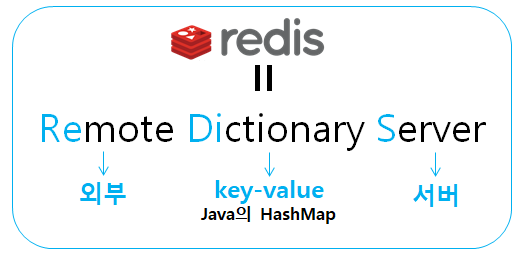  

---
## Redis의 특징
1. 다양한 자료구조 지원과 빠른 Read, Write 속도  
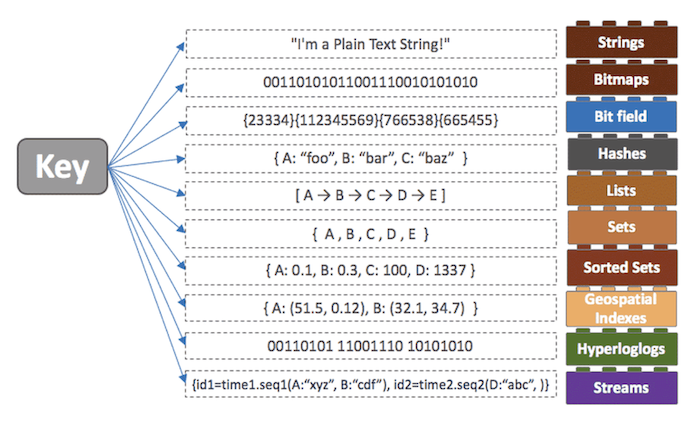

````C#
다양한 자료구조를 지원하게 되면 개발의 편의성이 좋아지고 난이도가 낮아진다.

예를들어 어떤 데이터를 정렬을 해야하는 상황이 있을 때 DBMS를 이용한다면 
DB에 데이터를 저장하고 -> 
저장된 데이터를 정렬하여 -> 
다시 읽어오는 과정은 디스크에 직접 접근
을 해야하기 때문에 시간이 더 걸린다는 단점이 있다. 

이 때 In Memory 데이터베이스인 Redis를 이용하고 레디스에서 제공하는 Sorted Set이라는 자료구조를 사용하면 더 빠르고 간단하게 데이터를 정렬할 수 있다.

그리고 메모리에 저장하기 때문에 디스크에 저장하는 데이터베이스보다 더 빠른 속도로 데이터에 접근이 가능하다.
````
2. 서버 복제 지원

````C#
Master - slave 구조로, 여러개의 복제본을 만들 수 있다. 
데이터베이스 읽기를 확장할 수 있기 때문에 높은 가용성(오랜 시간동안 고장나지 않음) 클러스터를 제공한다.

갱신이 가능한 1대를 Master로, 복제된 읽기 전용의 컴퓨터를 Slave로 구성하여 분산 환경을 만들 수 있다.
````
3. Pub / Sub messaging
````C#
Publish(발행)과 Sub(구독)방식의 메시지를 패턴 검색이 가능하다. 따라서 높은 성능을 요구하는 채팅, 실시간 스트리밍, SNS 피드 그리고 서버상호통신에 사용할 수 있다.

메시지들을 queue로 관리하지 않고, publish 하는 시점 기준으로 미리 subscribe 등록 대기 중인 클라이언트들을 대상으로만 메시지를 전달한다.
````
4. 싱글스레드
````C#
Redis는 싱글 쓰레드이기 때문에, 1번에 1개의 명령어만 실행할 수 있다. (자주 비교되는 맴캐쉬드는 멀티 스레드 지원)

Keys(저장된 모든키를 보여주는 명령어)나 flushall(모든 데이터 삭제)등의 명령어를 사용할 때, 
맴캐쉬드의 경우 1ms정도 소요되지만 레디스의 경우 100만건의 데이터 기준 1초로 엄청난 속도 차이가 있다.

즉 하나의 요청이 병목되면 그 다음 요청들이 계속 밀리기 때문에 O(N)관련 명령어를 주의해야한다. 
O(N)관련 명령어로는 위에서 언급한 Keys, flushall를 포함해 FLUSHDB, Delete COlLECTIONS, Get All Collections가 있으며 큰 컬렉션의 데이터를 다 가져오는 경우 등도 주의하자.
````
5. 데이터 영속화
````C#
레디스는 영속성을 지원하는 데이터 저장소 이다.

레디스는 데이터를 디스크에 저장하여, 영속화 시키는 기능을 갖고 있기에 메모리에 저장된 데이터가 휘발성으로 사라져 버릴 거라는 걱정을 안해도 된다.

Snapshot: 정기적으로 데이터베이스의 내용을 디스크에 쓴다. 만약 레디스를 재기동하면 이 파일부터 데이터를 불러와 복원시킨다. 
디스크에 언제 저장할 것인지 설정할 수 있다.

단, 이 때 스냅샷을 SAVE하는 시점에서 모든 명령어 수행이 제한되게 된다. 따라서 이런 문제를 막고자 백그라운드에서 스냅샷을 뜨는 BGSAVE 옵션이 존재한다.

BGSAVE를 수행할 때는 자식 프로세스를 하나 생성하여 스냅샷을 수행하기 때문에 메모리가 현재 사용량의 2배가 될 수 있음을 인지해야 한다.

Append Only File: Snapshot은 데이터가 유실될 가능성이 존재한다. AOF에서는 명령이 실행될 때 마다 명령어들을 파일에 기록하여 데이터 손실을 방지한다.
````

참고 : https://wildeveloperetrain.tistory.com/21  
참고 : https://devlog-wjdrbs96.tistory.com/374  
참고 : https://sketchofcreed.tistory.com/entry/Redis-%EA%B0%9C%EB%85%90-%EB%B0%8F-%ED%8A%B9%EC%A7%95  
참고 : https://handr95.tistory.com/6  
참고 : https://velog.io/@mu1616/%EB%A0%88%EB%94%94%EC%8A%A4-Redis%EC%9D%98-%EA%B0%9C%EB%85%90-%ED%8A%B9%EC%A7%95


---
## 설치
https://redis.io/docs/getting-started/

---
## 자료형

---
### 문자열
* 텍스트, 직렬화된 객체 및 이진 배열을 포함한 바이트 시퀀스를 저장하는 가장 기본적인 Redis 데이터 유형이다.
* 캐싱에 자주 사용되지만 Count, Bit 연산 등의 기능을 지원한다.
```C#
// 문자열을 저장하고 검색
> SET user:1 salvatore
OK

> GET user:1
"salvatore"
------------------------------------------------------------------------------------------
// 직렬화된 JSON 문자열을 저장하고 지금부터 t초 후에 만료되도록 설정한다.
> SET ticket:27 "\"{'username': 'priya', 'ticket_id': 321}\"" EX t

실제로 사용할땐 t자리에 시간을 작성한다 ex) EX 100 ->  100초후 만료
------------------------------------------------------------------------------------------
// Counting
> INCR views:page:2
(integer) 1

> INCRBY views:page:2 10
(integer) 11

첫번째 방식처럼 1을 증가시킬수도있고 두번째 방식처럼 증가시킬 값을 작성해 줄 수도 있다.
```
#### 문자열 기본 명령
| 명령어      | 기능                                 |
|----------|------------------------------------|
| SET      | 문자열 값을 저장                          |
| SETNX    | 키가 이미 존재하지 않는 경우에만 문자열 값을 저장       |
| GET      | 문자열 값을 검색                          |
| MGET     | 단일 작업에서 여러 문자열 값을 검색한다.            |

1. SET
```C#
// Option
EX 초 -- 지정된 만료 시간을 초 단위로 설정합니다.

PX 밀리초 -- 지정된 만료 시간을 밀리초 단위로 설정합니다.

EXAT timestamp-seconds -- 키가 만료되는 지정된 Unix 시간을 초 단위로 설정합니다.

PXAT timestamp-milliseconds -- 키가 만료되는 지정된 Unix 시간을 밀리초 단위로 설정합니다.

NX-- 이미 존재하지 않는 경우에만 키를 설정합니다.

XX-- 이미 존재하는 경우에만 키를 설정합니다.

KEEPTTL-- 키와 관련된 TTL(Time to Live)을 유지합니다.

GET-- key에 저장된 이전 문자열을 반환하거나 key가 존재하지 않는 경우 nil을 반환합니다. SETkey에 저장된 값이 문자열이 아니면 오류가 반환되고 중단됩니다.

// return
문자열 응답 : 올바르게 실행되었는지 여부

NULL 응답 : 조건이 충족되지 않아 작업이 수행되지 않은 경우

```

2. SETNX
```C#
SET if Not eXists의 줄임말

// return
정수 응답 
성공시 1 / 실패시 0  return

Lock의 기능구현에 많이 사용되는데 자세한 내용은 아래 링크를 참고하도록 한다.
```
참고 : https://redis.io/commands/setnx/

3. GET
```C#
// return
키가 있다면 key값
없다면 nil값 반환
만약 저장된 값이 문자열이 아니라면 오류 반환

redis:6379> GET nonexisting
 (nil)
 
 redis:6379> SET mykey "Hello"
 "OK"
 
 redis:6379> GET mykey
 "Hello"
```

4. MGET
```C#
// return
키가 있다면 key값
없다면 nil값 반환
만약 저장된 값이 문자열이 아니라면 nil 반환
그래서 실패하는 경우가 없다.


redis:6379> SET key1 "Hello"
 "OK"
 
redis:6379> SET key2 "World"
 "OK"
 
redis:6379> MGET key1 key2 존재하지 않음 
1) "Hello"
2) "세계"
3) (무)

redis:6379> mget key3 key5
1) (nil)
2) (무)
```
5. 명령어 전체  
   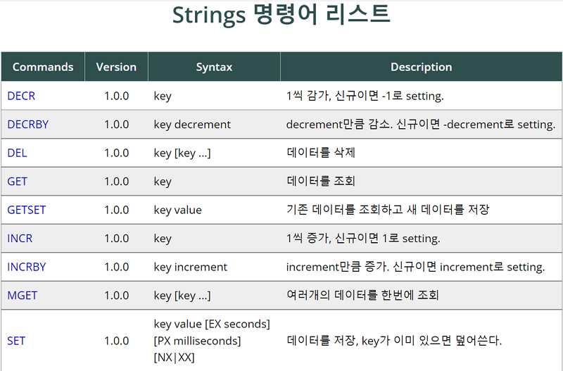  
   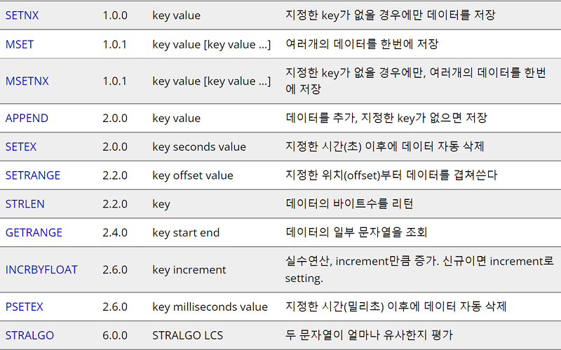  
     

---

### Set


---
### Lists

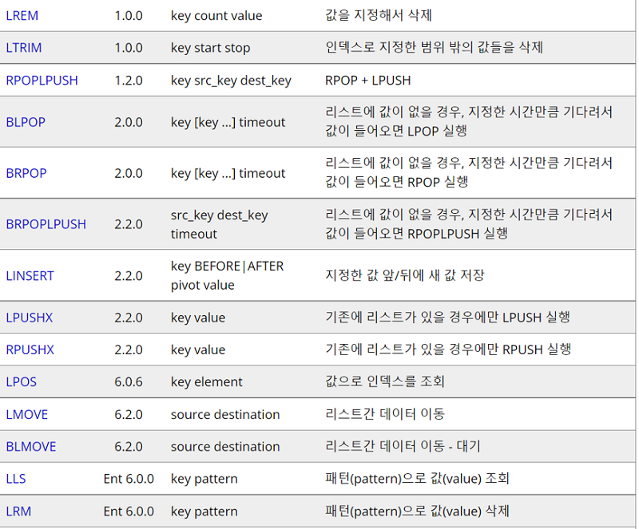


#### List를 활용한 Redis Message Queue
레디스 큐는 레디스의 자료구조 중 List를 이용하여 Queue를 구현한 것이며 FIFO(First In First Out)구조로 먼저 들어온 데이터가 먼저 처리된다. 
LIST자료구조의 LPUSH, RPOP(또는 RPUSH, LPOP)을 사용하여 구현할 수 있으며 지정한 시간만큼 기다리고 값이 들어오면 LPOP을 수행하는 BLPOP을 사용하여 블락킹(blocking) pop을 수행할 수 있는데
이를 이용하여 메세지 큐 로써의 기능을 할 수 있다.

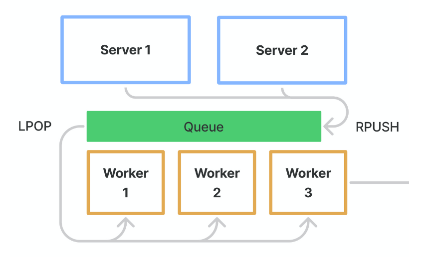  
  
```C#
위의 예시처럼 PUSH/POP 명령을 통해서 선입서니출 구조를 구현할 수 있고 필요에 따라 먼저 처리하고싶은 것을 앞으로 보내는 것도 가능하다.
그리고 Redis는 싱글스레드로 동작하기에 여러 명령이 들어와도 한 번에 한 명령씩 처리하는 것이 보장된다.
```

참고 : https://blog.slashuniverse.com/7 (레디스 메세지큐)  
참고 : https://peterica.tistory.com/149 (큐 처리방향에 따른 성능)

---
### Sorted set을 사용한 랭킹 시스템
RDBMS를 사용하여 랭킹 시스템 구축 시를 생각해보면 다음과 같이 사용할 수 있다.

```C#
// 랭킹 조회
SELECT * FROM <table> ORDER BY <col> DESC/ASC
```
```C#
// 특정 구간 랭킹 조회
SELECT * FROM <table> ORDER BY <col> DESC LIMIT <start, end>

여기서 추가 적인 최적화를 하게된다.
```
```C#
// 특정 플레이어의 랭킹 계산
SELECT COUNT(*) + 1 FROM <table> WHERE <col> > (
  SELECT <col> FROM <table>
  WHERE <col> = '검색어' 
)

이와 같은 방법으로 랭킹을 매길 수 있다.

하지만 위와 같은 방법은 데이터의 볼륨이 커질 수록 성능적인 문제가 발생하는데 이는 COUNT(*) 쿼리는 최적화가 되지 않기 때문이며 
시간복잡도로는 O(n)의 시간이 걸린다.

그러므로 관계형 데이터 베이스에서는 특정 범위의 랭킹 유저를 구하는 것은 최적화하기 쉽지만 특정 유저의 순위를 구하는 쿼리는 최적화 하는게 어렵고
최적화하면서 멀티쓰레드 또는 멀티프로세스 환경에서는 데드락 등이 발생할 수 있는 경우가 생긴다.

하지만 레디스에서 Sorted Set을 사용한 랭킹 시스템을 구현하면 이러한 문제가 해결된다. 
```
* Sorted Set
```C#
레디스는 Key-Value 저장소인데 Set은 Key의 중복을 허용하지 않으며 기본적으로 Value에 정렬된 형태로 데이터를 저장하기 때문에 특정 Key의 순위가 어떻게 되는지 빠르게 
판단할 수 있다는 장점이 있다.
시간복잡도로 따진다면 O(log n)의 시간으로 특정 Key값의 랭킹값을 얻을 수 있게 된다.
```

* 명령어
1. ZADD  
데이터를 추가할 수 있습니다. ZADD 뒤에 각각 Sorted Set 의 이름(Redis 키 값), 점수(Score), Sorted Set 내의 키값을 입력하면 됩니다.  
ZADD는 Bulk Insert를 지원하기 때문에 하나의 명령어를 사용하여 여러개의 대이터를 추가할 수 있으므로 효율적이다.
```C#
// 단일 ZADD 예시
ZADD movie 17615686 "명량"
ZADD movie 16266338 "극한직업"
ZADD movie 14414658 "신과함께-죄와벌"
ZADD movie 14263980 "국제시장"
ZADD movie 13977602 "어벤져스: 엔드게임"
ZADD movie 13747792 "겨울왕국 2"
ZADD movie 13486963 "아바타"
ZADD movie 13414484 "베테랑"

// 다중 ZADD 예시
ZADD movie 
  17615686 "명량"
  16266338 "극한직업" 
  14414658 "신과함께-죄와벌"
  14263980 "국제시장" 
  13977602 "어벤져스: 엔드게임" 
  13747792 "겨울왕국 2" 
  13486963 "아바타" 
  13414484 "베테랑"
```
2. ZSCORE
특정 키 값의 점수를 구하기 위해서는 ZSCORE 명령어를 사용하면 된다.
```C#
// 명령어
ZSCORE movie "베테랑"

// 결과값
"13414484"
```
3. ZRANGE, ZREVRANGE
다음 명령어들을 통해 특정 범위의 순위 데이터를 구할 수 있는데 ZRANGE의 경우 오름차순, ZREVRANGE는 내림차순 기준으로 랭킹 정보를 가져온다.
```C#
// 명령어
ZREVRANGE movie 1 3

// 결과값
1) "명량"
2) "극한직업"
3) "신과함께-죄와벌"
```
4. ZRANK
ZRANK는 특정 영화의 랭킹이 몇 위인지를 구할 수 있다.
```C#
// 명령어 
ZRANK movie "아바타"

// 결과값 
(integer) 7
```
---

### Hash
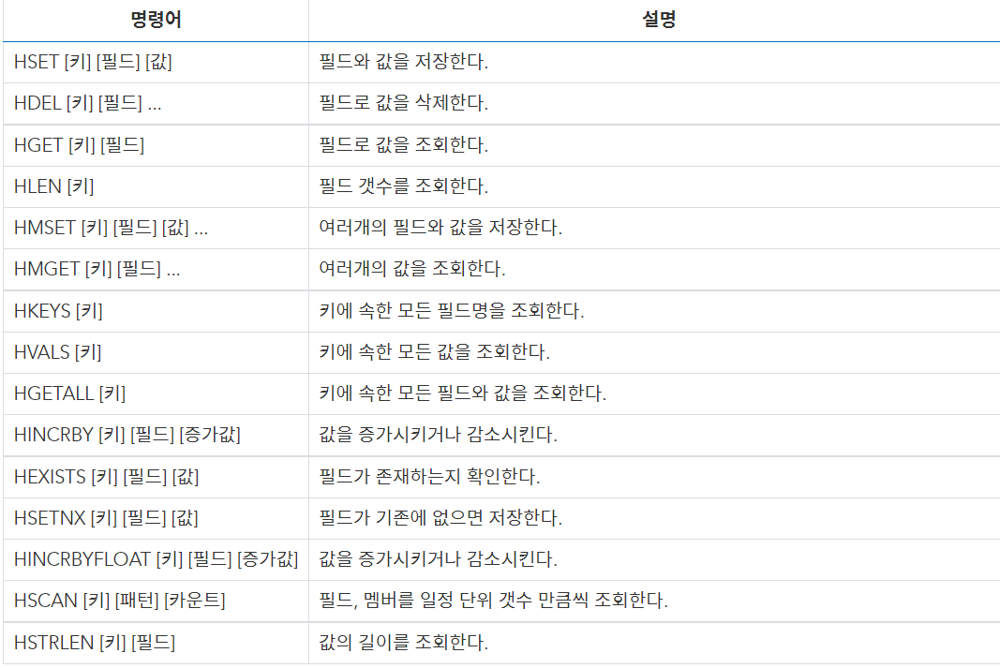

---
## 명령어 학습
Strings와 Lists는 위와 같이 링크의 교육자료를 가져와 바로 볼 수 있도록 만들어 놨지만 사용법등의 자세한 내용은 링크에서 학습하는게 효율적일 것이다.
메서드를 클릭하면 각 메서드에 대한 자세한 사용법을 아래와 같이 볼 수 있으며 애니메이션 보기를 클릭하면 도식화된 자료도 볼 수 있다.

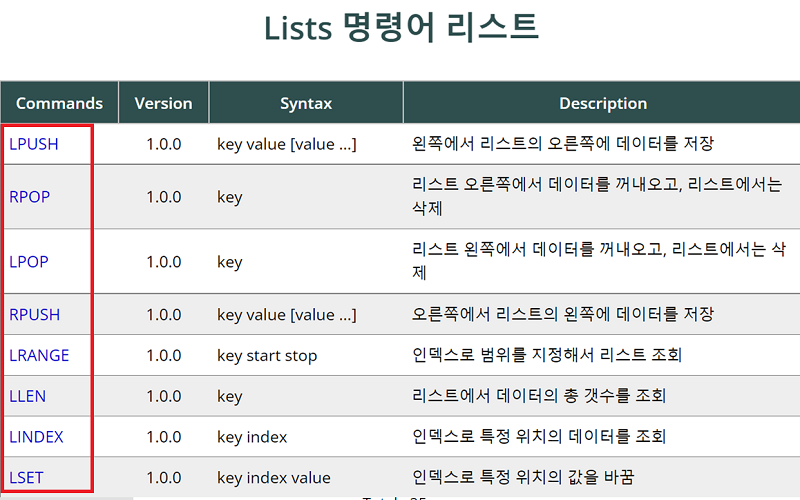

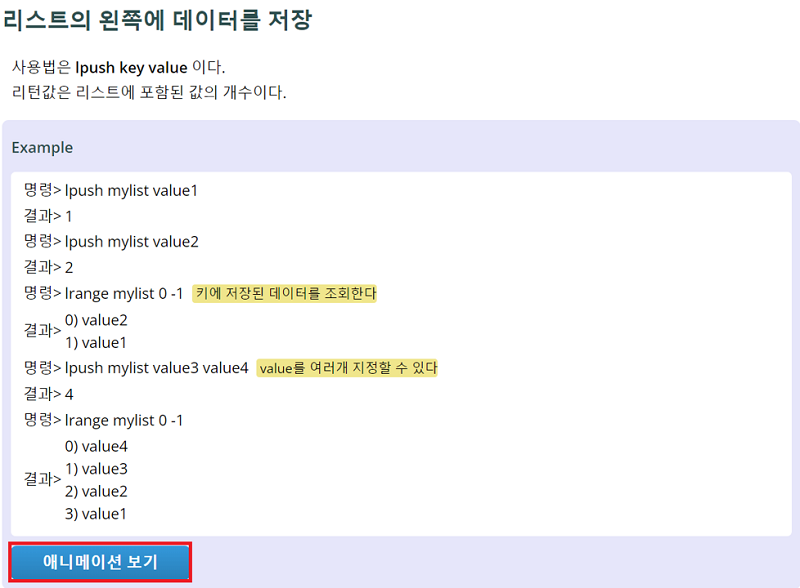

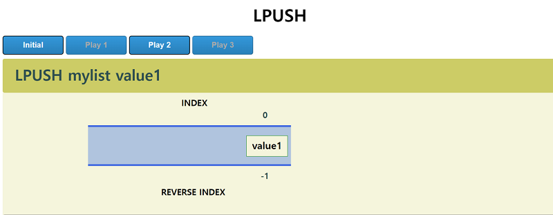

명령어 참고 : http://redisgate.kr/redis/introduction/redis_intro.php  
레디스 공식 사이트 : https://redis.io/docs/data-types/
Redis의 자료형 : https://ozofweird.tistory.com/entry/Redis-Redis-%EB%8D%B0%EC%9D%B4%ED%84%B0-%EC%9C%A0%ED%98%95
---

## 트랜잭션 명령어
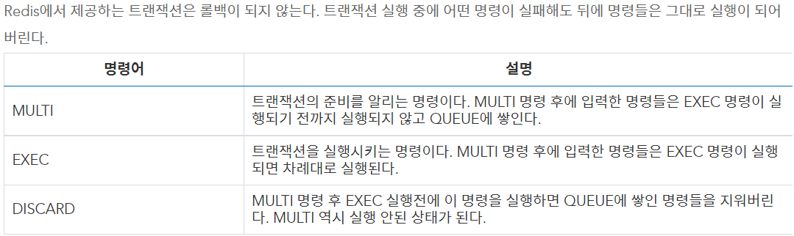

## Pub Sub 
### Pub Sub 이란
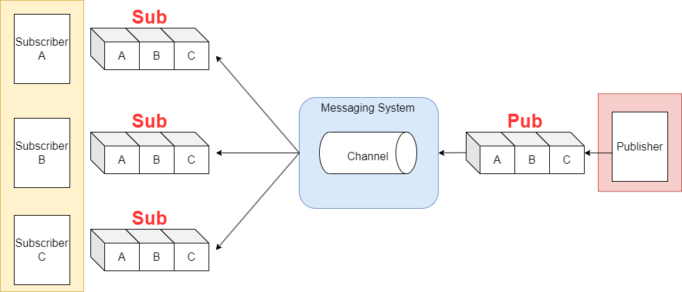
````
Publish / Subscribe 란 특정한 주제(topic)에 대하여 해당 topic을 구독한 모두에게 메시지를 발행하는 통신 방법으로 채널을 구독한 수신자(클라이언트) 
모두에게 메세지를 전송 하는것을 의미하고 그래서 레디스의 pub/sub 기능은 은 주로 채팅 기능이나, 푸시 알림등에 사용된다.
이를테면 날씨정보를 구독한 사람에게 주기적으로 날씨정보를 보내거나, 특정한 작업을 반복 수행하는 작업자에게 비동기적으로 작업을 보내 처리하도록 하거나, 
또는 현재 앱에 로그인한 유저에게 푸시를 발송하는 활동들이 모두 pub/sub의 원리로 만들어 진다고 보면 된다.

다만 유의할점이 있는데, 이러한 redis의 Pub/Sub 시스템에서는 채널에 구독 신청을 한 모든 subscriber에게 메시지를 전달하는 매우 단순한 구조로 되어있다는 것이다.
그런데 메시지를 "던지는" 시스템이기 때문에, 메시지를 따로 보관하지도 않는다.
즉, 수신자(클라이언트)가 메세지를 받는 것을 보장하지 않아, subscribe 대상이 하나도 없는 상황에서 메시지를 publish해도 역시 사라진다.
그래서 일반 메시지큐처럼 수신 확인을 하지 않는다.(전송 보장을 하지 않음)
따라서 현재 접속 중인 클라이언트에게 짧고 간단한 메시지를 빠르게 보내고 싶을 때, 그리고 전송된 메시지를 따로 저장하거나 수신확인이 필요 없을 때,
그리고 100% 전송 보장은 하지 않아도 되는 데이터를 보낼때 이용하면 괜찮다.
````
출처: https://hhhhhhhong.tistory.com/75

### Pub Sub 명령어
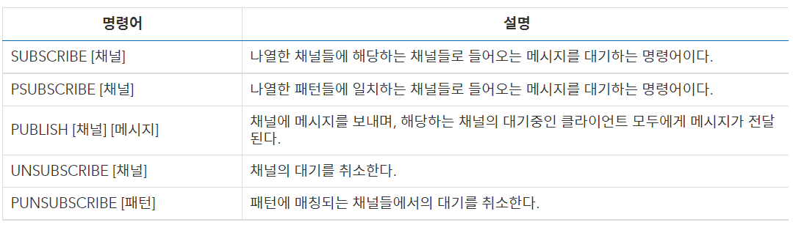

## 프로그래밍


### CloudStructures
````
StaExchange.Redis를 사용하여 CloudStructures는 Redis에 기능을 추가하고 사용하기 편하게 하는 라이브러리

Redis는 Key Value이기 때문에 Key에 Value 하나만 넣을 수 있기 때문에 Class Data를 넣을때 Binary로 변환해서 넣어주어야 한다.
하지만 CloudStructures에서는 Utf8Json을 default로 제공하고 있어 위의 과정을 거치지 않아도된다.

하지만 Utf8Json을 사용해 Json파일로 변환하게 되면 Binary 파일보다 데이터가 커지게 되는데 이럴 때는 MessagePack을 사용하여 크기를 줄이고
인코딩, 디코딩 송도를 좀 더 빠르게 할 수 있다.
````
https://gist.github.com/jacking75/5f91f8cf975e0bf778508acdf79499c0

---

#### 설치

---

```C#
public static class RedisServer
{
    public static RedisConnection Connection { get; }
    public static RedisServer()
    {
        var config = new RedisConfig("name", "connectionString");
        Connection = new RedisConnection(config);
    }
}

public class Person
{
    public string Name { get; set; }
    public int Age { get; set; }
}

// 1. Create redis structure
var key = "test-key";
var defaultExpiry = TimeSpan.FromDays(1); //데이터 유효기간. 24시간 동안 유효
var redis = new RedisString<Person>(RedisServer.Connection, key, defaultExpiry)

// 2. Call command
var neuecc = new Person("neuecc", 35);
await redis.SetAsync(neuecc);
var result = await redis.GetAsync();
```
참고 : https://gist.github.com/jacking75/5f91f8cf975e0bf778508acdf79499c0

---
### 정수자료형 다루기
```C#
var redisConfig = new RedisConfig("test", "127.0.0.1");
var RedisConnection = new RedisConnection(redisConfig);

// 3번째 인자가 유효기간이며 null 세팅시 무제한
var v = new RedisString<int>(RedisConnection, "test-incr", null);

// .Dump()는 LinqPad 툴에서 제공하는 함수이다. 이 코드를 LinqPad가 아닌 곳에서 실행할 때는 Dump() 함수를 사용하지 않는다.
// redis에 이미 값이 있다면 값을 반환하고, 없다면 50을 반환한다.
await v.GetOrSetAsync((() => 50), null).Dump();

// 값을 0 으로 설정
await v.SetAsync(0);

// 기존 값에서 10 증가한다.
await v.IncrementAsync(10).Dump();

// 기존 값에서 5 감소 시킨다.
await v.DecrementAsync(5).Dump();


// 30을 늘린다. 단 100을 넘지 않는다.
await v.IncrementLimitByMaxAsync(30, 100).Dump();

// 80을 늘린다. 단 100을 넘지 않는다.
await v.IncrementLimitByMaxAsync(80, 100).Dump();


// 최소 값 이상이 되도록 한다.
await v.SetAsync(100);
await v.IncrementLimitByMinAsync(-102, 100).Dump();
```

---
### 키의 유효 기간 얻기
```C#
var redisConfig = new RedisConfig("test", "127.0.0.1");
var RedisConnection = new RedisConnection(redisConfig);

// 이 키의 유효기간은 무제한
var defaultExpiry = TimeSpan.FromDays(1);
var v = new RedisString<int>(RedisConnection, "test-incr", defaultExpiry);

await v.SetAsync(230);

// 반환 값의 타입은 RedisResultWithExpiry
// 만약 Expiry 시간이 설정되어 있으면 Expiry(TimeSpan 타입)에 값이 설정 되어 있다. Expiry 설정이 없으면 null 
await v.GetWithExpiryAsync().Dump();
```

### 값을 읽고 삭제하기
```C#
// GetAndDeleteAsync
var redisConfig = new RedisConfig("test", "127.0.0.1");
var RedisConnection = new RedisConnection(redisConfig);

// 이 키의 유효기간은 무제한
var defaultExpiry = TimeSpan.FromDays(1);
var v = new RedisString<int>(RedisConnection, "test-incr", defaultExpiry);

await v.SetAsync(230);
await v.GetAndDeleteAsync().Dump();

// 값이 없다고 나온다
await v.GetAsync().Dump();
```
### 이미 key가 있다면 요청 실패하기
````C#
// SetAsync 에서 When 파라미터를 사용한다.

namespace StackExchange.Redis
{
//이 작업을 수행해야 하는 시기를 나타냅니다(주어진 컨텍스트에서 일부 변형만 허용됨)
public enum When
{
//기존 값이 있는지 여부에 관계없이 작업이 발생해야 합니다
Always,


// 작업은 기존 값이 있을 때만 발생해야 합니다.
Exists,


//작업은 기존 값이 없을 때만 발생해야 합니다.
NotExists
}
}
아래 코드는 키가 없을 때만 230을 저장한다. 만약 이미 있다면 저장하지 않는다.

await v.SetAsync(230, null, When.NotExists);
````

### list 타입 조작
````C#
var redisConfig = new RedisConfig("test", "127.0.0.1");
var RedisConnection = new RedisConnection(redisConfig);

var key = "userDataList-test-key";
var defaultExpiry = TimeSpan.FromDays(1);
var redis = new CloudStructures.Structures.RedisList<int>(RedisConnection, key, defaultExpiry);

// LengthAsync 현재 리스트에 있는 데이터 수 얻기
await redis.LengthAsync().Dump();

// 오른쪽에서 push
await redis.RightPushAsync(10);
await redis.RightPushAsync(20);

// 왼쪽에서 pop
while (true)
{
var value = redis.LeftPopAsync().Result;
if (value.HasValue == false)
{
break;
}

	value.Dump();
}


// 왼쪽에서 push
// LeftPushAsync

// 오른쪽에서 pop
// RightPopAsync
Redis 명령에 해당하는 함수

LINDEX : GetByIndexAsync
LINSERT : InsertAfterAsync, InsertBeforeAsync
LRANGE : RangeAsync
LREM : RemoveAsync
RPOPLPUSH : RightPopLeftPushAsync
LSET : SetByIndexAsync
LTRIM : TrimAsync
SORT : SortAsync
````
### Hash
````C#
class UpdateLobbyTask : RedisTask
{
public UInt16 LobbyNumber;
public UInt16 LobbyServerIdx;
public UInt16 LobbyUserCnt;
}

class InsertLobbyTask : RedisTask
{
public List<UpdateLobbyTask> LobbyInfoList;
}

var task = (UpdateLobbyTask)redisTask;
var redisKey = ServerCommon.RedisKeyForm.LobbyInfoList();
var redisMap = new RedisDictionary<UInt16, ServerCommon.RedisLobbyInfo>(RedisConnection, redisKey, TimeSpan.FromDays(1));
await redisMap.SetAsync(task.LobbyNumber, new ServerCommon.RedisLobbyInfo()
{
LobbyServerIdx = task.LobbyServerIdx,
UserCount = task.LobbyUserCnt
});
````
### 랭킹
````c#
//멤버의 순위 얻기

var redisConfig = new RedisConfig("test", "127.0.0.1");
var RedisConnection = new RedisConnection(redisConfig);

var set = new RedisSortedSet<string>(RedisConnection, "test-ranking", null);
await set.DeleteAsync();

await set.AddAsync("a", 10);
await set.AddAsync("d", 10000);
await set.AddAsync("b", 100);
await set.AddAsync("f", 1000000);
await set.AddAsync("e", 100000);
await set.AddAsync("c", 1000);

var rank = await set.RankAsync("c");
rank.Dump();
````
ZRANK : https://redis.io/commands/zrank

### 지정 순위 안의 랭킹 리스트
````C#
// ZREVRANGE: 일정 범위의 랭킹 리스트를 가져온다.

var redisConfig = new RedisConfig("test", "127.0.0.1");
var RedisConnection = new RedisConnection(redisConfig);

var set = new RedisSortedSet<string>(RedisConnection, "test-ranking", null);
await set.DeleteAsync();

await set.AddAsync("a", 10);
await set.AddAsync("d", 10000);
await set.AddAsync("b", 100);
await set.AddAsync("f", 1000000);
await set.AddAsync("e", 100000);
await set.AddAsync("c", 1000);

var range = await set.RangeByRankAsync();
range.Dump();

range = await set.RangeByRankAsync(0, 3);
range.Dump();

range = await set.RangeByRankAsync(1, 3);
range.Dump();
````
### 점수기반으로 순위 정렬
````c# 
// ZRANGEBYSCORE
// ZREVRANGEBYSCORE

var redisConfig = new RedisConfig("test", "127.0.0.1");
var RedisConnection = new RedisConnection(redisConfig);

var set = new RedisSortedSet<string>(RedisConnection, "test-ranking", null);
await set.DeleteAsync();

await set.AddAsync("a", 10);
await set.AddAsync("d", 10000);
await set.AddAsync("b", 100);
await set.AddAsync("f", 1000000);
await set.AddAsync("e", 100000);
await set.AddAsync("c", 1000);

var range = await set.RangeByScoreAsync();
range.Dump();

// 점수가 100 이상부터
range = await set.RangeByScoreAsync(start: 100);
range.Dump();

// 100~100000 사이만
range = await set.RangeByScoreAsync(start: 100, stop: 100000);
range.Dump();


range = await set.RangeByScoreAsync(order: StackExchange.Redis.Order.Descending);
range.Dump();

range = await set.RangeByScoreAsync(start: 100, order: StackExchange.Redis.Order.Descending);
range.Dump();

range = await set.RangeByScoreAsync(start: 100, stop: 100000, order: StackExchange.Redis.Order.Descending);
range.Dump();


range = await set.RangeByScoreAsync(order: StackExchange.Redis.Order.Ascending);
range.Dump();

range = await set.RangeByScoreAsync(start: 100, order: StackExchange.Redis.Order.Ascending);
range.Dump();

range = await set.RangeByScoreAsync(start: 100, stop: 100000, order: StackExchange.Redis.Order.Ascending);
range.Dump();


range = await set.RangeByScoreAsync(order: StackExchange.Redis.Order.Ascending);
angebyscore
````
### 멤버의 점수 업데이트
````c#
아래 함수를 사용한다.

DecrementAsync
IncrementAsync
IncrementLimitByMinAsync
IncrementLimitByMaxAsync
````

### Redis로 lock을 걸고 싶을 때
````c#
분산 서버 환경에서 병렬 처리를 순차적으로 처리하고 싶을 때 Redis를 동기화 객체로 사용할 수 있다.
RedisLock 클래스를 사용한다.
락 걸기 TakeAsync, 락 풀기 ReleaseAsync
````
````C#
Redis 클러스터로 운용 시 연결 방법
var connString = "127.0.0.1:7000,127.0.0.1:7001,127.0.0.1:7002";
var redisConfig = new RedisConfig("test", connString);
var redisConnection = new RedisConnection(redisConfig);
````
---
### 전체 참고
참고 : https://jacking75.github.io/NET_lib_CloudStructures/  
참고 : https://github.com/xin9le/CloudStructures  
참고 : https://gist.github.com/jacking75/5f91f8cf975e0bf778508acdf79499c0  
참고 : https://sabarada.tistory.com/104  
