# 연습 프로젝트 구현

---
## 목차
1. [구현 내용](#구현-내용)
2. [기본 세팅](#기본-세팅)
   * [launchsetting](#launchsetting)
3. [테스트 프로그램 제작](#테스트-프로그램-제작)
  * [기본 작업](#기본-작업)
    * [Test.cs](#Test)
    * [DataBase.cs & IDataBase.cs](#DataBase와-IDataBase)
    * [appsettings.Development.json](#appsettings-Development)
    * [program.cs](#program)
    * [TestController.cs](#TestController)
  * [Redis](#Redis)
    * [IRedisDb](#IRedisDb)
    * [RedisDB](#RedisDB)
    * [TestController.cs](#TestController)
    * [appsetting.Development.json](#appsetting-Development)
    * [Program.cs](#Program)
    * [간단한 Redis 테스트](#간단한-Redis-테스트)
  * [ZLogger](#ZLogger)
      * [Program.cs](#Program)
      * [LogManager.cs](#LogManager)
      * [TestController.cs](#TestController)
4. [생명주기에 따른 의존성 주입 테스트](#생명주기에-따른-의존성-주입-테스트)
---
## 구현 내용
1. 간단한 ASP.NET Core Web Api 서버를 구현
2. Dapper를 사용한 DB관리 
3. POST, GET, PUT, DELETE 등의 구현을 통해 REST API 서버, Dapper에 대한 체험
4. Postman 통한 테스트
5. Redis를 사용하여 데이터를 저장/검색 구현 및 테스트
6. ZLogger 사용법 설명 및 테스트
---
## 기본 세팅
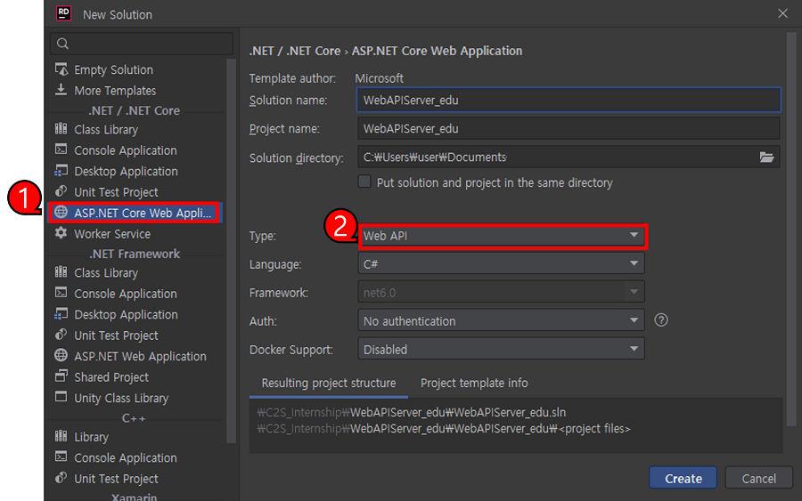
1. ASP.NET Core Web Application 선택
2. Type 옵션을 Web API로 선택
---
### launchsetting
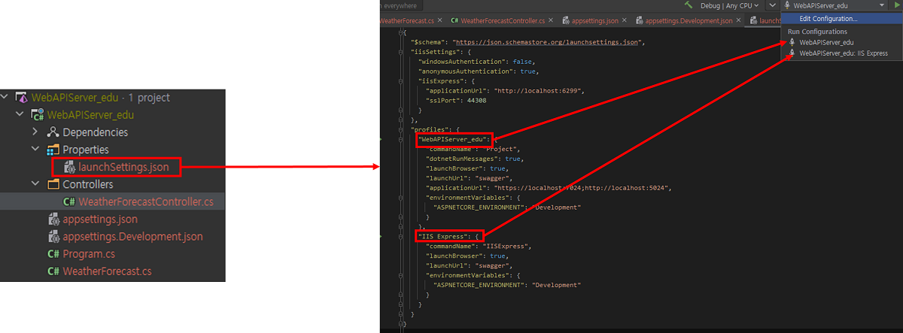
````
launchSettings.json의 환경 값은 시스템 환경에 설정된 값을 재정의 하며 해당 설정 값들은 프로젝트를 구동하도록 설정하는 것과 관련하여
어떤 환경변수가 사용되어야 하는 지를 포함한 모든 프로파일 설정을 가지고 있는 파일이며 다음과 같은 특징이 있다.
1. 로컬 개발 머신에서만 사용되어야 한다.
2. 배포되지 않아야 한다.
3. 프로필 설정을 포함해야 한다.

````

````
테스트의 편의상 사진의 왼쪽위의 항목에서 launchBrowser 항목을 false로 세팅하여 
서버 실행 시 왼쪽 아래의 브라우저가 실행되지 않게 세팅한다.
````
````
테스트를 진행하면서 오른쪽 사진과 같이 컨트롤러의 앞부분을 Url로 입력하여 해당 클래스로 요청이 전달되도록 한다.
````
---

---
## 테스트 프로그램 제작
### 기본 작업
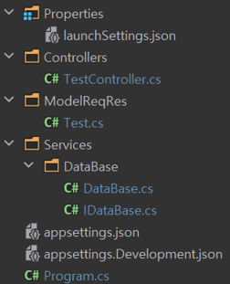
````
앞서 학습했던 Dapper, Asp.Net Core, HTTP 자료를 토대로 
Test용 Class와 DataBase작업 Class를 생성한다.
````
---
#### Test
1. 전체 코드
```C#
using System.ComponentModel.DataAnnotations;
namespace WebAPIServer_edu.ModelReqRes;

public class PkTestRequest // CreateAccount에 대한 Requust 패킷
{
    [Required]
    [MinLength(1, ErrorMessage = "EMAIL CANNOT BE EMPTY")]
    [StringLength(50, ErrorMessage = "EMAIL IS TOO LONG")]
    // 아래의 코드는 간단한 테스트를 위해 잠시 제외해 두었으며 
    // 코드의 주석을 풀고 E-mail 포멧을 사용하지 않은 ID를 보내어 오류가 뜨는 방식을
    // 확인해 봐도 좋을 것 같다.
    // [RegularExpression("^[a-zA-Z0-9_\\.-]+@([a-zA-Z0-9-]+\\.)+[a-zA-Z]{2,6}$", ErrorMessage = "E-mail is not valid")]
    public string Email { get; set; }

    [Required]
    [MinLength(1, ErrorMessage = "PASSWORD CANNOT BE EMPTY")]
    [StringLength(30, ErrorMessage = "PASSWORD IS TOO LONG")]
    [DataType(DataType.Password)]
    public string Password { get; set; }
    
    [Required]
    public string testRequest { get; set; }
}

public class PkTestResponse // CreateAccount에 대한 Response 패킷
{
    public string testResponse { get; set; }
}

public class DBUserInfo
{
    public String Email { get; set; }
    public String HashedPassword { get; set; }
    public String SaltValue { get; set; }
}

```
2. PkTestRequest
````
Test에 사용할 Request 패킷 구조체
Email, Password는 가공, DB 저장과정을 거칠 데이터 이며
testRequest는 간단하게 테스트 결과를 문자열로 확인하기 위한 데이터 이다.
````

3. PkTestResponse
````
Test에 사용할 Response 패킷 구조체
testResponse 간단하게 테스트 결과를 문자열로 확인하기 위한 데이터 이다.
````
4. DBUserInfo
````
Email, HashedPassword, SaltValue 모두 DB에 저장할 데이터 이며
SaltValue는 Password를 해싱하기 위한 데이터
Hasedpassword는 SaltValue와 Password를 사용하여 해싱된 데이터이다.
````
---
#### DataBase와 IDataBase
1. DataBase.cs
```C#
using MySqlConnector;
namespace WebAPIServer_edu.Services.DataBase;

public class DataBase : IDataBase
{
    static string DataBaseConnectionString;

    public static void Init(string address)
    {
        DataBaseConnectionString = address;
    }

    public async Task<MySqlConnection> GetAccountDbConnection()
    {
        return await GetOpenMySqlConnection(DataBaseConnectionString);
    }

    public async Task<MySqlConnection> GetOpenMySqlConnection(string connectionString)
    {
        var connection = new MySqlConnection(connectionString);
        await connection.OpenAsync();
        return connection;
    }
}
```
2. IDataBase.cs
```C#
using MySqlConnector;

namespace WebAPIServer_edu.Services.DataBase;

public interface IDataBase
{
    public Task<MySqlConnection> GetAccountDbConnection();

    public Task<MySqlConnection> GetOpenMySqlConnection(string connectionString);
}

```
````
앞서 Dapper에 대해 학습한 자료 참고
````
---
#### appsettings Development
```C#
{
  "Logging": {
    "LogLevel": {
      "Default": "Information",
      "Microsoft.AspNetCore": "Warning"
    }
  },

  "AllowedHosts": "*",
  "ServerAddress" : "http://0.0.0.0:11500",
  "DBConnection": {
    "MySqlAccount": "Server=127.0.0.1;user=root;port=3306;Password=0000;Database=AccountDB;Pooling=true;Min Pool Size=0;Max Pool Size=40;AllowUserVariables=True;"
  }
}
```
````
앞서 Dapper에 대해 학습한 자료 참고하여 수정이 필요한 값들을 변경
````
---
#### program
```C#
using WebAPIServer_edu.Services.DataBase;

var builder = WebApplication.CreateBuilder(args);

builder.Host.ConfigureAppConfiguration
((hostingContext, config) => {
    config.SetBasePath(Directory.GetCurrentDirectory());
    config.AddJsonFile("appsettings.Development.json", optional: true, reloadOnChange: true);
});

builder.Services.AddControllers();

builder.Services.AddTransient<IDataBase, DataBase>();

var app = builder.Build();

app.UseRouting();
app.UseEndpoints(endpoints => { endpoints.MapControllers(); });

DataBase.Init(builder.Configuration.GetSection("DbConnection")["MySqlAccount"]); 

app.Run();
```
---
#### TestController
1. 전체 코드
```C#
using System.Security.Cryptography;
using System.Text;
using Dapper;
using Microsoft.AspNetCore.Mvc;
using WebAPIServer_edu.ModelReqRes;
using WebAPIServer_edu.Services.DataBase;

namespace WebAPIServer_edu.Controllers;

[ApiController]
[Route("api/[controller]")]
public class TestController : ControllerBase
{
    private readonly IDataBase _accountDB;

    public TestController(IDataBase accountDB)
    {
        _accountDB = accountDB;
    }

    [HttpGet]
    public async Task<PkTestResponse> Get()
    {
        var response = new PkTestResponse();

        using (var connection = await _accountDB.GetAccountDbConnection())
        {
            var userInfos =
                await connection.QueryAsync<DBUserInfo>("select Email,  HashedPassword,SaltValue from account");

            foreach (var userInfo in userInfos)
            {
                Console.WriteLine("-----------------------");
                Console.WriteLine(userInfo.Email);
                Console.WriteLine(userInfo.HashedPassword);
                Console.WriteLine(userInfo.SaltValue);
                Console.WriteLine("-----------------------\n");
            }

            response.testResponse = "GET Test Ok~";
        }

        return response;
    }

    [HttpGet("{Email}")]
    public async Task<PkTestResponse> Get(String email)
    {
        var response = new PkTestResponse();

        using (var connection = await _accountDB.GetAccountDbConnection())
        {
            DBUserInfo userInfo;

            userInfo = await connection.QuerySingleOrDefaultAsync<DBUserInfo>(
                "select Email, HashedPassword, SaltValue from account where Email = @Email", new { Email = email });


            Console.WriteLine("-----------------------");
            Console.WriteLine(userInfo.Email);
            Console.WriteLine(userInfo.HashedPassword);
            Console.WriteLine(userInfo.SaltValue);
            Console.WriteLine("-----------------------\n");

            response.testResponse = "GET by Index Test Ok~";
        }

        return response;
    }

    [HttpPost]
    public async Task<PkTestResponse> Post(PkTestRequest request)
    {
        var response = new PkTestResponse();
        using (var connection = await _accountDB.GetAccountDbConnection())
        {
            var saltValue = SaltString();
            var hashingPassword = MakeHashingPassWord(saltValue, request.Password);
            
            DBUserInfo userInfo = new DBUserInfo();
            userInfo.Email = request.Email;
            userInfo.HashedPassword = hashingPassword;
            userInfo.SaltValue = saltValue;
            
            await connection.QueryFirstOrDefaultAsync<Int64>("INSERT INTO Account(Email,SaltValue,HashedPassword) Values(@Email, @SaltValue, @HashedPassword);", userInfo);
    
            response.testResponse = "Post Test Ok~~";
        }
    
        return response;
    }

    [HttpPut("{Email}")]
    public async Task<PkTestResponse> Put(string email, PkTestRequest request)
    {
        var response = new PkTestResponse();

        using (var connection = await _accountDB.GetAccountDbConnection())
        {
            var saltValue = SaltString();
            var hashingPassword = MakeHashingPassWord(saltValue, request.Password);

           var affectedRow = await connection.ExecuteAsync(
                "Update account set Email = @UpdateEmail, SaltValue = @UpdateSaltValue, HashedPassword = @UpdateHashedPassword where Email = @Email",
                new
                {
                    UpdateEmail = request.Email, UpdateSaltValue = saltValue, UpdateHashedPassword = hashingPassword,
                    Email = email
                });

           if (affectedRow == 0)
           {
               response.testResponse = "No Exist Email~";
           }
            response.testResponse = "Put Test Ok~";
        }

        return response;
    }
    
    [HttpDelete("{Email}")]
    public async Task<PkTestResponse> DeleteHttpTest(string email)
    {
        var response = new PkTestResponse();
        
        using (var connection = await _accountDB.GetAccountDbConnection())
        {


            var (sql, Data) = new Tuple<String, Object>("Delete From Account Where Email = @Email", email);
            
            DBUserInfo userInfo = await connection.QuerySingleOrDefaultAsync(sql, Data);

            response.testResponse = "DELETE by Index Test Ok~";
        }

        return response;
    }
    
    public String MakeHashingPassWord(String saltValue, String pw)
    {
        var sha = new SHA256Managed();
        var hash = sha.ComputeHash(Encoding.ASCII.GetBytes(saltValue + pw));
        var stringBuilder = new StringBuilder();
        foreach (var b in hash)
        {
            stringBuilder.AppendFormat("{0:x2}", b);
        }

        return stringBuilder.ToString();
    }
    public String SaltString()
    {
        var bytes = new Byte[64];
        using (var random = RandomNumberGenerator.Create())
        {
            random.GetBytes(bytes);
        }

        return new String(bytes.Select(x => AllowableCharacters[x % AllowableCharacters.Length]).ToArray());
    }

    private const String AllowableCharacters = "abcdefghijklmnopqrstuvwxyz0123456789";
}
```
````
최하단의 MakeHashingPassWord, SaltString 메서드는 Password를 DB에 바로 저장하지 않고
Hashing 하여 암호화 하는 기능을 하며 테스트 시에는 크게 신경쓰지 않아도 된다.
````
---

2. [HttpPost]
```C#
[HttpPost]
public async Task<PkTestResponse> Post(PkTestRequest request)
{
    Console.WriteLine("-----------------------");
    Console.WriteLine(request.Email);
    Console.WriteLine(request.Password);
    Console.WriteLine(request.testRequest);
    Console.WriteLine("-----------------------\n");
    var response = new PkTestResponse();
    using (var connection = await _accountDB.GetAccountDbConnection())
    {
        var saltValue = SaltString();
        var hashingPassword = MakeHashingPassWord(saltValue, request.Password);

        DBUserInfo userInfo = new DBUserInfo();
        userInfo.Email = request.Email;
        userInfo.HashedPassword = hashingPassword;
        userInfo.SaltValue = saltValue;
        
        var affectedRow =  await connection.ExecuteAsync("INSERT INTO Account(Email,SaltValue,HashedPassword) Values(@Email, @SaltValue, @HashedPassword);", userInfo);
        Console.WriteLine(affectedRow);
        response.testResponse = "Post Test Ok~~";
    }

    return response;
}
```

````
Post 요청에는 Request패킷을 받아와 데이터 베이스에 저장하는 기능을 구현할 것이며

다음과 같은 순서로 테스트 해볼 것이다.

1. Post 요청
2. Post 요청 데이터가 Request로 들어온 데이터와 일치하는가?
3. 해싱 과정을 거친후 해당 데이터가 DB에 Insert 되는가?
````
---

* Post요청 / 요청 데이터가 Request로 들어온 데이터와 일치하는가?  
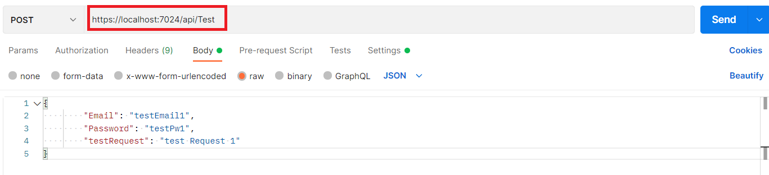
```C#
{
        "Email": "testEmail1",
        "Password": "testPw1",
        "testRequest": "test Request 1"
}

서버 실행 후 위의 데이터를 사진과 같이 Postman의 Body에 작성한 후 Send를 클릭한다.
단, 빨간 박스안의 url 경로는 개인에 맞게 세팅

Send에 성공하면 Console에 다음과 같은 출력값이 찍힌다.
-----------------------
testEmail1
testPw1
test Request 1
-----------------------
```
---

* 해싱 과정을 거친후 해당 데이터가 DB에 Insert 되는가?
```C#
var affectedRow =  await connection.ExecuteAsync("INSERT INTO Account(Email,SaltValue,HashedPassword) Values(@Email, @SaltValue, @HashedPassword);", userInfo);
위 쿼리문의 반환 값은 Dapper 교육자료에서 설명했듯 영향받은 row의 갯수를 뜻하며 Insert 성공시에는 1을 반환한다.


그렇다면 실제 DataBase에 Insert 됬는지 확인 해 보자
```


````
다음과 같이 testEmail1이 저장된 것을 볼 수 있는데 SaltValue와 HashedPassword는 암호화 과정을 거친 후의 데이터이기 때문에
Console출력과 값이 다르게 된다.

(slatValue, hashingPassword를 출력하면 값이 같은 것을 확인할 수 있다.)
````
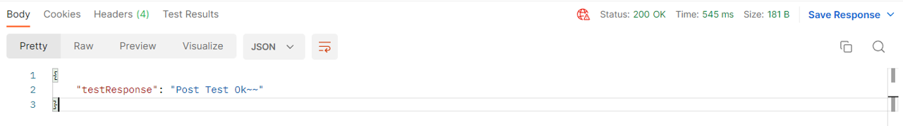
```C#
response.testResponse = "Post Test Ok~~";
Response 패킷으로 위의 데이터를 저장해서 return 했고 해당값은 Postman의 하단에서 확인할 수 있다.
```

```C#
다음에 해볼 Get, Put, Delete 테스트를 위해 Post로 데이터를 좀 더 추가한다.
{
        "Email": "testEmail2",
        "Password": "testPw2",
        "testRequest": "test Request 2"
}
------------------------------------------------------------
{
        "Email": "testEmail3",
        "Password": "testPw3",
        "testRequest": "test Request 3"
}
```
---
3. [HttpGet]
```C#
[HttpGet]
public async Task<PkTestResponse> Get()
   {
       var response = new PkTestResponse();

       using (var connection = await _accountDB.GetAccountDbConnection())
       {
           var userInfos =
               await connection.QueryAsync<DBUserInfo>("select Email,  HashedPassword,SaltValue from account");

           foreach (var userInfo in userInfos)
           {
               Console.WriteLine("-----------------------");
               Console.WriteLine(userInfo.Email);
               Console.WriteLine(userInfo.HashedPassword);
               Console.WriteLine(userInfo.SaltValue);
               Console.WriteLine("-----------------------\n");
           }

           response.testResponse = "GET Test Ok~";
       }

       return response;
   }
```
````
GET 요청에서는 QueryAsync를 사용하여 모든 데이터에 대한 조회를 해볼 것이다.
````
* GET 요청
  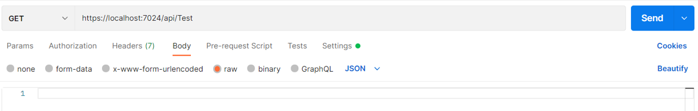
```C#
다음과 같이 GET 요청
```
---

* 콘솔에 출력된 내용과 DB에 저장된 내용이 일치하는가
```C#
콘솔에는 다음과 같은 데이터가 출력된다.

-----------------------
testEmail1
sykylatdi7irh22w7wcpkohcerydrpbi9g5th0sgrpsqry7udzpsu8y3fbk97np6
ecbee315b3095514a12a0c7f84b0d489599ab042718d65a666660e93f8b43c5c
-----------------------

-----------------------
testEmail2
31sc72hwq7js4rf9cc4xeu3n771qtlblw6a4to2iubcqgthpzeghmd5r2ine17d7
d6fc21622355ffb47e78bd7d0f438fbfd665e94aeedd032272c40879ab774b44
-----------------------

-----------------------
testEmail3
82lkxu1ogk6pjhxqtgrscajopro0e807m3dybrsazk4vn8bygiu9hh585h9o0igk
30b7190bc33894d15f12d1846c822dbfd816ee8d68f4317c739f77e8026b0134
-----------------------


그렇다면 DB의 데이터도 확인해보자
```
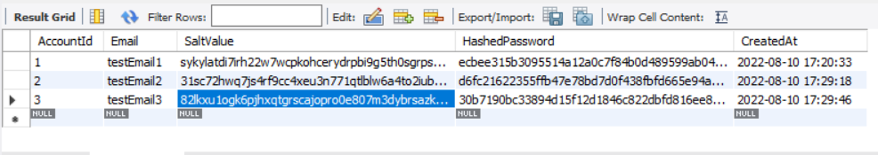
````
다음과 같이 일치하는 것을 볼 수 있다.
````
---
3-1. [HttpGet("{Email}")]
```C#
 public async Task<PkTestResponse> Get(String email)
    {
        var response = new PkTestResponse();

        using (var connection = await _accountDB.GetAccountDbConnection())
        {
            DBUserInfo userInfo;

            userInfo = await connection.QuerySingleOrDefaultAsync<DBUserInfo>(
                "select Email, HashedPassword, SaltValue from account where Email = @Email", new { Email = email });


            Console.WriteLine("-----------------------");
            Console.WriteLine(userInfo.Email);
            Console.WriteLine(userInfo.HashedPassword);
            Console.WriteLine(userInfo.SaltValue);
            Console.WriteLine("-----------------------\n");

            response.testResponse = "GET by Index Test Ok~";
        }

        return response;
    }
```
````
GET 요청에 인자로 Email을 받아 해당하는 데이터만 조회해 볼 것이며
QuerySingleOrDefaultAsync를 사용하여 조회한다.
````
* GET 요청
  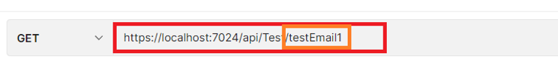
```C#
이전에 했던 GET 요청 Url 끝단에 "{Email}"에 해당하는 testEmail1을 추가하여
Email이 testEmail1과 일치하는 데이터를 조회 하게 한다. 
```
* 콘솔에 출력된 내용과 DB에 저장된 내용이 일치하는가
```C#
콘솔에는 다음과 같은 데이터가 출력된다.

-----------------------
testEmail1
ecbee315b3095514a12a0c7f84b0d489599ab042718d65a666660e93f8b43c5c
sykylatdi7irh22w7wcpkohcerydrpbi9g5th0sgrpsqry7udzpsu8y3fbk97np6
-----------------------

그렇다면 DB의 데이터도 확인해보자
```

````
사진의 testEmail1의 데이터와 일치하는 것을 볼 수 있다.
````

---
4. [HttpPut("{Email}")]
```C#
[HttpPut("{Email}")]
public async Task<PkTestResponse> Put(string email, PkTestRequest request)
{
    var response = new PkTestResponse();
    using (var connection = await _accountDB.GetAccountDbConnection())
    {
        var saltValue = SaltString();
        var hashingPassword = MakeHashingPassWord(saltValue, request.Password);
       var affectedRow = await connection.ExecuteAsync(
            "Update account set Email = @UpdateEmail, SaltValue = @UpdateSaltValue, HashedPassword = @UpdateHashedPassword where Email = @Email",
            new
            {
                UpdateEmail = request.Email, UpdateSaltValue = saltValue, UpdateHashedPassword = hashingPassword,
                Email = email
            });
       if (affectedRow == 0)
       {
           response.testResponse = "No Exist Email~";
           return response;
       }
        response.testResponse = "Put Test Ok~";
    }
    return response;
}
```
````
Put 요청에서는 ExecuteAsync를 사용하여 Update을 진행하고 영향받은 행의 개수를 리턴받아
예외에 대한 처리를 한다.
````
* PUT 요청
  
```C#
사진과 같이 testEmail3의 데이터를 testEmail4의 데이터로 Update해 볼 것이다. 
```
* Before

* After
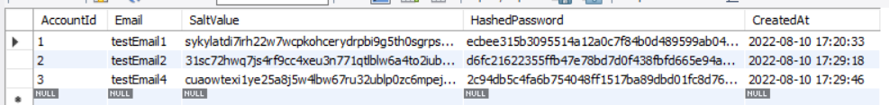
```C#
사진과 같이 testEmail3의 데이터가 Update된 것을 볼 수 있다. 
```
* 잘못된 PUT 요청
  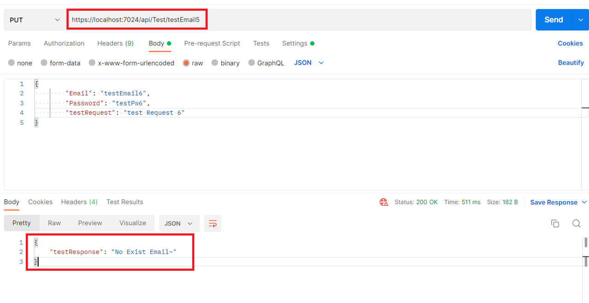

```C#
다음과 같이 DB에 없는 testEmail5 데이터를 조회하게 하면 return되는
affectedRow 값이 0이므로 
if (affectedRow == 0)
{
    response.testResponse = "No Exist Email~";
    return response;
}
가 실행되어 Postman의 하단에 testResponse의 데이터가 No Exist Email~ 로 출력되는 것을 볼 수 있다.
```

---
5. [HttpDelete("{Email}")]
```C#
[HttpDelete("{Email}")]
public async Task<PkTestResponse> DeleteHttpTest(string email)
{
    var response = new PkTestResponse();
    
    using (var connection = await _accountDB.GetAccountDbConnection())
    {
        var (sql, Data) = new Tuple<String, Object>("Delete From Account Where Email = @Email", new { Email = email});
        
        var affectedRow = await connection.ExecuteAsync(sql, Data);
        response.testResponse = "DELETE by Index Test Ok~";
    }
    return response;
}
```
````
Delete 요청에서는 DB의 데이터를 삭제해 볼 것이다.
````
---

* DELETE 요청
  
```C#
사진과 같이 testEmail1의 데이터를 Delete 해 볼 것이다. 
```
* Before
  
* After
  
```C#
사진과 같이 testEmail1의 데이터가 Delete된 것을 볼 수 있다. 
```

---

## Redis
````
전체적인 코드 추가 이후에 실행 과정에 대해 천천히 설명할 것이다.

먼저 Nuget으로 CloudStructer를 설치하고 RedisDB, IRedisDB 파일을 생성하고 테스트에 필요한 코드를 작성/수정한다.
````

#### IRedisDb
````C#
public interface IRedisDB
{
    public Task<ErrorCode> TestSet(String token);

    public Task<ErrorCode> TestGet(String token);
}
````
---

#### RedisDB
````C#
using CloudStructures;
using CloudStructures.Structures;

public class RedisDB : IRedisDB
{
    private static readonly ILogger<RedisDB> s_logger = LogManager.GetLogger<RedisDB>();
    private static RedisConnection s_redisConn { get; set; }

    // Redis의 Set 기능을 Test 하기 위한 코드로써 TestController.cs의 Post 메서드에서 사용한다.
    public async Task<ErrorCode> TestSet(String token)
    {
        try
        {
            // Key구성
            // 3번째 인자는 유효기간을 의미한다.
            var redis = new RedisString<String>(s_redisConn, token+"Data", TimeSpan.FromDays(1));
            
            // Redis에 
            // <Key             , Value> 구조의
            // <token(EmailData), token(Email)> 를 추가한다.
            await redis.SetAsync(token);
            
            // 출력부
            s_logger.ZLogError("------------Set Test------------");
            s_logger.ZLogError("Set Value : <" + token + ">");
            s_logger.ZLogError("--------------------------------");
            return ErrorCode.None;
        }
        catch (Exception e)
        {
            return ErrorCode.SetTest;
        }
    }
    
    // Redis의 Get 기능을 Test 하기 위한 코드로써 TestController.cs의 Get(Email) 메서드에서 사용한다.
    public async Task<ErrorCode> TestGet(String token)
    {
        try
        {
            // Key구성
            var redis = new RedisString<String>(s_redisConn, token+"Data", null);
            
            // Redis에서 위의 Key와 매칭되는 값의 Value를 Get한다.
            var result = await redis.GetAsync();
            
            s_logger.ZLogError("------------Get Test------------");
            s_logger.ZLogError("Get Value : <" + result.Value + ">");
            s_logger.ZLogError("--------------------------------");

            return ErrorCode.None;
        }
        catch (Exception e)
        {
            return ErrorCode.GetTest;
        }
    }
    
    // Init은 밑에서 추가 설명
    public static void Init(String address)
    {
        try
        {
            var config = new RedisConfig("Redis", address);
            s_redisConn = new RedisConnection(config);
        }
        catch (Exception e)
        {
            s_logger.ZLogError($"[RedisDB.Init] Exception : {e}");
        }
    }
}


public enum ErrorCode
{
    None = 0,
    
    SetTest = 1,
    GetTest = 2
}
````

*  Init 추가 설명
````C#
// appsettings.Development.json
"AllowedHosts": "*",
"ServerAddress" : "http://0.0.0.0:11500",
"DBConnection": {
  "MySqlAccount": "Server=127.0.0.1;user=root;port=3306;Password=0000;Database=AccountDB;Pooling=true;Min Pool Size=0;Max Pool Size=40;AllowUserVariables=True;",
  
  "Redis": "127.0.0.1:6379"
}

// program.cs
RedisDB.Init(builder.Configuration.GetSection("DbConnection")["Redis"]);

// RedisDB.cs
public static void Init(String address)
{
    try
    {
        var config = new RedisConfig("Redis", address);
        s_redisConn = new RedisConnection(config);
    }
    catch (Exception e)
    {
        s_logger.ZLogError($"[RedisDB.Init] Exception : {e}");
    }
}
````

````C#
Program.cs에서 RedisDB의 Init 메서드를 호출하게 되는데 인자로들어가는 string address 자리에 
builder.Configuration.GetSection("DbConnection")["Redis"]의 값을 넣어준다.
이 값은 appsettings.Development.json에 설정 되어 있는데 "DBConnection"의 "Redis": "127.0.0.1:<port>" 와 같은 방식으로 설정하여
Redis와의 연결을 위한 IP로 세팅한다.
````
---

#### TestController
````C#
public class TestController : ControllerBase
{
    private readonly IDataBase _accountDB;
    private readonly ILogger<TestController> _logger;
    
    // IRedisDB 객체 추가
    private readonly IRedisDB _redisDB;

    public TestController(IDataBase accountDB, ILogger<TestController> logger, IRedisDB redisDB)
    {
        _logger = logger;
        _accountDB = accountDB;        
        
        // Program.cs의 
        // builder.Services.AddSingleton<IRedisDB, RedisDB>();
        // 에서 의존성 주입을 통해 세팅
        _redisDB = redisDB;
    }
...
    // Get(Email) 메서드 변경
    [HttpGet("{Email}")]
    public async Task<PkTestResponse> Get(String email)
    {
        var response = new PkTestResponse();

        using (var connection = await _accountDB.GetAccountDbConnection())
        {
            DBUserInfo userInfo;

            userInfo = await connection.QuerySingleOrDefaultAsync<DBUserInfo>(
                "select Email, HashedPassword, SaltValue from account where Email = @Email", new { Email = email });


            Console.WriteLine("-----------------------");
            Console.WriteLine(userInfo.Email);
            Console.WriteLine(userInfo.HashedPassword);
            Console.WriteLine(userInfo.SaltValue);
            Console.WriteLine("-----------------------\n");
            
            
            // Postman이나 기타 테스트 프로그램에서 보내준 Email로 위의 SQL문을 실행하고 
            // 아래의 TestGet함수를 호출하여 데이터를 가져온다.
            var testError =  _redisDB.TestGet(email);

            if (testError.Result == ErrorCode.GetTest)
            {
                response.testResponse = "GetTest Fail!";
            }
            
            response.testResponse = "GET by Index Test Ok~";
        }

        return response;
    }
...
    [HttpPost]
    public async Task<PkTestResponse> Post(PkTestRequest request) 
    {
        Console.WriteLine("-----------------------");
        Console.WriteLine(request.Email);
        Console.WriteLine(request.Password);
        Console.WriteLine(request.testRequest);
        Console.WriteLine("-----------------------\n");
        var response = new PkTestResponse();
        using (var connection = await _accountDB.GetAccountDbConnection())
        {
            var saltValue = SaltString();
            var hashingPassword = MakeHashingPassWord(saltValue, request.Password);

            DBUserInfo userInfo = new DBUserInfo();
            userInfo.Email = request.Email;
            userInfo.HashedPassword = hashingPassword;
            userInfo.SaltValue = saltValue;
            
            var affectedRow =  await connection.ExecuteAsync("INSERT INTO Account(Email,SaltValue,HashedPassword) Values(@Email, @SaltValue, @HashedPassword);", userInfo);
            Console.WriteLine(affectedRow);
            
            // Postman이나 기타 테스트 프로그램에서 보내준 Email로 위의 SQL문을 실행하고 
            // 아래의 TestSet 호출하여 데이터를 세팅한다.
            var testError =  _redisDB.TestSet(request.Email);

            if (testError.Result == ErrorCode.SetTest)
            {
                response.testResponse = "SetTest Fail!";
            }
            
            response.testResponse = "Post Test Ok~~";
        }
        

        return response;
    }
````
---

#### appsetting Development
````C#
{
  "Logging": {
    "LogLevel": {
      "Default": "Information",
      "Microsoft.AspNetCore": "Warning"
    }
  },

  "AllowedHosts": "*",
  "ServerAddress" : "http://0.0.0.0:11500",
  "DBConnection": {
    "MySqlAccount": "Server=127.0.0.1;user=root;port=3306;Password=0000;Database=AccountDB;Pooling=true;Min Pool Size=0;Max Pool Size=40;AllowUserVariables=True;",
    
    "Redis": "127.0.0.1:6379"
  }
}

"DBConnection" Section에  "Redis": "127.0.0.1:6379" 추가
````
---


#### Program
````C#
var builder = WebApplication.CreateBuilder(args);

builder.Host.ConfigureAppConfiguration
((hostingContext, config) => {
    config.SetBasePath(Directory.GetCurrentDirectory());
    config.AddJsonFile("appsettings.Development.json", optional: true, reloadOnChange: true);
});

// Logging
builder.Host.ConfigureLogging(logging =>
{
    logging.ClearProviders();
    logging.AddConfiguration(builder.Configuration.GetSection("Logging"));
    logging.AddZLoggerConsole();

     logging.AddZLoggerFile("WebAPI_EDU.log",
         x =>
         {
             x.PrefixFormatter = (writer, info) =>
                 ZString.Utf8Format(writer, "[{0}][WebAPI_EDU] -> ", info.Timestamp.ToLocalTime().DateTime);
         });
});

builder.Services.AddControllers();

builder.Services.AddTransient<IDataBase, DataBase>();

// *****************************************
// Redis 추가 코드 DI
builder.Services.AddSingleton<IRedisDB, RedisDB>();
// *****************************************

var app = builder.Build();

// Logging
var loggerFactory = app.Services.GetRequiredService<ILoggerFactory>();
LogManager.SetLoggerFactory(loggerFactory, "Global");


app.UseRouting();
app.UseEndpoints(endpoints => { endpoints.MapControllers(); });

// *****************************************
// Redis 추가 코드 appsetting.Development.json
RedisDB.Init(builder.Configuration.GetSection("DbConnection")["Redis"]);
// *****************************************

DataBase.Init(builder.Configuration.GetSection("DbConnection")["MySqlAccount"]); 

app.Run();
````
---

### 간단한 Redis 테스트
````
코드 작성이 끝났다면 천천히 테스트해보도록 하겠다.
````
---

1. Redis cli 실행
````
C:\Program Files\Redis 와 같이 Redis가 설치된 경로에 접속하여 아래 사진에서 빨간박스로 표시된 
redis-cli.exe 파일을 실행한다.

실행 후에 ping명령어를 입력하여 연결이 잘 되어있는지 확인한다.
````


---

2. Post명령 실행 및 Redis-cli를 통한 Test
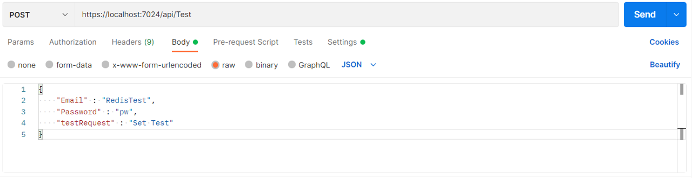
 
````C#
Postman을 통해 Post요청을 보낸다.

{
    "Email" : "RedisTest",
    "Password" : "pw",
    "testRequest" : "Set Test"
}

명령을 보낸후 정상 작동하는지 테스트하기 위해 다음과 같이 로그와 Redis-cli통해 확인한다.
````
````C#
// Log
[08/16/2022 17:39:27][WebAPI_EDU] -> ------------Set Test------------
[08/16/2022 17:39:27][WebAPI_EDU] -> Set Value : <RedisTestData>
[08/16/2022 17:39:27][WebAPI_EDU] -> --------------------------------
````
  

---

3. Get명령 실행 및 Redis-cli를 통한 Test  
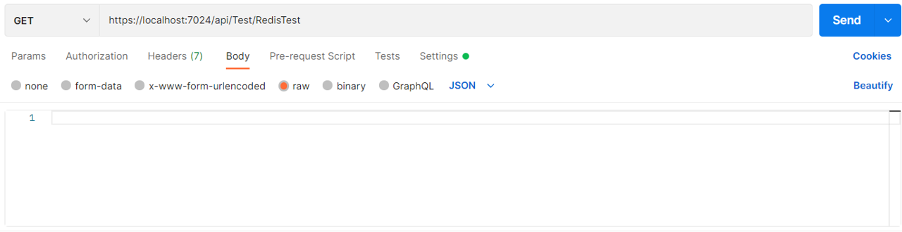

````C#
[08/16/2022 17:44:55][WebAPI_EDU] -> ------------Get Test------------
[08/16/2022 17:44:55][WebAPI_EDU] -> Get Value : <RedisTest>
[08/16/2022 17:44:55][WebAPI_EDU] -> --------------------------------

위와 같이 제대로 된 값을 가져오는 것을 확인할 수 있다.
````
---

### ZLogger

---

#### Program
```C#
// Logging
builder.Host.ConfigureLogging(logging =>
{
    // 기본 제공자를 재정의해준다.
    logging.ClearProviders();

    logging.AddConfiguration(builder.Configuration.GetSection("Logging"));

    // 콘솔에 출력한다. 해당 메서드를 실행해주지 않으면 콘솔에는 출력되지 않는다.
    logging.AddZLoggerConsole();

    // 지정된 파일에 출력한다. 해당 메서드를 실행해주지 않으면 파일로써 작성되지 않는다.
    //logging.AddZLoggerFile("WebAPI_EDU_1.log");


     // addZLoggerFile메서드에 두번째 인자로 prefixfromatter를 세팅해주면
     // prefixFormatter의 info에 해당하는 데이터(포멧)가 로그 출력 가장 앞에 추가 된다.
     // 원한는 포멧으로 바꿔서 테스트해봐도 좋다.
     logging.AddZLoggerFile("WebAPI_EDU.log",
         x =>
         {
             x.PrefixFormatter = (writer, info) =>
                 ZString.Utf8Format(writer, "[{0}][WebAPI_EDU] -> ", info.Timestamp.ToLocalTime().DateTime);
         });
    
     // 날짜와 같은 데이터를 기준으로 파일을 생성하고 작성하는 기능
     // 아래 코드만 있어도 날짜에 따라 log 파일이 생성되고
     // 날짜별 로그가 분리된다.
     // 필요에 따라 사용하도록 한다.
     // logging.AddZLoggerRollingFile(
     //     fileNameSelector: (dt, x) => $"{dt.ToLocalTime():yyyy-MM-dd}_{x:000}.log", 
     //     timestampPattern: x => x.ToLocalTime().Date, 
     //     rollSizeKB: 1024);
    
     // 구조화된 로깅이 가능하도록 옵션 세팅
     // logging.AddZLoggerConsole(options =>
     // {
     //     options.EnableStructuredLogging = true;
     // });
});
...
// Logging
var loggerFactory = app.Services.GetRequiredService<ILoggerFactory>();
LogManager.SetLoggerFactory(loggerFactory, "Global");
```
---

#### LogManager
````C#
public static class LogManager
{
    static ILogger s_globalLogger;
    static ILoggerFactory s_loggerFactory;

    public static void SetLoggerFactory(ILoggerFactory loggerFactory, string categoryName)
    {
        LogManager.s_loggerFactory = loggerFactory;
        LogManager.s_globalLogger = loggerFactory.CreateLogger(categoryName);
    }
    public static ILogger Logger => s_globalLogger;
    public static ILogger<T> GetLogger<T>() where T : class => s_loggerFactory.CreateLogger<T>();
        
    public static ILogger GetLogger(string categoryName) => s_loggerFactory.CreateLogger(categoryName);
}
````
---


#### TestController
````C#
private readonly ILogger<TestController> _logger;

public TestController(IDataBase accountDB, ILogger<TestController> logger)
{
    _logger = logger;
    _accountDB = accountDB;
}
````
---

````C#
[HttpGet]
public async Task<PkTestResponse> Get()
{
    var response = new PkTestResponse();

    using (var connection = await _accountDB.GetAccountDbConnection())
    {
        var userInfos =
            await connection.QueryAsync<DBUserInfo>("select Email,  HashedPassword,SaltValue from account");
        

        _logger.ZLogInformation("----------LogTest-------------");
        foreach (var userInfo in userInfos)
        {
            _logger.ZLogInformation("Email : " + userInfo.Email);
        }

        _logger.ZLogInformation("-----------------------\n");

        response.testResponse = "GET Test Ok~";
    }

    return response;
}

간단하게 HttpGet 메서드에만 테스트해 보도록 한다.

다음 코드 작성 후 HttpGet 요청을 보내면 아래와 같이 Console창에 출력되고
Log 파일도 출력되는 것을 볼 수 있다.
````
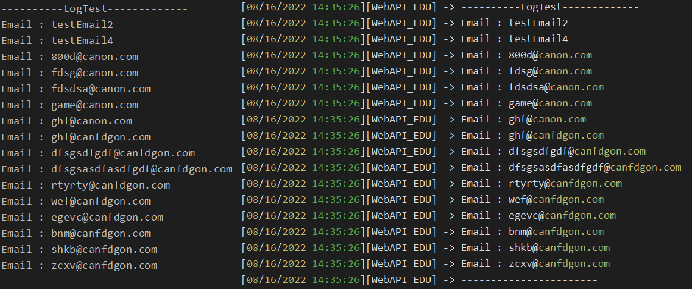

````
다양한 사용방법은 ZLogger 교육자료들을 통해 확인하고 사용하도록 한다.
````
---

## 생명주기에 따른 의존성 주입 테스트

### 프로젝트 생성
[기본 세팅](#기본-세팅) 파트와 동일하게 프로젝트 생성

---


### launchSettings.json
````C#
{
  "$schema": "https://json.schemastore.org/launchsettings.json",
  "iisSettings": {
    "windowsAuthentication": false,
    "anonymousAuthentication": true,
    "iisExpress": {
      "applicationUrl": "http://localhost:58463",
      "sslPort": 44388
    }
  },
  "profiles": {
    "DILifeTime": {
      "commandName": "Project",
      "dotnetRunMessages": true,
      "launchBrowser": false,
      "launchUrl": "Operations",
      "applicationUrl": "https://localhost:7267;http://localhost:5267",
      "environmentVariables": {
        "ASPNETCORE_ENVIRONMENT": "Development"
      }
    },
    "IIS Express": {
      "commandName": "IISExpress",
      "launchBrowser": true,
      "launchUrl": "swagger",
      "environmentVariables": {
        "ASPNETCORE_ENVIRONMENT": "Development"
      }
    }
  }
}

````

---

### Program.cs
````C#
using DILifeTime;
using WebApplication2.Services;

var builder = WebApplication.CreateBuilder(args);

builder.Services.AddControllers();

builder.Services.AddTransient<IOperationTransient, OperationData>();
builder.Services.AddScoped<IOperationScoped, OperationData>();
builder.Services.AddSingleton<IOperationSingleton, OperationData>();

builder.Services.AddTransient<OperationService, OperationService>();

builder.Services.AddEndpointsApiExplorer();
builder.Services.AddSwaggerGen();

var app = builder.Build();

if (app.Environment.IsDevelopment())
{
    app.UseSwagger();
    app.UseSwaggerUI();
}

app.UseHttpsRedirection();

app.UseAuthorization();

app.MapControllers();

app.Run();
````

---

### Operation.cs
````C#
namespace DILifeTime;

public class Operation
{
    public Guid OperationId { get; set; }
}
````

---

### IOperationData.cs
````C#
namespace DILifeTime;

public interface IOperationData
{
    Guid OperationId { get; }
}

public interface IOperationTransient : IOperationData
{
}

public interface IOperationScoped : IOperationData
{
}

public interface IOperationSingleton : IOperationData
{
}
````

---

### OperationData.cs
````C#
namespace DILifeTime;

public class OperationData : IOperationData, IOperationTransient, IOperationScoped, IOperationSingleton
{
    Guid _guid;
    public OperationData() : this(Guid.NewGuid())
    {

    }

    public OperationData(Guid guid)
    {
        _guid = guid;
    }

    public Guid OperationId => _guid;
}
````

---


### OperationService.cs
````C#
using DILifeTime;

namespace WebApplication2.Services
{
    public class OperationService
    {
        public IOperationTransient TransientOperation { get; }
        public IOperationScoped ScopedOperation { get; }
        public IOperationSingleton SingletonOperation { get; }

        public OperationService(IOperationTransient transientOperation,
            IOperationScoped scopedOperation,
            IOperationSingleton singletonOperation)
        {
            TransientOperation = transientOperation;
            ScopedOperation = scopedOperation;
            SingletonOperation = singletonOperation;
        }
    }
}
````

---


### OperationsController.cs
````C#
using DILifeTime;
using Microsoft.AspNetCore.Mvc;
using WebApplication2.Services;

namespace WebApplication2.Controllers
{
    [ApiController]
    [Route("[controller]")]
    public class OperationsController : ControllerBase
    {
        private readonly OperationService _operationService;
        private readonly IOperationTransient _transientOperation;
        private readonly IOperationScoped _scopedOperation;
        private readonly IOperationSingleton _singletonOperation;

        public OperationsController(OperationService operationService,
            IOperationTransient transientOperation,
            IOperationScoped scopedOperation,
            IOperationSingleton singletonOperation)
        {
            _operationService = operationService;
            _transientOperation = transientOperation;
            _scopedOperation = scopedOperation;
            _singletonOperation = singletonOperation;
        }

        // GET: api/<BlogController>
        [HttpGet]
        public ActionResult<IEnumerable<Operation>> Get()
        {
            var transient_guid = _transientOperation.OperationId;
            var scoped_guid = _scopedOperation.OperationId;
            var singleton_guid = _singletonOperation.OperationId;

            string a = $"transient : {transient_guid}";
            string b = $"scoped : {scoped_guid}";
            string c = $"singleton : {singleton_guid}";

            string d = $"-----EndLine-----";

            var os_transient_guid = _operationService.TransientOperation.OperationId;
            var os_scoped_guid = _operationService.ScopedOperation.OperationId;
            var os_singleton_guid = _operationService.SingletonOperation.OperationId;

            string a2 = $"transient : {os_transient_guid}";
            string b2 = $"scoped : {os_scoped_guid}";
            string c2 = $"singleton : {os_singleton_guid}";

            List<string> result = new List<string>()
            {
                a,b,c,d,
                a2,b2,c2
            };

            return Ok(result);
        }
    }
}
````

---

### Postman을 통한 Test
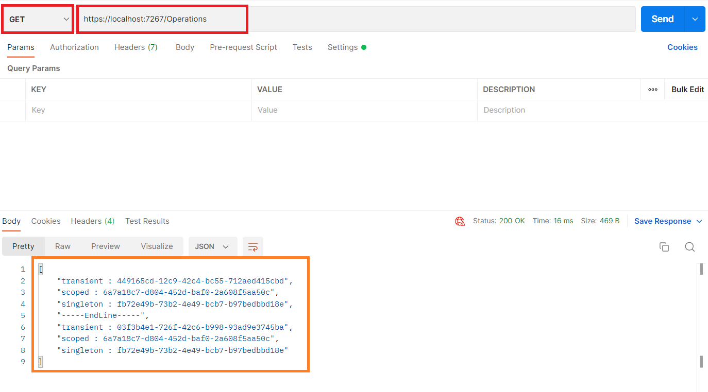
````C#
Controller에 HttpGet을 사용하여 Test를 진행할 것이기 때문에 위의 사진과 같이 GET세팅에서 
자신에 맞는 Port를 Url에 작성하여 Send요청을 하고 Response Body에서 결과를 확인할 수 있다.

ASP.NET Core에 기입한 테스트 내용처럼
서비스마다 AddTransient의 GUID가 다르며, Request(Send)마다 GUID가 변화하는지? 
Request(Send)마다 AddScope의 GUID가 바뀌는지? 

서버 종료 후 재접속 시 마다 AddSingleton의 GUID가 바뀌며 그 전에는 바뀌지 않는지?
에 대한 테스트를 진행해보도록 한다. 
````


