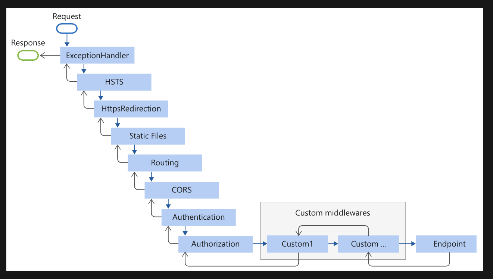

## Middleware

- 미들웨어는 요청 - 응답 사이에서 해당 요청을 중간 처리하는 단계로써, 기존의 미들웨어와 커스텀 미들웨어 두 가지 형태가 존재한다.

- 기존에 존재하는 미들웨어의 경우, 정해진 흐름에 따라서 추가해야되며, 바뀔 경우 문제가 발생할 수 있다.


- 정상적인 방법
``` cs
var app = builder.build();

app.UseAuthentication();

app.UseAuthorization();
```

- 틀린 방법
``` cs
var app = builder.build();

app.UseAuthorization();

app.UseAuthentication();
```
### Middleware 적용 방법
1. RUN을 이용한 초간단한 미들 웨어
``` cs
app.Run(async (context) =>{
    context.Response.ContentType = "text/plain";
    await context.Response.WriteAsync("Hello MiddleWare");
});
```

2. Branching 미들웨어 파이프라인
- 순차적으로 실행되어야 하는 것은 아니다
- 흐름을 가로챘다고 해서 꼭 위로 올려 보내는 것도 아- Map
``` cs
app.Map("/secret", branch => {
    branch.Run(async (context) =>{
        context.Response.ContentType = "text/plain";
        await context.Response.WriteAsync("Hello MiddleWare");
    });
});
```

3. Use를 이용한 초간단 양방향 미들웨어
``` cs
app.Use(async (context, next) =>{
    // Request 미들웨어
    Console.WriteLine("Request MiddleWare");
    await next();  // < next 기준으로 전 후 나뉨
    // Response 미들웨어
    Console.WriteLine("Response MiddleWare");
});

// or

app.UseMiddleware<TestMiddleWare>();
```

### Custom Middleware
``` cs
public class TestMiddleWare
{
    // 무조건 필요
    RequestDelegate _next;
    public TestMiddleWare(RequestDelegate next)
    {
        _next = next;
    }

    private async Task Invoke(HttpContext context)
    {
        // Request TODO
        await _next(context);
        // Response TODO
    }
}
```